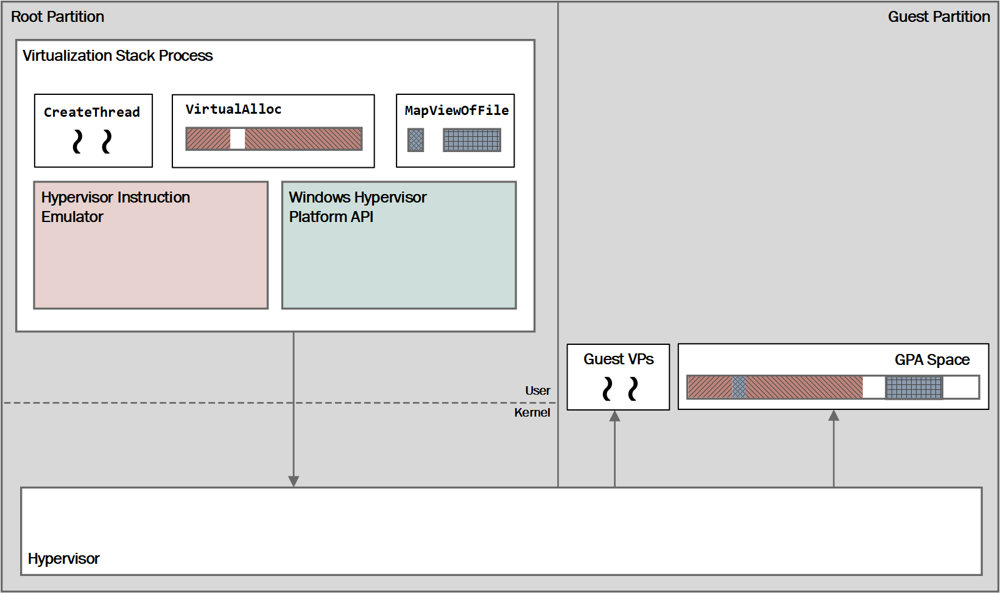

# Windows Hypervisor Platform API Definitions

>**This API is available starting in the Windows April 2018 Update.**

The following diagram provides a high-level overview of the third-party architecture.

The following section contains the definitions of the Windows Hypervisor Platform APIs that are exposed through WinHvPlatform.h. WinHvApi.dll exports a set of C-style Windows API functions which return HRESULT error codes.

## Platform Capabilities

|Function   |Description|
|---|---|
|[WHvGetCapability](funcs/WHvGetCapability.md)|Platform capabilities are a generic way for callers to query properties and capabilities of the hypervisor, of the API implementation, and of the hardware platform that the application is running on. The platform API uses these capabilities to publish the availability of extended functionality of the API as well as the set of features that the processor on the current system supports.|
|   |   |

## Partition Creation, Setup, and Deletion

|Function   |Description|
|---|---|
|[WHvCreatePartition](funcs/WHvCreatePartition.md)|Creating a partition creates a new partition object. Additional properties of the partition are stored in the partition object and are applied when creating the partition in the hypervisor.|
|[WHvSetupPartition](funcs/WHvSetupPartition.md)|Setting up the partition causes the actual partition to be created in the hypervisor. A partition needs to be set up prior to performing any other operation on the partition after it was created, with exception of configuring the initial properties of the partition.|
|[WHvDeletePartition](funcs/WHvDeletePartition.md)|Deleting a partition tears down the partition object and releases all resource that the partition was using.|

## Partition Properties

Partition properties provide the mechanism for callers to query and configure the characteristics of a partition. Querying a property returns the current value of that property, which provides the default value determined by the hypervisor and API implementations in case the property hasn’t been previously modified by the caller. 

The availability of features that can be configured through the partition properties depends on the capabilities of the hypervisor, API implementation and the physical processor on the system. An application should check the corresponding capability before attempting to configure a property.

Several properties (e.g., the properties that configure the processor features that are made available to the partition) can only be modified during the creation of the partition and prior to executing a virtual processor in the partition. An attempt to modify these properties after a partition started executing results in a failure of the operation.

For more information about the partition properties: [Partition Property Data Types](funcs/WHvPartitionPropertyDataTypes.md)

|Function   |Description|
|---|---|
|[WHvGetPartitionProperty](funcs/WHvGetPartitionProperty.md)|Querying a property returns the current value of that property, which provides the default value determined by the hypervisor and API implementations in case the property hasn’t been previously modified by the caller.|
|[WHvSetPartitionProperty](funcs/WHvSetPartitionProperty.md)|This functions sets the configurations of partition properties. |

## VM Memory Management

The physical address space of the VM partition (the GPA space) is populated using memory allocated in the user-mode process of the virtualization stack. I.e., the virtualization stack allocates the required memory using standard memory management functions in Windows (such as VirtualAlloc) or maps a file into its process, and uses the addresses to these areas to map this memory into the partition’s GPA space.

|Function   |Description|
|---|---|
|[WHvMapGpaRange](funcs/WHvMapGpaRange.md)|Creating a mapping for a range in the GPA space of a partition sets a region in the caller’s process as the backing memory for that range. The operation replaces any previous mappings for the specified GPA pages.|
|[WHvUnmapGpaRange](funcs/WHvUnmapGpaRange.md)|Unmapping a previously mapped GPA range makes the memory range unavailable to the partition. Any further access by a virtual processor to the range will result in a memory access exit.|
|[WHvTranslateGva](funcs/WHvTranslateGva.md)|Translating a virtual address used by a virtual processor in a partition allows the virtualization stack to emulate a processor instruction for an I/O operation, using the results of the translation to read and write the memory operands of the instruction in the GPA space of the partition.|
|[WHvQueryGpaRangeDirtyBitmap](funcs/WHvQueryGpaRangeDirtyBitmap.md)|Querying a range of GPA space to determine which pages have been modified by the guest since the last query of the range.|

## Virtual Processor Execution

The virtual processors of a VM are executed using the new integrated scheduler of the hypervisor. To run a virtual processor, a thread in the process of the virtualization stack issues a blocking call to execute the virtual processor in the hypervisor, the call returns because of an operation of the virtual processor that requires handling in the virtualization stack or because of a request by the virtualization stack.  

A thread that handles a virtual processor executes the following basic operations:

1. Create the virtual processor in the partition.
2. Setup the state of the virtual processor, which includes injecting pending interrupts and events into the processor.
3. Run the virtual processor.
4. Upon return from running the virtual processor, query the state of the processor and handle the operation that caused the processor to stop running.
5. If the virtual processor is still active, go back to Step 2 to continue to run the processor.
6. Delete the virtual processor in the partition.  

The state of the virtual processor includes the hardware registers and any interrupts the virtualization stack wants to inject into the virtual processor.

|Function   |Description|
|---|---|
|[WHvCreateVirtualProcessor](funcs/WHvCreateVirtualProcessor.md)|This function creates a new virtual processor in a partition. The index of the virtual processor is used to set the APIC ID of the processor.|
|[WHvDeleteVirtualProcessor](funcs/WHvDeleteVirtualProcessor.md)|This function deletes a virtual processor in a partition.|
|[WHvRunVirtualProcessor](funcs/WHvRunVirtualProcessor.md)|This function executes the virtual processor (i.e., enables to run guest code). A call to this function blocks synchronously until either the virtual processor executed an operation that needs to be handled by the virtualization stack (e.g., accessed memory in the GPA space that is not mapped or not accessible) or the virtualization stack explicitly request an exit of the function (e.g., to inject an interrupt for the virtual processor or to change the state of the VM). |
|[WHvCancelRunVirtualProcessor](funcs/WHvCancelRunVirtualProcessor.md)|Canceling the execution of a virtual processor allows an application to abort the call to run the virtual processor by another thread, and to return the control to that thread. The virtualization stack can use this function to return the control of a virtual processor back to the virtualization stack in case it needs to change the state of a VM or to inject an event into the processor. |

### Exit Context

The detailed reason and additional information for the exit of the [`WHvRunVirtualProcessor`](funcs/WHvRunVirtualProcessor.md) function is return in an output buffer of the function that receives a context structure for the exit. The data provided in this context buffer is specific to the individual exit reason, and for simple exit reasons the buffer might be unused (`RunVpExitLegacyFpError` and `RunVpExitInvalidVpRegisterValue`).

|Structures   |Description|
|---|---|
|[Exit Contexts](funcs/WHvExitContextDataTypes.md)| The context structures for several exit reasons share common definitions for the data that provides information about the processor instruction that caused the exit and the state of the virtual processor at the time of the exit. |
|[Memory Access](funcs/MemoryAccess.md)| Information about exits caused by the virtual processor accessing a memory location that is not mapped or not accessible is provided by the `WHV_MEMORY_ACCESS_CONTEXT` structure.  |
|[I/O Port Access](funcs/IOPortAccess.md)|Information about exits caused by the virtual processor executing an I/O port instruction (IN, OUT, INS, and OUTS) is provided in the `WHV_X64_IO_PORT_ACCESS_CONTEXT` structure.|
|[MSR Access](funcs/MSRAccess.md)|Information about exits caused by the virtual processor accessing a model specific register (MSR) using the RDMSR or WRMSR instructions is provided in the `WHV_X64_MSR_ACCESS_CONTEXT` structure. |
|[CPUID Access](funcs/CPUIDAccess.md)|Information about exits caused by the virtual processor executing the CPUID instruction is provided in the `WHV_X64_CPUID_ACCESS_CONTEXT` structure.|
|[Virtual Processor Exception](funcs/VirtualProcessorException.md)|Information about an exception generated by the virtual processor is provided in the `WHV_VP_EXCEPTION_CONTEXT` structure.|
|[Interrupt Window](funcs/InterruptWindow.md)|Information about exits caused by the virtual processor when the interruptibility state of the processor would allow delivery of a given interrupt. |
|[Unsupported Feature](funcs/UnsupportableFeature.md)|An exit for an unsupported feature is caused by the virtual processor accesses a feature of the architecture that is not properly virtualized by the hypervisor. |
|[Execution Cancelled](funcs/ExecutionCancelled.md)|Information about an exit caused by host system is provided in the `WHV_RUN_VP_CANCELLED_CONTEXT` structure. |
|[RDTSC(P)](funcs/Rdtsc.md)|Information about exits caused by the virtual processor executing the RDTSC(P) instruction is provided in the `WHV_X64_RDTSC_CONTEXT` structure.|

### Virtual Process Registers

The state of a virtual processor, which includes both the state defined by the underlying architecture (such as general-purpose registers) and additional state defined by the hypervisor, can be access through these functions.

For more information about the registers see: [Virtual Processor Register Names and Values](funcs/WHvVirtualProcessorDataTypes.md)

|Function   |Description|
|---|---|
|[WHvGetVirtualProcessorRegisters](funcs/WHvGetVirtualProcessorRegisters.md)|This function allows for querying a set of individual registers by the virtualization stack.|
|[WHvGetVirtualProcessorXsaveState](funcs/WHvGetVirtualProcessorXsaveState.md)|This function allows for querying a virtual processor's XSAVE state.|
|[WHvSetVirtualProcessorRegisters](funcs/WHvSetVirtualProcessorRegisters.md)|This function allows for setting a set of individual registers by the virtualization stack.|
|[WHvSetVirtualProcessorXsaveState](funcs/WHvSetVirtualProcessorXsaveState.md)|This function allows for setting a virtual processor's XSAVE state.|

### Interrupt controller virtualization

Optionally, the hypervisor platform can emulate a local APIC
interrupt controller. For virtual machines where an APIC is required, using the platform's built-in emulation will yield the best performance.

When this functionality is enabled, these functions can be used to query and set APIC state and to request virtual interrupts.

|Function|Description|
|---|---|
|[WHvGetVirtualProcessorInterruptControllerState](funcs/WHvGetVirtualProcessorInterruptControllerState.md)|Queries a virtual processor's interrupt controller state.|
|[WHvRequestInterrupt](funcs/WHvRequestInterrupt.md)|Requests a interrupt.|
|[WHvSetVirtualProcessorInterruptControllerState](funcs/WHvGetVirtualProcessorInterruptControllerState.md)|Sets a virtual processor's interrupt controller state.|

### Counters

These functions can be used to query various hypervisor platform counters.

|Function|Description|
|---|---|
|[WHvGetPartitionCounters](funcs/WHvGetPartitionCounters.md)|This function allows querying counters for a partition.|
|[WHvGetVirtualProcessorCounters](funcs/WHvGetVirtualProcessorCounters.md)|This function allows querying counters for a virtual processor.|
