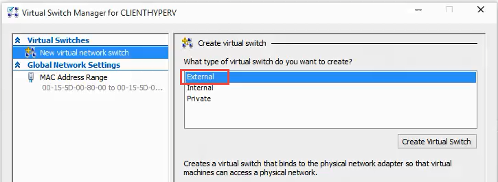
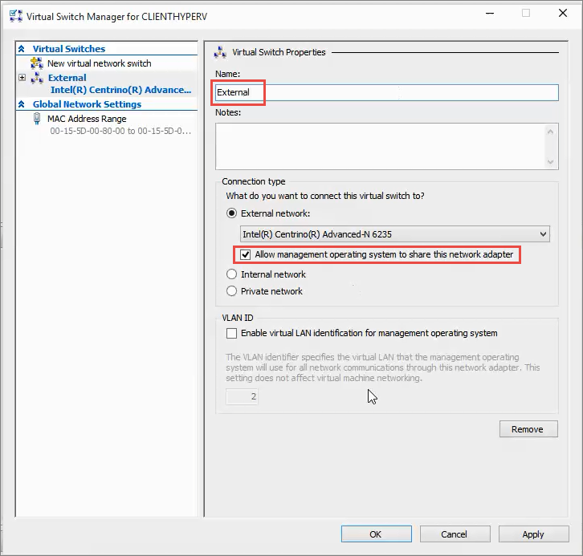
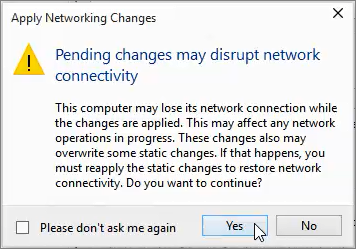

ms.ContentId: D50E5834-85A4-4BD7-819C-EC3B31198BE2
title: Step 3: Create a virtual switch

# Create a virtual switch #

The virtual switch is how you create a network connection for your virtual machine to use when connecting to the internet, the host or to other virtual machines.

For this example, we are going to create an External switch, which will let virtual machines access the internet using the host machines network adapter. We will also set the switch to allow the host to share this network adapter. This will make it so that both the virtual machines and the host can use the same physical NIC.

1. In Hyper-V manager, click **Action** > **Virtual Switch Manager**.

  
2. In the left pane, select **New virtual network switch**.
3. Select **External** and **Create Virtual Switch**.

  
3. Under **Name**, type **External**. Under **External network**, make sure the correct NIC is selected and that **Allow management operating system to share this network adapter** is selected and then click **OK**. 
  
  
4. You will get a message warning you that your network might disconnect while the virtual switch is created. Just click **Yes**.
  
  

# Next step: #
[Step 4: Configure your host](step4.md)