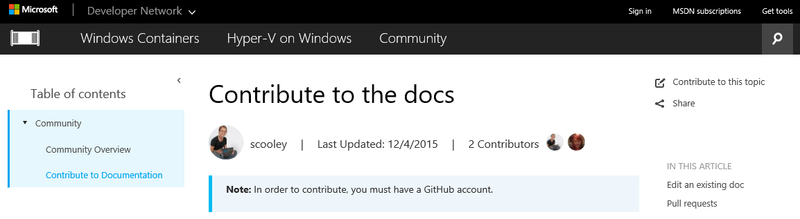
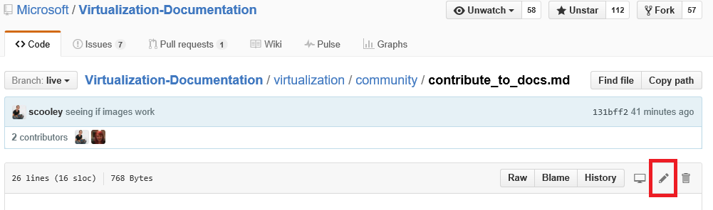
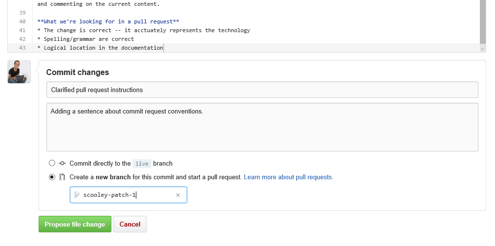
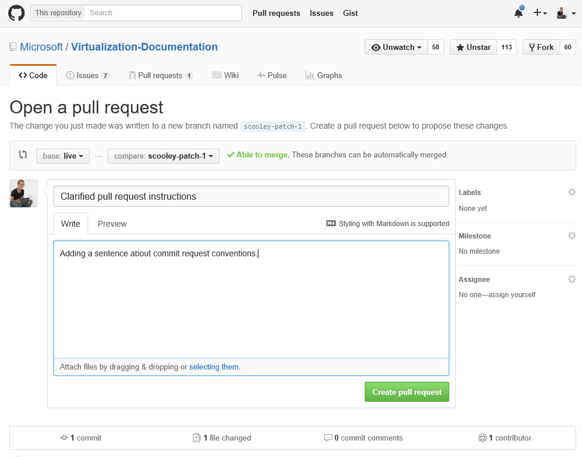
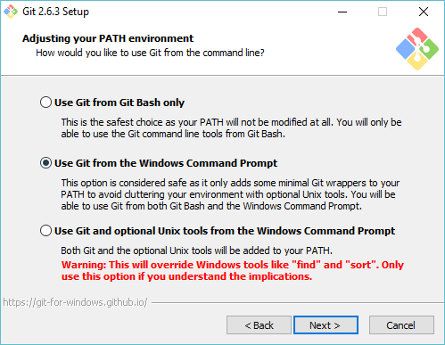

# Contribute to the docs

> **Note:**  In order to contribute, you must have a [GitHub](https://www.github.com) account.

## Edit an existing doc

1. Find the doc you'd like to edit.  

2. Select **Contribute to this topic**  
  
  
  This will automatically redirect you to the markdown file in GitHub associated with this file.
  
  Make sure you are signed into GitHub.  If not, either sign in or create a GitHub account.
  
  
  
3. Select the edit icon to edit with the in browser editor.
  
  

4. Make changes inline.
  
  Possible actions:
  1. Edit file
  2. Preview changes
  3. Rename the file (it's very unlikely you'll want to do this)
  
  
  
5. Propose your changes as a pull request
  
  

6. Review your changes
  
  **What we're looking for in a pull request**  
  * The change is correct -- it accurately represents the technology
  * Spelling/grammar are correct
  * Logical location in the documentation
    
  

7. Create a [pull request](contribute_to_docs.md#pull-requests)  

## Pull requests

Most changes will be committed via pull request.  A pull request is a way of reviewing a change set with multiple reviewers, changing, and commenting on the current content.


## Fork the repo and edit locally

For long term doc work Clone the repository locally and work on your machine.

The following guide shows you how to emulate my (Sarah Cooley's) set up.  There are many alternative setups that work equally well.

> **Note:** All of these doc tools work equally well on Linux/OSX.  If you want other guides, ask.

This is broken into three sections:
* [Set up git](contribute_to_docs.md#set-up-git)
  * git installation
  * initial set up
  * forking the documentation repo
  * cloning your copy to your local machine
* [Initial credential management](contribute_to_docs.md#validate-and-stash-credentials)
  * information about stashing credentials and cred helper.
* [Set up doc environment](contribute_to_docs.md#set-up-markdown-editing-environment)
  * install VSCode
  * VSCode for Git walk through some handy features
  * Make first commit.

### Set up Git

1. Install git (on Windows) from [here](https://git-for-windows.github.io/)

  There is only one value in the installation you need to change:

  **Adjusting your PATH environment**
  Use Git from the Windows Command Prompt

  

  This lets you use git commands in the PowerShell console/in any Windows console.

2. Configure your git identity

  Open a PowerShell Window and run:

  ``` PowerShell
  git config --global user.name "User Name"
  git config --global user.email username@microsoft.com
  ```

  Git uses these values to label your commits.

  > If recieved the following error git probably isn't installed properly or you need to relaunch PowerShell.
    ``` PowerShell
    git : The term 'git' is not recognized as the name of a cmdlet, function, script file, or operable program. Check the spelling of the name, or if a path was included, verify that the path is correct and try again.
    ```

3. Configure your git environment

   Set up a credential helper so you only need to enter username and password once (at least on this machine).
   I use this basic [Windows cred helper](https://github.com/Microsoft/Git-Credential-Manager-for-Windows#download-and-install)

   Once that is installed, run the following to enable the credential helper and set your push behavior:
   ```
   git config --global credential.helper manager
   git config --global push.default simple
   ```

   The first time you need to authenticate against GitHub - you will be prompted for your username, and the two-factor authcode if you have it enabled.
   Example:
   ```
   C:\Users\plang\Source\Repos\Virtualization-Documentation [master]> git pull
   Please enter your GitHub credentials for https://github.com/
   username: plang@microsoft.com
   password:
   authcode (app): 562689
   ```
   This will automatically a [Personal Access Token](https://github.com/settings/tokens) with the right permissions on GitHub,
   then store that token securely on the local machine. You shouldn't be prompted again in the future.

4. Fork the repository

5. Clone the repository

  Git clone makes a local copy of the git repository with the right hooks to sync with other clones of the same repository.

  By default, clone will create a folder with the same name as the repository in the current directory.  I keep all of my git repos in my user directory.  Read more about git clone [here](http://git-scm.com/docs/git-clone).

  ``` PowerShell
  cd ~
  git clone https://github.com/Microsoft/Virtualization-Documentation.git
  ```

  If successful, you now have a `Virtualization-Documentation` folder.

  ``` PowerShell
  cd Virtualization-Documentation
  ```

5. [Optional] Set up Posh-Git

  Posh-Git is a community created PowerShell module that makes using Git in PowerShell a little friendlier.  It adds tab completion for Git in PowerShell, and can also make your prompt display useful about branching and file state.  Read more about it [here](https://github.com/dahlbyk/posh-git).  You can install Posh-Git by running the following in an Administrator PowerShell console.

  ``` PowerShell
  Install-Module -Name posh-git
  ```

  To make Posh-Git work automatically each time you start PowerShell, add the following code to your PowerShell Profile (e.g. `%UserProfile%\My Documents\WindowsPowerShell\profile.ps1 `)

  ``` PowerShell
  Import-Module posh-git

  function global:prompt {
    $realLASTEXITCODE = $LASTEXITCODE

    Write-Host($pwd.ProviderPath) -nonewline

    Write-VcsStatus

    $global:LASTEXITCODE = $realLASTEXITCODE
    return "> "
  }
  ```

### Validate and stash credentials

  To validate that the repository is set up correctly, try pulling new content.

  ``` PowerShell
  git pull
  ```


### Set up markdown editing environment

1. Download VSCode

6. Make a test commit.  If your credentials are stashed correctly, it should all work perfectly.


