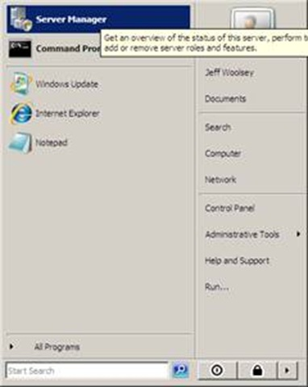
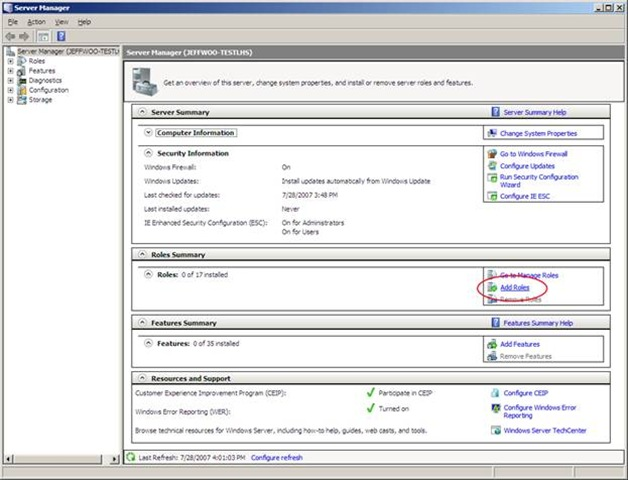
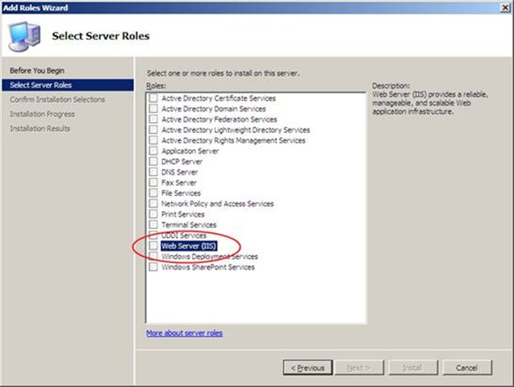
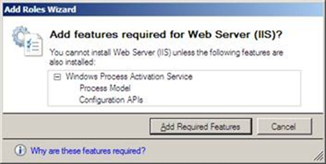
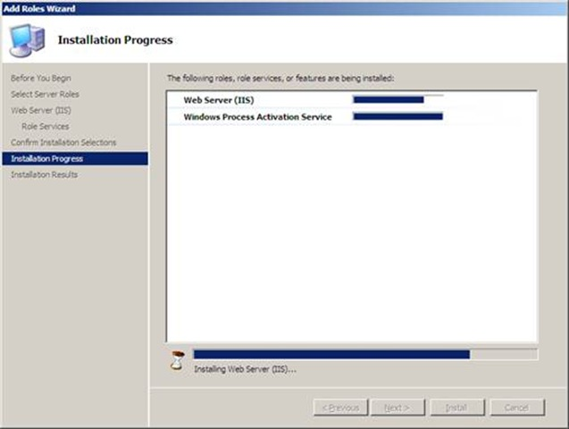
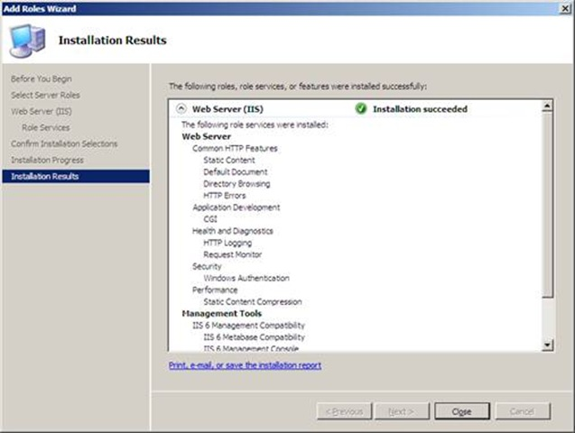
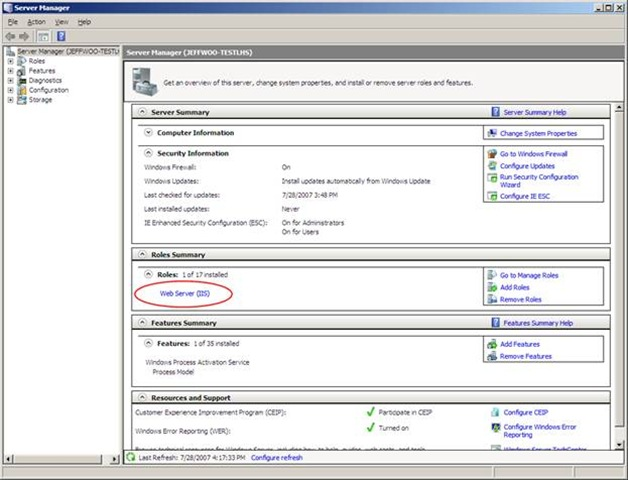

# Installing Virtual Server R2 SP1 on Windows Server 2008 Beta 3

Virtualization Nation,

If you’re trying to run Virtual Server R2 SP1 on Window Server 2008 Beta 3, it does work. However, there are three steps for success.

You need to:

1. Add the IIS role with the correct settings for Virtual Server.
2. Install Virtual Server R2 SP1.
3. Run IE elevated as an Administrator to access the Virtual Server Administration Page. To run IE elevated, right click on IE and select **Run as Administrator**. (BTW: If you don’t do this, IE will quit with an error. This is a known issue and a fix is being investigated.)

Since the first step, adding the IIS role, requires specific settings to be enabled, I thought I’d cover this first step in detail. The second and third steps are straightforward and require nothing special.  So, below I’ve provided step-by-step instructions for configuring IIS, the correct settings and included screen shots.

These installation instructions are for running Virtual Server R2 SP1 on a full installation of Windows Server 2008 Beta 3, not a server core installation. I'll cover that in a future blog.

Cheers,  
Jeff

-------- CONFIGURING IIS IN WINDOWS SERVER 2008 FOR VIRTUAL SERVER BELOW ---------------------------------

To Enable IIS and the right settings here are the steps you need to take.

1. Go to the **Start** Menu and select **Server Manager.**
  

1. Under **Roles Summary **click **Add Roles.**  
  

1. You will now be presented with the Select Server Roles screen. Select **Web Server (IIS).**
  

1. Click **Next**
1. A dialog will be displayed telling you that IIS has dependencies that need to be installed as well. Click **Add Required Features.**
  

1. You will now see a screen called **Select Role Services** where you can select which IIS services you want enabled. Here are the required IIS services for Virtual Server.

    Under **Common Http Features** enable:
    * Static Content
    * Default Document
    * Directory Browsing
    * HTTP Errors

    Under **Application Development Features** enable:
    * CGI

    Under **Health and Diagnostics** enable:
    * HTTP Logging
    * Request Monitor

    Under **Security** enable:
    * Windows Authentication

    Under **Performance Features** enable:
    * Static Content Compression

    Under **Management Tools** enable:
    * IIS 6 Management Console
    * IIS 6 Management Compatibility
    * IIS 6 Metabase Compatibility

1. Once you’ve enabled all of the settings above, click **Next.**

1. You’ll be presented with the confirmation screen. Click **Install** and the installation will begin.
  

1. After about a minute, the role has been added and you’ll see that the installation was successful. You can click **Close.**
  

1. After closing the last window you’ll now see that the Web Server (IIS) appears in the Roles Summary.
  

[Original post](https://blogs.technet.microsoft.com/virtualization/2007/07/31/installing-virtual-server-r2-sp1-on-windows-server-2008-beta-3/)