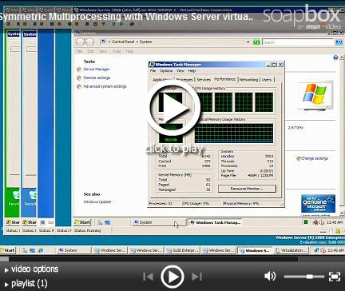
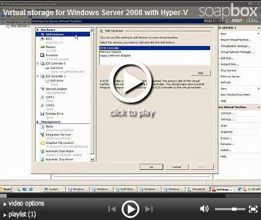
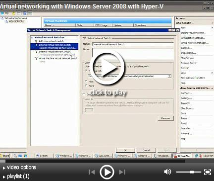

# Happy holidays! Windows Server 2008 RC1 with hyper-v beta now available

Greetings!  Jeff Woolsey here from the virtualization team.

We have some big news today! We just released the Windows Hyper-V BETA! The Hyper-V beta is a _major_ step forward from the Preview release we provided just a couple of months ago.

This beta is publicly available and you can download it [here](https://www.microsoft.com/downloads/details.aspx?FamilyId=8F22F69E-D1AF-49F0-8236-2B742B354919&displaylang=en).

Some of the new features added since the Windows Hyper-V CTP include:

1. Quick Migration and high availability providing solutions for planned and unplanned downtime
2. Support for running Hyper-V with Server Core in the parent partition
3. Import/Export of virtual machines
4. Hyper-V now integrated with Windows Server Manager
5. Integration components are now included in Windows Server 2008 meaning that when you install Windows Server 2008 in a Hyper-V virtual machine, Windows will _automatically_ install the ICs
6. VHD Tools support (compaction, expansion and inspection)
7. Emulated video card has changed from an S3 Trio video card to a more generic VESA compatible device. (This change resolves numerous video issues with non-Windows operating systems like Linux)
8. Support for up to four virtual SCSI controllers per virtual machine
9. Numerous fixes for compatibility, performance and scalability
10. ...and lots more that I'll cover in upcoming blogs

In short, you want to start evaluating Windows Server 2008 Hyper-V today!

The last thing I want point out are a couple of Hyper-V videos that demonstrate just some of Hyper-V's built-in SMP, networking and storage capabilities. Cheers!

Windows Hyper-V SMP Virtual Machines

Windows Hyper-V Virtual Storage

Windows Hyper-V Networking

[Original post](https://blogs.technet.microsoft.com/virtualization/2007/12/13/happy-holidays-windows-server-2008-rc1-with-hyper-v-beta-now-available/)