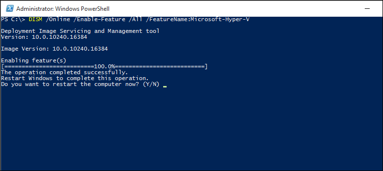

# Install Hyper-V on Windows 10

Enable Hyper-V to create virtual machines on Windows 10.  
Hyper-V can be enabled in many ways including using the Windows 10 control panel, PowerShell (my favorite) or using the Deployment Imaging Servicing and Management tool (DISM). This documents walks through each option.

> **Note:**  Hyper-V is built into Windows as an optional feature -- there is no Hyper-V download or installable component. 

## Check Requirements

* Windows 10 Enterprise, Professional, or Education
* 64-bit Processor with Second Level Address Translation (SLAT).
* CPU support for VM Monitor Mode Extension (VT-c on Intel CPU's).
* Minimum of 4 GB memory.

The Hyper-V role **cannot** be installed on Windows 10 Home.  
Upgrade from Windows 10 Home edition to Windows 10 Professional by opening up **Settings** > **Update and Security** > **Activation**.

For more information and troubleshooting, see [Windows 10 Hyper-V System Requirements](../reference/hyper-v-requirements.md).


## Install Hyper-V 
Hyper-V is built into Windows as an optional feature -- there is no Hyper-V download or installable component.  There are several ways to enable the built-in Hyper-V role.

### Enable Hyper-V using PowerShell

1. Open a PowerShell console as Administrator.

2. Run the following command:
  ```powershell
  Enable-WindowsOptionalFeature -Online -FeatureName Microsoft-Hyper-V -All
  ```  

  If the command couldn't be found, make sure you're running PowerShell as Administrator.  

When the installation has completed you need to reboot the computer.  

### Enable Hyper-V with CMD and DISM

The Deployment Image Servicing and Management tool (DISM) helps configure Windows and Windows images.  Among its many applications, DISM can enable Windows features while the operating system is running.  

To enable the Hyper-V role using DISM:
1. Open up a PowerShell or CMD session as Administrator.

2. Type the following command:  
  ```powershell
  DISM /Online /Enable-Feature /All /FeatureName:Microsoft-Hyper-V
  ```  
  

For more information about DISM, see the [DISM Technical Reference](https://technet.microsoft.com/en-us/library/hh824821.aspx).

### Manually enable the Hyper-V role

1. Right click on the Windows button and select ‘Programs and Features’.

2. Select **Turn Windows Features on or off**.

3. Select **Hyper-V** and click **OK**.  


When the installation has completed you are prompted to restart your computer.


## Next Step - Set up a network
[Connect to the internet](connect-to-network.md)
