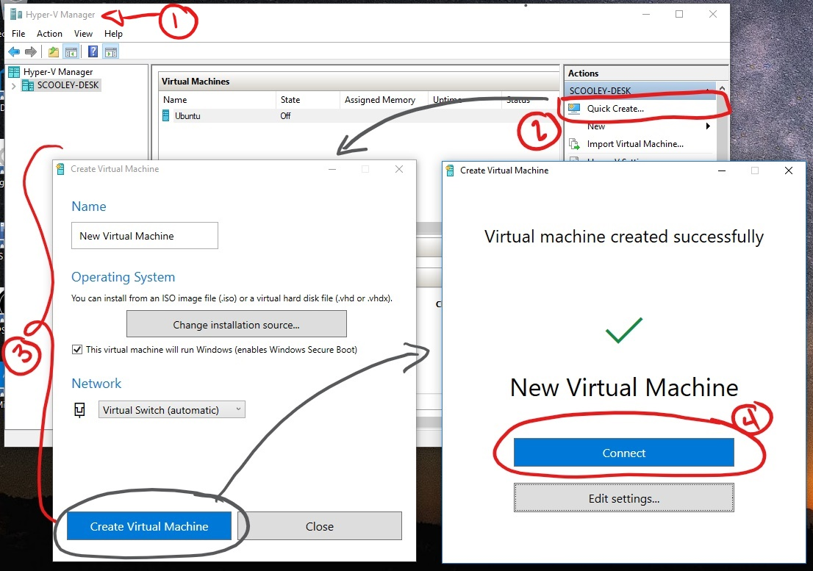

# Create a Virtual Machine with Hyper-V

Create a virtual machine and install its operating system.

We've been building new tools for creating virtual machines so the instructions have changed signifigantly over the past three releases.

Pick your operating system for the right set of instructions:

* [Windows 10 Fall Creators Update and later](quick-create-virtual-machine.md#windows-10-fall-creators-update)
* [Windows 10 Creators Update](quick-create-virtual-machine.md#windows-10-creators-update)
* [Windows 10 Aniversary Update and earlier](quick-create-virtual-machine.md#before-windows-10-creators-update)

Let's get started.

## Windows 10 Fall Creators Update

In Fall Creators Update, Quick Create expanded to include a virtual machine gallery that can be launched independently from Hyper-V Manager.

To create a new virtual machine in Fall Creators Update:

1. Open Hyper-V Quick Create from the start menu.
1. Select an operating system or choose your own by using a local installation source.
1. Select "Create Virtual Machine"

That's it!  Quick Create will take care of the rest.

## Windows 10 Creators Update

1. Open Hyper-V Manager from the start menu.

1. In Hyper-V Manager, Find **Quick Create** in the right hand **Actions** menu.

1. Customize your virtual machine.

    * (optional) Give the virtual machine a name.
    * Select the installation media for the virtual machine. You can install from a .iso or .vhdx file.
    If you are installing Windows in the virtual machine, you can enable Windows Secure Boot. Otherwise leave it unselected.
    * Set up network.
    If you have an existing virtual switch, you can select in the network dropdown. If you have no existing switch, you will see a button to set up an automatic network, which will automatically configure a virtual network.

1. Click **Connect** to start your virtual machine. Don't worry about editing the settings, you can go back and change them any time.

    You may be prompted to ‘Press any key to boot from CD or DVD’. Go ahead and do so.  As far as it knows, you're installing from a CD.

Congratulations, you have a new virtual machine.  Now you're ready to install the operating system.

Your virtual machine should look something like this:

> **Note:** Unless you're running a volume-licensed version of Windows, you need a separate license for Windows running inside a virtual machine. The virtual machine's operating system is independent of the host operating system.

## Before Windows 10 Creators Update

If you aren't running Windows 10 Creators Update or later, follow these instructions using New Virtual Machine Wizard instead:

1. [Create a virtual network](connect-to-network.md)
1. [Create a new virtual machine](create-virtual-machine.md)
