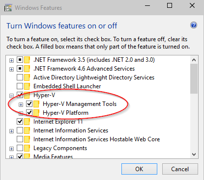

# Windows 11 Hyper-V system requirements

Hyper-V is available in 64-bit version of Windows 11 Pro and Enterprise. Hyper-V requires Second Level Address Translation (SLAT) -- present in the current generation of 64-bit processors by Intel and AMD.

You can run 3 or 4 basic virtual machines on a host that has 4GB of RAM, though you'll need more resources for more virtual machines. On the other end of the spectrum, you can also create large virtual machines with 32 processors and 512GB RAM, depending on your physical hardware.

## Operating System Requirements

The Hyper-V role can be enabled on these versions of Windows 11:

- Windows 11 Enterprise
- Windows 11 Pro

## Hardware Requirements

Although this document does not provide a complete list of Hyper-V compatible hardware, the following items are necessary:

- 64-bit Processor with Second Level Address Translation (SLAT).
- CPU support for VM Monitor Mode Extension (VT-x on Intel CPU's).
- Minimum of 4 GB memory. As virtual machines share memory with the Hyper-V host, you will need to provide enough memory to handle the expected virtual workload.

The following items will need to be enabled in the system BIOS:

- Virtualization Technology - may have a different label depending on motherboard manufacturer.
- Hardware Enforced Data Execution Prevention.

## Verify Hardware Compatibility

After checking the operating system and hardware requirements above, verify hardware compatibility in Windows by opening a PowerShell session or a command prompt (cmd.exe) window, typing **systeminfo**, and then checking the Hyper-V Requirements section. If all listed Hyper-V requirements have a value of **Yes**, your system can run the Hyper-V role. If any item returns **No**, check the requirements listed in this document and make adjustments where possible.


## Final Check

If all OS, hardware and compatibility requirements are met then you will see **Hyper-V** in **Control Panel: Turn Windows features on or off** and it will have 2 options.

1. Hyper-V platform
1. Hyper-V Management Tools



> [!NOTE]
> If you see **Windows Hypervisor Platform** instead of **Hyper-V** in **Control Panel: Turn Windows features on or >off** your system may not be compatible for Hyper-V, then cross check above requirements.
>If you run **systeminfo** on an existing Hyper-V host, the Hyper-V Requirements section reads:
>```
>Hyper-V Requirements: A hypervisor has been detected. Features required for Hyper-V will not be displayed.
>```
