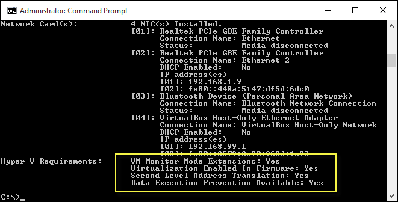

# Windows 10 Hyper-V System Requirements

Hyper-V is available in 64-bit version of Windows 10 Pro, Enterprise, and Education. Hyper-V requires Second Level Address Translation (SLAT) -- present in the current generation of 64-bit processors by Intel and AMD.

You can run 3 or 4 basic virtual machines on a host that has 4GB of RAM, though you'll need more resources for more virtual machines. On the other end of the spectrum, you can also create large virtual machines with 32 processors and 512GB RAM, depending on your physical hardware.

## Operating System Requirements

The Hyper-V role can be enabled on these versions of Windows 10:

- Windows 10 Enterprise
- Windows 10 Pro
- Windows 10 Education

The Hyper-V role **cannot** be installed on:

- Windows 10 Home
- Windows 10 Mobile
- Windows 10 Mobile Enterprise

>Windows 10 Home edition can be upgraded to Windows 10 Pro. To do so open up **Settings** > **Update and Security** > **Activation**. Here you can visit the store and purchase an upgrade.

## Hardware Requirements

Although this document does not provide a complete list of Hyper-V compatible hardware, the following items are necessary:
	
- 64-bit Processor with Second Level Address Translation (SLAT).
- CPU support for VM Monitor Mode Extension (VT-c on Intel CPU's).
- Minimum of 4 GB memory. As virtual machines share memory with the Hyper-V host, you will need to provide enough memory to handle the expected virtual workload.

The following items will need to be enabled in the system BIOS:
- Virtualization Technology - may have a different label depending on motherboard manufacturer.
- Hardware Enforced Data Execution Prevention.

## Verify Hardware Compatibility

To verify compatibility, open up PowerShell or a command prompt (cmd.exe) and type **systeminfo**. If all listed Hyper-V requirements have a value of **Yes**, your system can run the Hyper-V role. If any item returns **No**, check the requirements listed in this document and make adjustments where possible.



If you run **systeminfo** on an existing Hyper-V host, the Hyper-V Requirements section reads:

```
Hyper-V Requirements: A hypervisor has been detected. Features required for Hyper-V will not be displayed.
```
