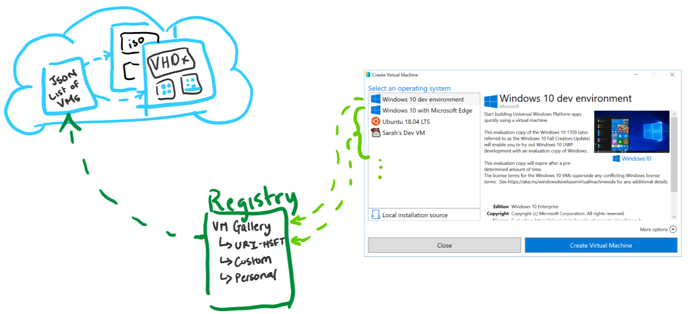
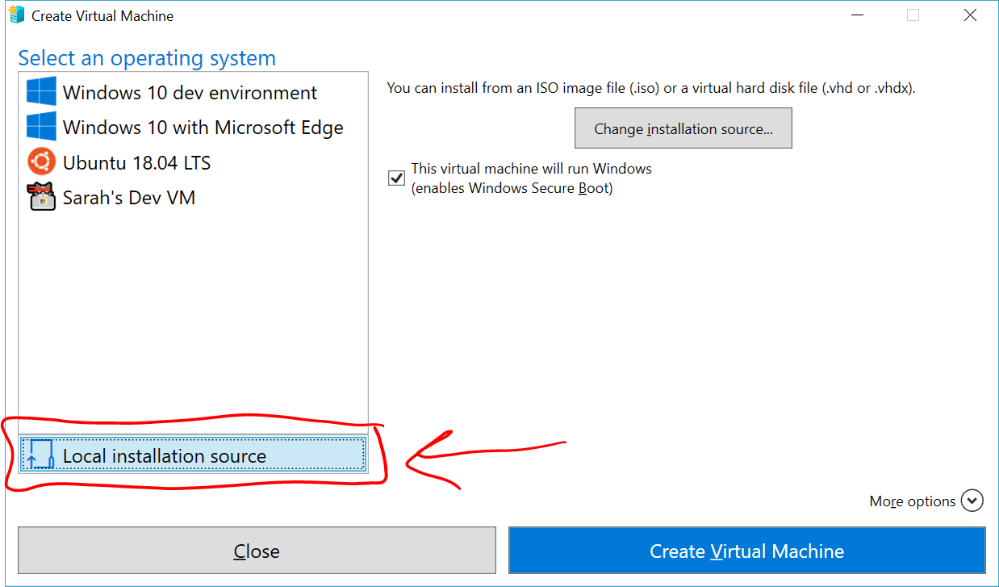
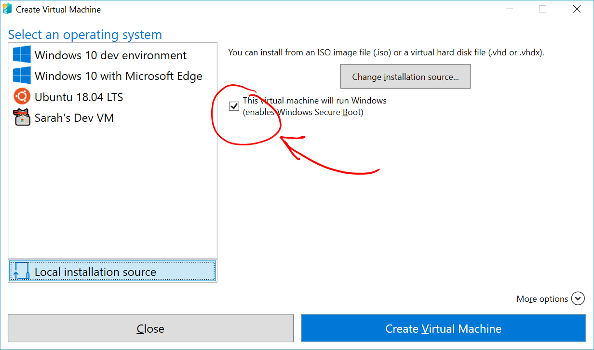
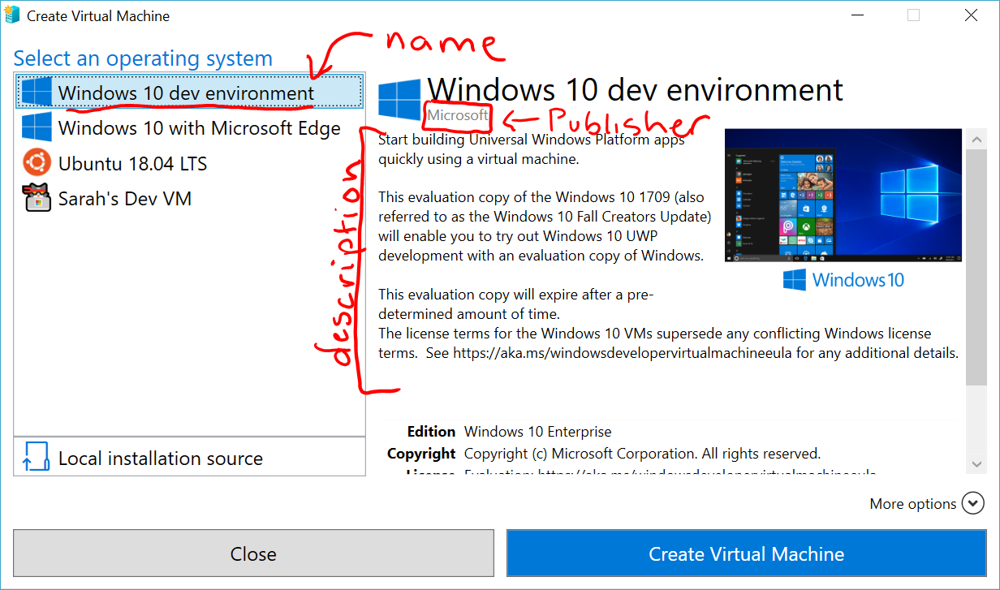
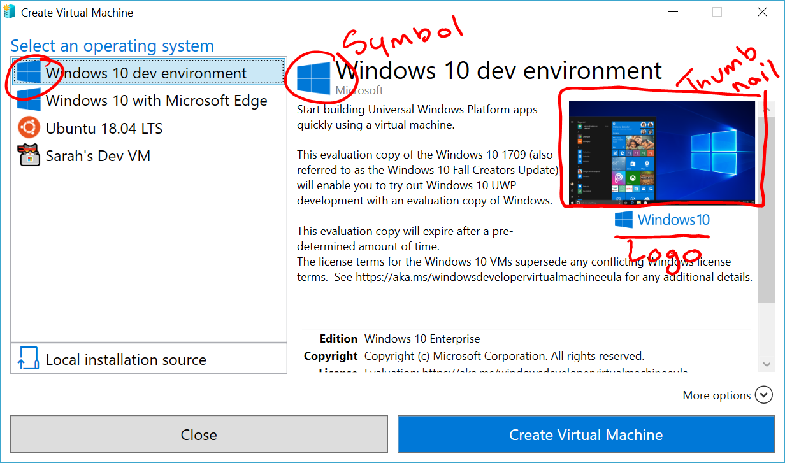
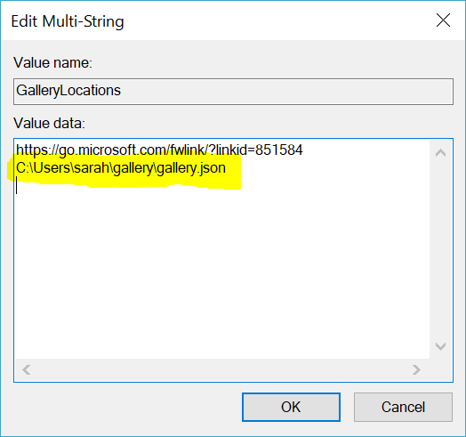

# Create a custom virtual machine gallery

> Windows 10 Fall Creators Update and later.

In Fall Creators Update, Quick Create expanded to include a virtual machine gallery.


While there are a set of images provided by Microsoft and Microsoft partners, the gallery can also list your own images.

This article details:

* building virtual machines that are compatible with the gallery.
* creating a new gallery source.
* adding your custom gallery source to the gallery.

## Gallery architecture

The virtual machine gallery is a graphical view for a set of virtual machine sources defined in the Windows registry.  Each virtual machine source is a path (local path or URI) to a JSON file with virtual machines as list items.

The list of virtual machines you see in the gallery is the full contents of the first source, followed by the contents of the second source, so on and so forth until all of the available virtual machines have been listed.  The list is dynamically created every time you launch the gallery.



Registry Key: `Computer\HKEY_LOCAL_MACHINE\SOFTWARE\Microsoft\Windows NT\CurrentVersion\Virtualization`

Value Name: `GalleryLocations`

Type: `REG_MULTI_SZ`

## Create gallery-compatible virtual machines

Virtual machines in the gallery can be either a disk image (.iso) or virtual hard drive (.vhdx).

Virtual machines made from a virtual hard drive have a few configuration requirements:

1. Built to support UEFI firmware. If they're created using Hyper-V, that's a Generation 2 VM.
1. The virtual hard drive should be at least 20GB - keep in mind, that's the max size.  Hyper-V will not take space the VM isn't actively using.

### Testing a new VM image

The virtual machine gallery creates virtual machines using the same mechanism as installing from a local installation source.

To validate a virtual machine image will boot and run:

1. Open the VM Gallery (Hyper-V Quick Create) and select **Local Installation Source**.
  
1. Select **Change Installation Source**.
  
1. Pick the .iso or .vhdx that will be used in the gallery.
1. If the image is a Linux image, deselect the Secure Boot option.
  
1. Create Virtual Machine.  If the virtual machine boots correctly, it's ready for the gallery.

## Build a new gallery source

The next step is to create a new gallery source.  This is the JSON file that lists your virtual machines and adds all of the extra information you see in the gallery.

Text infomation:



* **name** - required - this is the name that appears in the left column and also at the top of the virtual machine view.
* **publisher** - required
* **description** - required - List of strings that describe the VM.
* **version** - required
* lastUpdated - defaults to Monday, January 1, 0001.

  The format should be: yyyy-mm-ddThh:mm:ssZ

  The following PowerShell command will provide today's date in the proper format and put it on the clipboard:

  ``` PowerShell
  Get-Date -UFormat "%Y-%m-%dT%TZ" | clip.exe
  ```

* locale - defaults to blank.

Pictures:



* **logo** - required
* symbol
* thumbnail

And, of course, your virtual machine (.iso or .vhdx).

The below JSON template has starter items and the gallery's schema.  If you edit it in VSCode, it will automatically provide intellisense.

[!code-json[main](../../../hyperv-tools/vmgallery/vm-gallery-template.json)]

## Connect your gallery to the VM Gallery UI

The easiest way to add your custom gallery source to the VM Gallery is to add it in regedit.

1. Open **regedit.exe**
1. Navigate to `Computer\HKEY_LOCAL_MACHINE\SOFTWARE\Microsoft\Windows NT\CurrentVersion\Virtualization\`
1. Look for the `GalleryLocations` item.

    If it already exists, go to the **Edit** menu and **modify**.

    If it doesn't already exist, go to the **Edit** menu, navigate through **New** to **Multi-String Value**

1. Add your gallery to the `GalleryLocations` registry key.

    

## Troubleshooting

### Check for errors loading Gallery

The virtual machine gallery does provide error reporting in the Windows Event Viewer.  To check for errors:

1. Open Event Viewer
1. Navigate to **Windows Logs** -> **Application**
1. Look for events from Source VMCreate.

## Resources

There are a handfull of gallery scripts and helpers in github [link]().

See a sample gallery entry [here]().  This is the JSON file that defines the in-box gallery.