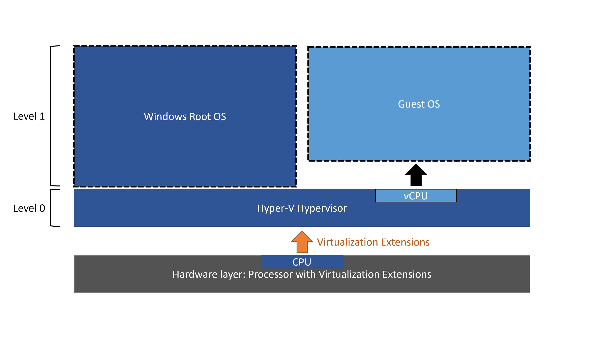
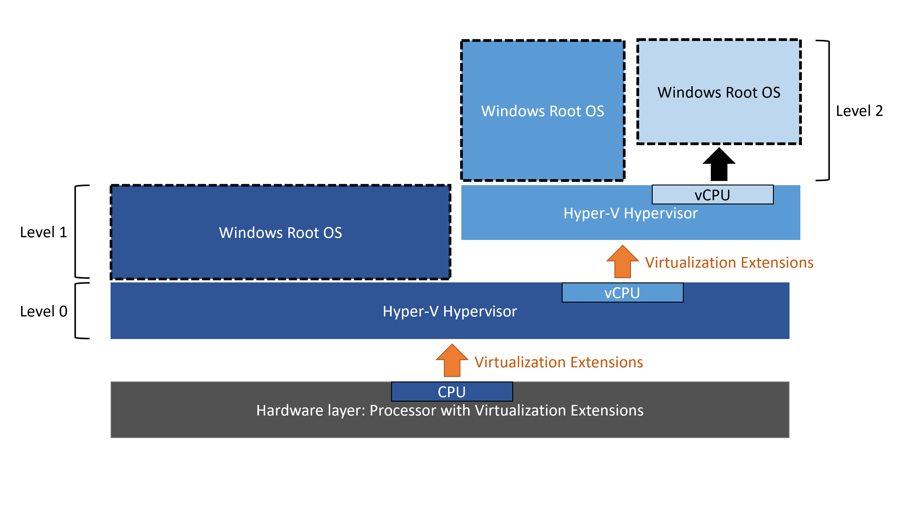

# Run Hyper-V in a Virtual Machine with Nested Virtualization

Nested virtualization is a feature that allows you to run Hyper-V inside of a Hyper-V virtual machine (VM). This is helpful for running a Visual Studio phone emulator in a virtual machine, or testing configurations that ordinarily require several hosts.

>[!NOTE]
> Nested Virtualization is supported both Azure and on-premises. However, if using a non-Microsoft hypervisor such as KVM, Microsoft can not provide end-to-end support please ensure your vendor supports this scenario.


## Prerequisites

### Intel processor with VT-x and EPT technology
* The Hyper-V host must be Windows Server 2016/Windows 10 or greater
* VM configuration version 8.0 or greater

### AMD EPYC/Ryzen processor or later
* The Hyper-V host must be Windows Server 2022/Windows 11 or greater
* VM configuration version 10.0 or greater

>[!NOTE]
> The guest can be any Windows supported guest operating system. Newer Windows operating systems may support enlightenments that improve performance.


## Configure Nested Virtualization

1. Create a virtual machine. See the prerequisites above for the required OS and VM versions.
2. While the virtual machine is in the OFF state, run the following command on the physical Hyper-V host. This enables nested virtualization for the virtual machine.

```
Set-VMProcessor -VMName <VMName> -ExposeVirtualizationExtensions $true
```
3. Start the virtual machine.
4. Install Hyper-V within the virtual machine, just like you would for a physical server. For more information on installing Hyper-V see, [Install Hyper-V](../quick-start/enable-hyper-v.md).

## Disable Nested Virtualization
You can disable nested virtualization for a stopped virtual machine using the following PowerShell command:
```
Set-VMProcessor -VMName <VMName> -ExposeVirtualizationExtensions $false
```

## Dynamic Memory and Runtime Memory Resize
When Hyper-V is running inside a virtual machine, the virtual machine must be turned off to adjust its memory. This means that even if dynamic memory is enabled, the amount of memory will not fluctuate. For virtual machines without dynamic memory enabled, any attempt to adjust the amount of memory while it's on will fail. 

Note that simply enabling nested virtualization will have no effect on dynamic memory or runtime memory resize. The incompatibility only occurs while Hyper-V is running in the VM.

## Networking Options

There are two options for networking with nested virtual machines: 

1. MAC address spoofing
2. NAT networking

### MAC Address Spoofing
In order for network packets to be routed through two virtual switches, MAC address spoofing must be enabled on the first (L1) level of virtual switch. This is completed with the following PowerShell command.

``` PowerShell
Get-VMNetworkAdapter -VMName <VMName> | Set-VMNetworkAdapter -MacAddressSpoofing On
```

### Network Address Translation (NAT)
The second option relies on network address translation (NAT). This approach is best suited for cases where MAC address spoofing is not possible, like in a public cloud environment.

First, a virtual NAT switch must be created in the host virtual machine (the "middle" VM). Note that the IP addresses are just an example, and will vary across environments:

``` PowerShell
New-VMSwitch -Name VmNAT -SwitchType Internal
New-NetNat –Name LocalNAT –InternalIPInterfaceAddressPrefix “192.168.100.0/24”
```

Next, assign an IP address to the net adapter:

``` PowerShell
Get-NetAdapter "vEthernet (VmNat)" | New-NetIPAddress -IPAddress 192.168.100.1 -AddressFamily IPv4 -PrefixLength 24
```

Each nested virtual machine must have an IP address and gateway assigned to it. Note that the gateway IP must point to the NAT adapter from the previous step. You may also want to assign a DNS server:

``` PowerShell
Get-NetAdapter "vEthernet (VmNat)" | New-NetIPAddress -IPAddress 192.168.100.2 -DefaultGateway 192.168.100.1 -AddressFamily IPv4 -PrefixLength 24
Netsh interface ip add dnsserver “vEthernet (VmNat)” address=<my DNS server>
```

## How nested virtualization works

Modern processors include hardware features that make virtualization faster and more secure. Hyper-V relies on these processor extensions to run virtual machines (e.g. Intel VT-x and AMD-V). Typically, once Hyper-V starts, it prevents other software from using these processor capabilities.  This prevents guest virtual machines from running Hyper-V.

Nested virtualization makes this hardware support available to guest virtual machines.

The diagram below shows Hyper-V without nesting.  The Hyper-V hypervisor takes full control of the hardware virtualization capabilities (orange arrow), and does not expose them to the guest operating system.



In contrast, the diagram below shows Hyper-V with nested virtualization enabled. In this case, Hyper-V exposes the hardware virtualization extensions to its virtual machines. With nesting enabled, a guest virtual machine can install its own hypervisor and run its own guest VMs.



## 3rd Party Virtualization Apps

Virtualization applications other than Hyper-V are not supported in Hyper-V virtual machines, and are likely to fail. This includes any software that requires hardware virtualization extensions.

Third party hypervisors such as [Proxmox VE](https://pve.proxmox.com/wiki/Install_Proxmox_VE_on_Debian_11_Bullseye) built on [Azure Debian](https://wiki.debian.org/Cloud/MicrosoftAzure) run with minimal issues (tested on [Proxmox VE 7.3](https://pve.proxmox.com/wiki/Roadmap#Proxmox_VE_7.3)), however [QEMU/KVM](https://pve.proxmox.com/wiki/Qemu/KVM_Virtual_Machines) guest VM's within the nested hypervisor have been seen to have stability issues when using virtio storage drivers. The Default (LSI 53C895A) SCSI controller is a suitable alternative.
