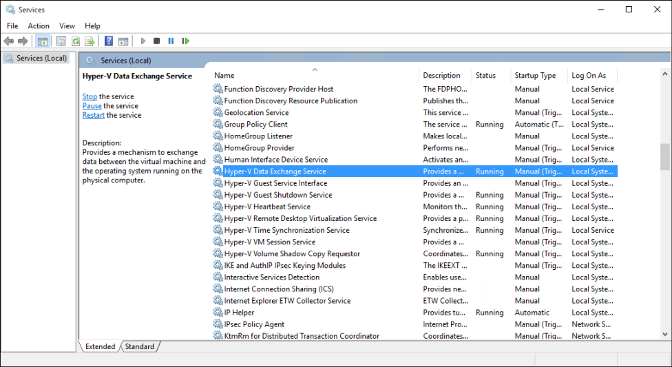

# Managing Hyper-V Integration Services

Integration services (often called integration components), are services that allow the virtual machine to communicate with the Hyper-V host. Many of these services are conveniences (such as guest file copy), while others can be quite important to the virtual machine's ability to function correctly (time synchronization).

This article will detail how to manage integration services using both Hyper-V manager and PowerShell in Windows 10.  

For more information on each individual integration service, see [Integration Services](../reference/integration-services.md).

## Enable or Disable Integration Services using Hyper-V Manager

1. Select a virtual machine and open settings.
  
2. From the virtual machine settings window, go to the Integration Services tab under Management.
  
  Here you can see all integration services available on this Hyper-V host.  It's worth noting that the guest operating system may or may not support all of the integration services listed. To determine the version information for a guest operating system, log on to the guest operating system and run the following command from command prompt.

REG QUERY "HKLM\Software\Microsoft\Virtual Machine\Auto" /v IntegrationServicesVersion

## Enable or Disable Integration Services Using PowerShell

Integration services can also be enabled and disabled with PowerShell by running [`Enable-VMIntegrationService`](https://technet.microsoft.com/en-us/library/hh848500.aspx) and [`Disable-VMIntegrationService`](https://technet.microsoft.com/en-us/library/hh848488.aspx).

In this example, we'll enable and then disable the guest file copy integration service on the "demovm" virtual machine seen above.

1. See what integration services are running
  
  ``` PowerShell
  Get-VMIntegrationService -VMName "DemoVM"
  ```

  The output will look like this:  
  ``` PowerShell
  VMName      Name                    Enabled PrimaryStatusDescription SecondaryStatusDescription
  ------      ----                    ------- ------------------------ --------------------------
  DemoVM      Guest Service Interface False   OK
  DemoVM      Heartbeat               True    OK                       OK
  DemoVM      Key-Value Pair Exchange True    OK
  DemoVM      Shutdown                True    OK
  DemoVM      Time Synchronization    True    OK
  DemoVM      VSS                     True    OK
  ```

2. Enable the `Guest Service Interface` integration service

   ``` PowerShell
   Enable-VMIntegrationService -VMName "DemoVM" -Name "Guest Service Interface"
   ```
   
   If you run `Get-VMIntegrationService -VMName "DemoVM"` you will see that the Guest Service Interface integration service is enabled.
 
3. Disable the `Guest Service Interface` integration service

   ``` PowerShell
   Disable-VMIntegrationService -VMName "DemoVM" -Name "Guest Service Interface"
   ```
   
Integration services were designed such that they need to be enabled in both the host and the guest in order to function.  While all integration services are enabled by default on Windows guest operating systems, they can be disabled.  See how in the next section.


## Manage Integration Services from Guest OS (Windows)

> **Note:** disabling integration services may severely affect the hosts ability to manage your virtual machine.  Integration services must be enabled on both the host and guest to operate.

Integration services appear as services in Windows. To enable or disable an integration services from inside the virtual machine, open the Windows Services manager.

 

Find the services containing Hyper-V in the name. Right click on the service you'd like to enable or disable and start or stop the service.

Alternately, to see all integration services with PowerShell, run:

```PowerShell
Get-Service -Name vm*
```

that will return a list that looks something like this:

```PowerShell
Status   Name               DisplayName
------   ----               -----------
Running  vmicguestinterface Hyper-V Guest Service Interface
Running  vmicheartbeat      Hyper-V Heartbeat Service
Running  vmickvpexchange    Hyper-V Data Exchange Service
Running  vmicrdv            Hyper-V Remote Desktop Virtualizati...
Running  vmicshutdown       Hyper-V Guest Shutdown Service
Running  vmictimesync       Hyper-V Time Synchronization Service
Stopped  vmicvmsession      Hyper-V VM Session Service
Running  vmicvss            Hyper-V Volume Shadow Copy Requestor
```

Start or stop services using [`Start-Service`](https://technet.microsoft.com/en-us/library/hh849825.aspx) or [`Stop-Service`](https://technet.microsoft.com/en-us/library/hh849790.aspx).

For example, to disable PowerShell Direct you can run `Stop-Service -Name vmicvmsession`.

By default, all integration services are enabled in the guest operation system.

## Manage Integration Services from Guest OS (Linux)

Linux integration services are generally provided through the Linux kernel.

Check to see if the integration service driver and daemons are running by running the following commands in your Linux guest operating system.

1. The Linux integration services driver is called `hv_utils'.  Run the following to see if it is loaded.

  ``` BASH
  lsmod | grep hv_utils
  ``` 
  
  The output should look about like this:  
  
  ``` BASH
  Module                  Size   Used by
  hv_utils               20480   0
  hv_vmbus               61440   8 hv_balloon,hyperv_keyboard,hv_netvsc,hid_hyperv,hv_utils,hyperv_fb,hv_storvsc
  ```

2. Run the following command in your Linux guest operating system to see if the required daemons are running.
  
  ``` BASH
  ps -ef | grep hv
  ```
  
  The output should look about like this:  
  
  ``` BASH
  root       236     2  0 Jul11 ?        00:00:00 [hv_vmbus_con]
  root       237     2  0 Jul11 ?        00:00:00 [hv_vmbus_ctl]
  ...
  root       252     2  0 Jul11 ?        00:00:00 [hv_vmbus_ctl]
  root      1286     1  0 Jul11 ?        00:01:11 /usr/lib/linux-tools/3.13.0-32-generic/hv_kvp_daemon
  root      9333     1  0 Oct12 ?        00:00:00 /usr/lib/linux-tools/3.13.0-32-generic/hv_kvp_daemon
  root      9365     1  0 Oct12 ?        00:00:00 /usr/lib/linux-tools/3.13.0-32-generic/hv_vss_daemon
  scooley  43774 43755  0 21:20 pts/0    00:00:00 grep --color=auto hv          
  ```
  
  To see what daemons are available, run:
  ``` BASH
  compgen -c hv_
  ```
  
  The output should look about like this:
  
  ``` BASH
  hv_vss_daemon
  hv_get_dhcp_info
  hv_get_dns_info
  hv_set_ifconfig
  hv_kvp_daemon
  hv_fcopy_daemon     
  ```
  
  Integration service daemons you may see:  
  * **`hv_vss_daemon`** – This daemon is required to create live Linux virtual machine backups.
  * **`hv_kvp_daemon`** – This daemon allows setting and querying intrinsic and extrinsic key value pairs.
  * **`hv_fcopy_daemon`** – This daemon implements a file copying service between the host and guest.

> **Note:** if the above integration services daemons are not available, they may not be supported on your system or they may not be installed.  Find more disto specific information [here](https://technet.microsoft.com/en-us/library/dn531030.aspx).  

In this example, we'll stop and start the KVP daemon `hv_kvp_daemon`.

Stop the daemon's process using the pid (process ID) located in the second column of the above output.  Alternately, you can find the right process using `pidof`.  Since Hyper-V daemons run as root, you do need root permissions.

``` BASH
sudo kill -15 `pidof hv_kvp_daemon`
```

Now if you run `ps -ef | hv` again, you'll discover all `hv_kvp_daemon` process are gone.

To start the daemon again, run the daemon as root.

``` BASH
sudo hv_kvp_daemon
``` 

Now if you run `ps -ef | hv` again, you'll discover a `hv_kvp_daemon` process with a new process ID.


## Integration service maintenance

Integration service maintainance in Windows 10 happens by default so long as your virtual machines can recieve important updates from Windows Update.  

Keeping integration services current provides the best virtual machine performance and features possible.

**For virtual machines running on Windows 10 hosts:**

> **Note:** The ISO image file vmguest.iso is no longer needed for updating integration components. It's not included with Hyper-V on Windows 10.

| Guest OS | Update mechanism | Notes |
|:---------|:---------|:---------|
| Windows 10 | Windows Update | |
| Windows 8.1 | Windows Update | |
| Windows 8 | Windows Update | Requires the Data Exchange integration service.* |
| Windows 7 | Windows Update | Requires the Data Exchange integration service.* |
| Windows Vista (SP 2) | Windows Update | Requires the Data Exchange integration service.* |
| - | | |
| Windows Server 2012 R2 | Windows Update | |
| Windows Server 2012 | Windows Update | Requires the Data Exchange integration service.* |
| Windows Server 2008 R2 (SP 1) | Windows Update | Requires the Data Exchange integration service.* |
| Windows Server 2008 (SP 2) | Windows Update | Extended support only in Server 2016 ([read more](https://support.microsoft.com/en-us/lifecycle?p1=12925)). |
| Windows Home Server 2011 | Windows Update | Will not be supported in Server 2016 ([read more](https://support.microsoft.com/en-us/lifecycle?p1=15820)). |
| Windows Small Business Server 2011 | Windows Update | Not under mainstream support ([read more](https://support.microsoft.com/en-us/lifecycle?p1=15817)). |
| - | | |
| Linux guests | package manager | Integration components for Linux are built into the distro but there may be optional updates available. ******** |

>  \* If the Data Exchange integration service can not be enabled, the integration components for these guests are available [here](https://support.microsoft.com/en-us/kb/3071740) as a cabinet (cab) file on the download center.  
  Instructions for applying a cab are available  [here](http://blogs.technet.com/b/virtualization/archive/2015/07/24/integration-components-available-for-virtual-machines-not-connected-to-windows-update.aspx).


**For virtual machines running on Windows 8.1 hosts:**

| Guest OS | Update mechanism | Notes |
|:---------|:---------|:---------|
| Windows 10 | Windows Update | |
| Windows 8.1 | Windows Update | |
| Windows 8 | Integration Services disk | Instructions available  [here](https://technet.microsoft.com/en-us/library/hh846766.aspx#BKMK_step4). |
| Windows 7 | Integration Services disk | Instructions available  [here](https://technet.microsoft.com/en-us/library/hh846766.aspx#BKMK_step4). |
| Windows Vista (SP 2) | Integration Services disk | Instructions available  [here](https://technet.microsoft.com/en-us/library/hh846766.aspx#BKMK_step4). |
| Windows XP (SP 2, SP 3) | Integration Services disk | Instructions available  [here](https://technet.microsoft.com/en-us/library/hh846766.aspx#BKMK_step4). |
| - | | |
| Windows Server 2012 R2 | Windows Update | |
| Windows Server 2012 | Integration Services disk | Instructions available  [here](https://technet.microsoft.com/en-us/library/hh846766.aspx#BKMK_step4). |
| Windows Server 2008 R2 | Integration Services disk | Instructions available  [here](https://technet.microsoft.com/en-us/library/hh846766.aspx#BKMK_step4). |
| Windows Server 2008 (SP 2) | Integration Services disk | Instructions available  [here](https://technet.microsoft.com/en-us/library/hh846766.aspx#BKMK_step4). |
| Windows Home Server 2011 | Integration Services disk | Instructions available  [here](https://technet.microsoft.com/en-us/library/hh846766.aspx#BKMK_step4). |
| Windows Small Business Server 2011 | Integration Services disk | Instructions available  [here](https://technet.microsoft.com/en-us/library/hh846766.aspx#BKMK_step4). |
| Windows Server 2003 R2 (SP 2) | Integration Services disk | Instructions available  [here](https://technet.microsoft.com/en-us/library/hh846766.aspx#BKMK_step4). |
| Windows Server 2003 (SP 2) | Integration Services disk | Instructions available  [here](https://technet.microsoft.com/en-us/library/hh846766.aspx#BKMK_step4). |
| - | | |
| Linux guests | package manager | Integration components for Linux are built into the distro but there may be optional updates available. ** |


**For virtual machines running on Windows 8 hosts:**

| Guest OS | Update mechanism | Notes |
|:---------|:---------|:---------|
| Windows 8.1 | Windows Update | |
| Windows 8 | Integration Services disk | Instructions available  [here](https://technet.microsoft.com/en-us/library/hh846766.aspx#BKMK_step4). |
| Windows 7 | Integration Services disk | Instructions available  [here](https://technet.microsoft.com/en-us/library/hh846766.aspx#BKMK_step4). |
| Windows Vista (SP 2) | Integration Services disk | Instructions available  [here](https://technet.microsoft.com/en-us/library/hh846766.aspx#BKMK_step4). |
| Windows XP (SP 2, SP 3) | Integration Services disk | Instructions available  [here](https://technet.microsoft.com/en-us/library/hh846766.aspx#BKMK_step4). |
| - | | |
| Windows Server 2012 R2 | Windows Update | |
| Windows Server 2012 | Integration Services disk | Instructions available  [here](https://technet.microsoft.com/en-us/library/hh846766.aspx#BKMK_step4). |
| Windows Server 2008 R2 | Integration Services disk | Instructions available  [here](https://technet.microsoft.com/en-us/library/hh846766.aspx#BKMK_step4).|
| Windows Server 2008 (SP 2) | Integration Services disk | Instructions available  [here](https://technet.microsoft.com/en-us/library/hh846766.aspx#BKMK_step4). |
| Windows Home Server 2011 | Integration Services disk | Instructions available  [here](https://technet.microsoft.com/en-us/library/hh846766.aspx#BKMK_step4). |
| Windows Small Business Server 2011 | Integration Services disk | Instructions available  [here](https://technet.microsoft.com/en-us/library/hh846766.aspx#BKMK_step4). |
| Windows Server 2003 R2 (SP 2) | Integration Services disk | Instructions available  [here](https://technet.microsoft.com/en-us/library/hh846766.aspx#BKMK_step4). |
| Windows Server 2003 (SP 2) | Integration Services disk | Instructions available  [here](https://technet.microsoft.com/en-us/library/hh846766.aspx#BKMK_step4). |
| - | | |
| Linux guests | package manager | Integration components for Linux are built into the distro but there may be optional updates available. ** |

 > ** Find more information about Linux Guests [here](https://technet.microsoft.com/en-us/library/dn531030.aspx). 
