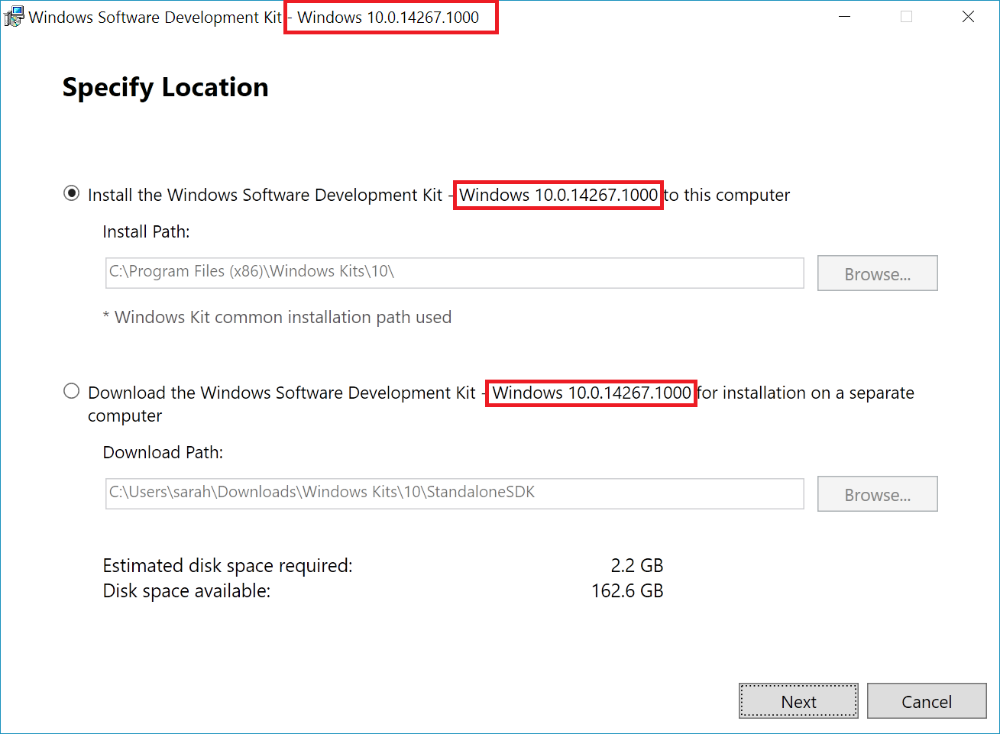

# Make your own integration services

Starting in Windows 10, anyone can make a service very similar to the in-box Hyper-V integration services using a new socket-based communication channel between the Hyper-V host and the virtual machines running on it.  Using these Hyper-V sockets, services can run independently of the networking stack and all data stays on the same physical memory.

This document walks through creating a simple application built on Hyper-V sockets and how to get started using them.

[PowerShell Direct](../user_guide/vmsession.md) is an example of an application (in this case an in-box Windows service) which uses Hyper-V sockets to communicate.

**Supported Host OS**
* Windows 10 build 14290 and beyond
* Windows Server Technical Preview 4 and later
* Future releases (Server 2016 +)

**Supported Guest OS**
* Windows 10
* Windows Server Technical Preview 4 and later
* Future releases (Server 2016 +)
* Linux guests with Linux Integration Services (see [Supported Linux and FreeBSD virtual machines for Hyper-V on Windows](https://technet.microsoft.com/library/dn531030(ws.12).aspx))

**Capabilities and Limitations**  
* Supports kernel mode or user mode actions  
* Data stream only  	
* No block memory (not the best for backup/video)   

--------------

## Getting started
Right now, Hyper-V sockets are available in native code (C/C++).  

To write a simple application, you'll need:
* C compiler.  If you don't have one, checkout [Visual Studio Community](https://aka.ms/vs)
* A computer running Hyper-V and a virtual machine.  
  * Host and guest (VM) OS must be Windows 10, Windows Server Technical Preview 3, or later.
* [Windows 10 SDK](http://aka.ms/flightingSDK) installed on the Hyper-V host

**Windows SDK Details**

Links to the Windows SDK:
* [Windows 10 SDK for insiders preview](http://aka.ms/flightingSDK)
* [Windows 10 SDK](https://dev.windows.com/en-us/downloads/windows-10-sdk)

The API for Hyper-V sockets became available in Windows 10 build 14290 -- the flighting download matches the latest insider fast track flighting build.  
If you experience strange bahavior, let us know in the [TechNet forum](https://social.technet.microsoft.com/Forums/windowsserver/en-US/home "TechNet Forums").  In your post, please include:
* The unexpected behavior 
* The OS and build numbers for the host, guest, and SDK.  
  
  The SDK build number is visible in the title of the SDK installer:  
  


## Register a new application
In order to use Hyper-V sockets, the application must be registered with the Hyper-V Host's registry.

By registering the service in the registry, you get:
*  WMI management for enable, disable, and listing available services
*  Permission to communicate with virtual machines directly

The following PowerShell will register a new application named "HV Socket Demo".  This must be run as administrator.  Manual instructions below.

``` PowerShell
$friendlyName = "HV Socket Demo"

# Create a new random GUID and add it to the services list then add the name as a value

$service = New-Item -Path "HKLM:\SOFTWARE\Microsoft\Windows NT\CurrentVersion\Virtualization\GuestCommunicationServices" -Name ((New-Guid).Guid)

$service.SetValue("ElementName", $friendlyName)

# Copy GUID to clipboard for later use
$service.PSChildName | clip.exe
```

** Registry location and information **  

``` 
HKEY_LOCAL_MACHINE\SOFTWARE\Microsoft\Windows NT\CurrentVersion\Virtualization\GuestCommunicationServices\
```  
In this registry location, you'll see several GUIDs.  Those are our in-box services.

Information in the registry per service:
* `Service GUID`   
    * `ElementName (REG_SZ)` -- this is the service's friendly name

To register your own service, create a new registry key using your own GUID and friendly name.

The friendly name will be associated with your new application.  It will appear in performance counters and other places where a GUID isn't appropriate.

The registry entry will look like this:
```
HKEY_LOCAL_MACHINE\SOFTWARE\Microsoft\Windows NT\CurrentVersion\Virtualization\GuestCommunicationServices\
    999E53D4-3D5C-4C3E-8779-BED06EC056E1\
	    ElementName	REG_SZ	VM Session Service
    YourGUID\
	    ElementName	REG_SZ	Your Service Friendly Name
```

> ** Tip: **  To generate a GUID in PowerShell and copy it to the clipboard, run:  
``` PowerShell
(New-Guid).Guid | clip.exe
```

## Creating a Hyper-V socket

In the most basic case, defining a socket requires an address family, connection type, and protocol.

Here is a simple [socket definition](
https://msdn.microsoft.com/en-us/library/windows/desktop/ms740506(v=vs.85).aspx
)

``` C
SOCKET WSAAPI socket(
  _In_ int af,
  _In_ int type,
  _In_ int protocol
);
``` 

For a Hyper-V socket:
* Address family - `AF_HYPERV`
* type - `SOCK_STREAM`
* protocol - `HV_PROTOCOL_RAW`


Here is an example declaration/instantiation:  
``` C
SOCKET sock = socket(AF_HYPERV, SOCK_STREAM, HV_PROTOCOL_RAW);
```


## Binding to a Hyper-V socket

Bind associates a socket with connection information.

The function definition is copied below for convinience, read more about bind [here](https://msdn.microsoft.com/en-us/library/windows/desktop/ms737550.aspx).

``` C
int bind(
  _In_ SOCKET                s,
  _In_ const struct sockaddr *name,
  _In_ int                   namelen
);
```

In contrast to the socket address (sockaddr) for a standard Internet Protocol address family (`AF_INET`) which consists of the host machine's IP address and a port number on that host, the socket address for `AF_HYPERV` uses the virtual machine's ID and the application ID defined above to establish a connection. 

Since Hyper-V sockets do not depend on a networking stack, TCP/IP, DNS, etc. the socket endpoint needed a non-IP, not hostname, format that still unambiguously describes the connection.

Here is the definition for a Hyper-V socket's socket address:

``` C
struct SOCKADDR_HV
{
     ADDRESS_FAMILY Family;
     USHORT Reserved;
     GUID VmId;
     GUID ServiceId;
};
```

In lieu of an IP or hostname, AF_HYPERV endpoints rely heavily on two GUIDs:  
* VM ID – this is the unique ID assigned per VM.  A VM’s ID can be found using the following PowerShell snippet.  
  ```PowerShell
  (Get-VM -Name $VMName).Id
  ```
* Service ID – GUID, [described above](#RegisterANewApplication), with which the application is registered in the Hyper-V host registry.

There is also a set of VMID wildcards available when a connection isn't to a specific virtual machine.
 
### VMID Wildcards

| Name | GUID | Description |
|:-----|:-----|:-----|
| HV_GUID_ZERO | 00000000-0000-0000-0000-000000000000 | Listeners should bind to this VmId to accept connection from all partitions. |
| HV_GUID_WILDCARD | 00000000-0000-0000-0000-000000000000 | Listeners should bind to this VmId to accept connection from all partitions. |
| HV_GUID_BROADCAST | FFFFFFFF-FFFF-FFFF-FFFF-FFFFFFFFFFFF | |  
| HV_GUID_CHILDREN | 90db8b89-0d35-4f79-8ce9-49ea0ac8b7cd | Wildcard address for children. Listeners should bind to this VmId to accept connection from its children. |
| HV_GUID_LOOPBACK | e0e16197-dd56-4a10-9195-5ee7a155a838 | Loopback address. Using this VmId connects to the same partition as the connector. |
| HV_GUID_PARENT | a42e7cda-d03f-480c-9cc2-a4de20abb878 | Parent address. Using this VmId connects to the parent partition of the connector.* |


***HV_GUID_PARENT**  
The parent of a virtual machine is its host.  The parent of a container is the container's host.  
Connecting from a container running in a virtual machine will connect to the VM hosting the container.  
Listening on this VmId accepts connection from:  
(Inside containers): Container host.  
(Inside VM: Container host/ no container): VM host.  
(Not inside VM: Container host/ no container): Not supported.

## Supported socket commands

Socket()  
Bind()  
Connect()  
Send()  
Listen()  
Accept()  

[Complete WinSock API](https://msdn.microsoft.com/en-us/library/windows/desktop/ms741394.aspx)

## Work in progress
Graceful disconnect
select
