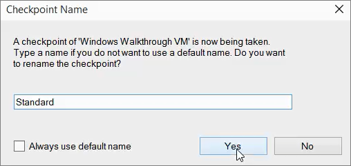
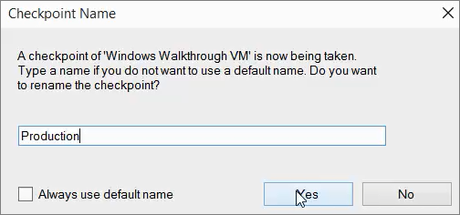
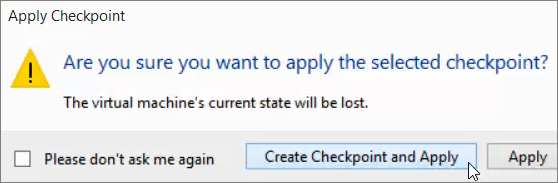
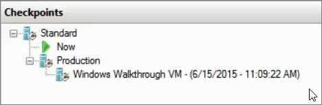
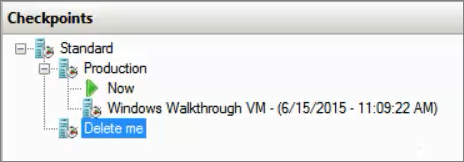
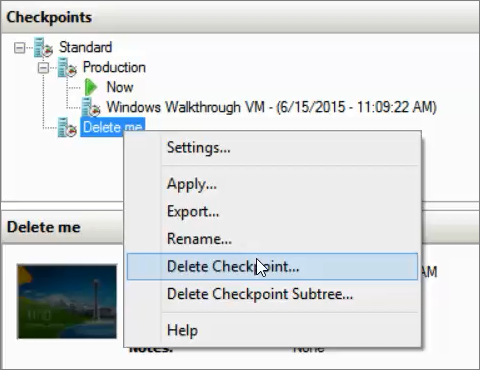
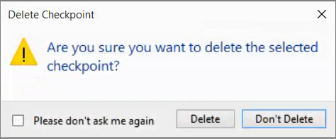
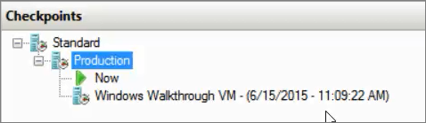

ms.ContentId: FBBAADE6-F1A1-4B5C-8FD2-BDCA3FCF81CA
title: Step 6: Experiment with checkpoints

# Step 6: Experiment with checkpoints 

Checkpoints can be helpful to use when you are about to make a change to a virtual machine and want to be able to roll-back to the present state if the updates cause issues. There are two types of checkpoints:

•	**Production checkpoints**: Used mainly on servers in production environments 

•	**Standard checkpoints**: Used in development or testing environments 

Production checkpoints are the default for Hyper-V on Windows 10.

## Change the checkpoint type
We will start by trying out the older style of checkpoints, **standard checkpoints**. Since production checkpoints are the default, we need to go into the settings for the VM and change the checkpoint type.

1. Right-click on **Windows Walkthrough VM** and select **Settings**.
2. In the **Management** section, select **Checkpoints**.
3. Select **Standard checkpoints**. The dialog should look like this:

  
4.	Click **OK** to close the dialog box.

## Open Notepad to test checkpoints 
In order to see what happens with each type of checkpoint, we will run an application in the VM. 
1. Right-click on **Windows Walkthrough VM** and select **Connect**.
2. In the virtual machine, open **Notepad** by clicking on the **Start** menu and typing **Notepad** and then select it from the results. 
3. In Notepad, type **This is a test of checkpoints.** The file should look like this:
  
  
4. Save the file as **test.txt**, but don't close Notepad. Leave it running in the virtual machine.

## Create a standard checkpoint 
1. To create the checkpoint, right-click the VM and click **Checkpoint**. 
2. In the checkpoint name dialog, type **Standard**. The dialog should look like this:

   
3. When the process is complete, the checkpoint will appear under **Checkpoints** in the **Hyper-V Manager**.

   

## Create a production checkpoint 
Now, we need to change change the type of checkpoint that we want to take back to **Production checkpoints** before taking a second checkpoint.

1.	Right-click the virtual machine, and click **Settings**.
2.	In the **Management** section, select **Checkpoints**.
3.	Select **Production checkpoints**.
4.  Clear the fall-back option. If the system can't take a production checkpoint, we want it to fail instead of taking a standard checkpoint.

  
5.	click **OK** to close the dialog box.
6.	Right-click on the VM again and select **Connect**.
7.	In Notepad in the VM, type another line that reads **This is a test of a production checkpoint** and save the file again.
8.	Click on the  **Checkpoint** button in the menu bar.
9.	When asked, name it **Production** and then click **Yes**.

   
10. Close VMConnect. The VM will continue running, you just won't be connected to it anymore.
11. In Hyper-V manager, your list of checkpoints will now look like this:

  

## Apply the standard checkpoint 

1.	In **Hyper-V Manager**, in the **Checkpoints** section, right-click the one titled **Standard** and click **Apply**.
2.	In the pop-up dialog, click **Create Checkpoint and Apply**. 

  
34. When the finished, your list of checkpoints will now look something like this:

  
4. When this finishes, right-click the VM and the click **Connect** to connect to the VM. 
5. When you connect to the VM, the VM should be running, with Notepad open, but the line about production checkpoints will be missing:

  
6. Close VMConnect, but leave the VM running.

## Apply the production checkpoint 
Now, let's go back to Hyper-V manager and apply the production checkpoint and see how our VM looks afterwards.

1.	In the Checkpoints section, right-click the one titled **Production Checkpoint** and click **Apply**.
2.	In the pop-up dialog, pick **Create Checkpoint and Apply**. 
3. When this finishes, right-click the VM and the click **Connect** to launch the VM. 
4. You will notice that the VM is not running. Click on the  Start button in the menu bar to start the VM.
5. Open open test.txt in Notepad. You should see the line in the file about testing production checkpoints:

  
	

## Rename a checkpoint ##
1. Right-click the last checkpoint in the tree and click Rename.
2. Name the checkpoint **Delete me**.

  

## Delete a checkpoint 
The previous step has probably given you a hint about what we will do next. We are going to delete the checkpoint that you just renamed.

1. Right-click on the checkpoint named **Delete me** and click **Delete checkpoint**. 

  
2. In the warning dialog, click **Delete**. 

  
3. After the checkpoint is deleted, your list should look something like this:

  

## Next Steps: 
[Step 7: Export and import a virtual machine](walkthrough_export_import.md)

