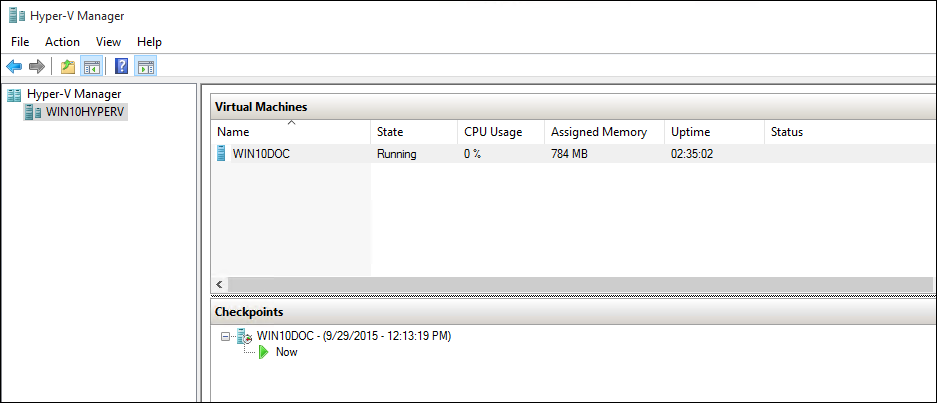

ms.ContentId: FBBAADE6-F1A1-4B5C-8FD2-BDCA3FCF81CA
title: Step 5 - Experiment with Checkpoints

# Use checkpoints in Hyper-V on Windows 10

One of the great benefits to virtualization is the ability to easily save the state of a virtual machine. In Hyper-V this is done through the use of virtual machine checkpoints. You may want to create a virtual machine checkpoint before making software configuration changes, applying a software update, or installing new software. If a system change were to cause an issue, the virtual machine can be reverted to the state at which it was when then checkpoint was taken.

Windows 10 Hyper-V includes two types of checkpoints:

- **Standard Checkpoints** – takes a snapshot of the virtual machine and virtual machine memory state at the time the checkpoint is initiated. This can be problematic for some workload such as when the virtual machine is hosting a database or other sever / client workload.
- **Production Checkpoints** – uses Volume Shadow Copy Service or File System Freeze on a Linux virtual machine to create an application consistent storage snapshot.

Production checkpoints are selected by default however this can be changed using either Hyper-V manager or PowerShell.

## Changing the checkpoint type using Hyper-V Manager

1. Open up Hyper-V Manager.

2. Right click on a virtual machine and select **settings**.

3. Under Management select **Checkpoints**.

4. Select the desired checkpoint type.


## Change the checkpoint type using PowerShell

The following commands can be run to change the checkpoint with PowerShell. 

```powershell
# Set to Standard Checkpoint.
Set-VM -Name <vmname> -CheckpointType Standard

# Set to Production Checkpoint.
Set-VM -Name <vmname> -CheckpointType Production

# Set to Production Checkpoint with no failback to Standard. 
Set-VM -Name <vmname> -CheckpointType ProductionOnly
```

## Working with Standard Checkpoints in Hyper-V Manager 

This exercise will walk through creating and applying a standard checkpoint. For this example, you will make a simple change to the virtual machine. The concept of checkpoints would also apply to more significant changes such as changing a software configuration. Before starting this exercise make sure that you have a virtual machine to work with and have changed the checkpoint type to standard checkpoints. 

**Modify the virtual machine and Create a Standard Checkpoint**

1. Log into your virtual machine and create a text file on the desktop.

2. In the text file enter the text ‘This is a Standard Checkpoint.’, save the file, but **do not close Notepad**.

3. In Hyper-V Manager either right click on the virtual machine and select **Checkpoint**.

When the checkpoint has been created it will be listed under the Checkpoints tree view of Hyper-V Manager. The checkpoint is given an auto generated name with a timestamp indicating the time at which the checkpoint was created.

 

**Apply the Standard Checkpoint with Hyper-V Manager**

Now that a checkpoint exists, make a modification to the virtual machine and then apply the checkpoint to revert the virtual machine back to the saved state. 

1. Close the text file if it is still open and delete it from the virtual machines desktop.

2. Open Hyper-V Manager, right click on the standard checkpoint, and select Apply.

3. Select Apply on the Apply Checkpoint notification window.

 

Once the checkpoint has been applied notice, that not only is the text file present, but the system is in the exact state that it was when the checkpoint was created. In this case Notepad is open and the text file loaded.

## Working with Production Checkpoints in Hyper-V Manager

Let’s now examine production checkpoints. This process is almost identical to working with standard checkpoint however will have slightly different results. Before beginning make sure you have a virtual machine and that you have changes the checkpoint type to Production checkpoints.

**Modify the virtual machine and Create a Production Checkpoint**

1. Log into the virtual machine and create a new text file. If you have been following along in this exercises you can use the existing text file.

2. Enter ‘This is a Production Checkpoint.’ into the text file, save the file but **do not close Notepad**.

3. Open up Hyper-V Manager > right click on the virtual machine > select **Checkpoint**.

4. Click **OK** on the Production Checkpoint Created Window.

 
	
**Apply the Production Checkpoint with Hyper-V Manager**

Now that a checkpoint exists make a modification to the system and then apply the checkpoint to revert the virtual machine back to the saved state. 

1. Close the text file if it is still open and delete it from the virtual machines desktop.

2. Open up Hyper-V Manager, right click on the production checkpoint, and select **Apply**.

3. Select **Apply** on the Apply Checkpoint notification window.

Once the production checkpoint has been applied, noticed that the virtual machine is in an off state.

1. Start and log into the virtual machine.

2. Take note that the text file has been restored. But unlike the standard checkpoint, Notepad is not open.   

## Export, rename, delete checkpoints using Hyper-V Manager 

In addition to applying a checkpoint using Hyper-V manager several other actions can be completed.

- **Export** – Allows you to export the checkpoint to another location to create a single virtual machine backup. When you import this backup into Hyper-V, it includes no checkpoint data.

- **Rename** – useful for including details about the system state when the checkpoint was created.

- **Delete Checkpoint** – when a checkpoint is no longer needed, deleting it will free up storage space on the Hyper-V host.

Each of these actions can be accessed through the right click contextual menu or the actions pane in Hyper-V Manager.

## Export, rename, delete checkpoints using PowerShell

To set the stage for working with checkpoints and PowerShell do the following:

1. Create a text file and enter the text ‘PowerShell checkpoint demonstration’. If you have been following along in this exercises you can use the existing text file.

2. On the Hyper-V Host, open PowerShell by clicking on the Windows Start button and typing powershell.

3. Create a checkpoint using the **CheckPoint-VM** command. This command will create a checkpoint of the type configured for the virtual machine. See the Configuring Checkpoint Type section earlier in this document for instructions on how to change this type.

	```powershell
	Checkpoint-VM –Name <VMName>
	```
4. When the checkpoint process has completed, delete the file from the virtual machine.

5. To see a list of checkpoints for a virtual machine use the **Get-VMSnapshot** command.

	```powershell
	Get-VMSnapshot -VMName <VMName>
	```
6. To apply the checkpoint use the **Restore-VMSnapshot** command.

	```powershell
	Restore-VMSnapshot -Name <checkpoint name> -VMName <VMName> -Confirm:$false
	```

## Next Step
[Export and Import Virtual Machines](walkthrough_export_import.md)


