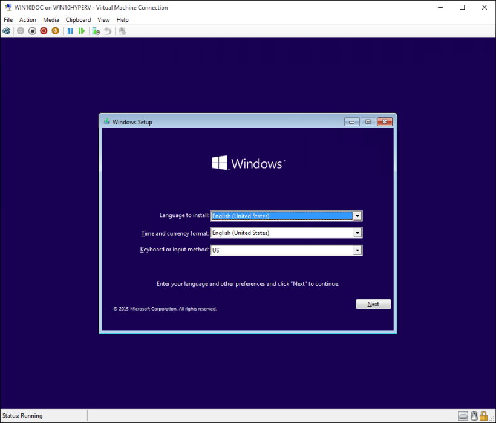

# Deploy a Windows Virtual Machine in Hyper-V on Windows 10

You can create a virtual machine and deploy an operating system to it in many different ways, for example using Windows Deployment Services, attaching a prepared virtual hard drive, or manually using the installation media. This article walks through how to create a virtual machine and deploy an operating system to the virtual machine using the operating system installation media.

Before starting this exercise, you need an .iso file for the operating system that you would like to deploy. If needed, grab an evaluation copy of Windows 8.1 or Windows 10 from the [TechNet Evaluation Center](http://www.microsoft.com/en-us/evalcenter/).

## Create a Virtual Machine with Hyper-V Manager
These steps walk through how to manually create a virtual machine and deploy an operating system to this virtual machine.

1. In Hyper-V Manager click **Action** > **New** > **Virtual Machine**.

2. Review the ‘Before You Begin’ content and click **Next**. 

3. Give the Virtual Machine a name. Note, this is the name of the Virtual Machine and not the computer name given to the system once the operating system has been deployed.

4. Chose a location where the virtual machine files will be stored such as **c:\virtualmachine**. You can also accept the default location. Click **Next** when done.
	
  

5. Select a generation for the machine and click **Next**.  

  Generation 2 virtual machines were introduced with Windows Server 2012 R2 and provide a simplified virtual hardware model and some additional functionality. You can only install a 64-bit operating system on a generation 2 virtual machine. For more information on Generation 2 virtual machines see the [Generation 2 Virtual Machine Overview](https://technet.microsoft.com/en-us/library/dn282285.aspx).

6. Select **2048** for the **Startup Memory** value and leave **Use Dynamic Memory**, selected. Click the **Next** button.  

  Memory is shared between a Hyper-V host and the virtual machine running on the host. The number of virtual machine’s that can run on a single host is in part dependent on available memory. A virtual machine can also be configured to use Dynamic Memory. When enabled, dynamic memory reclaims unused memory from the running virtual machine. This allows more virtual machines to run on the host. For more information on Dynamic Memory, see the [Hyper-V Dynamic Memory Overview](https://technet.microsoft.com/en-us/library/hh831766.aspx).

7. On the Configure Networking wizard, select a virtual switch for the virtual machine and click **Next**. For more information, see [Create a Virtual Switch](walkthrough_virtual_switch.md).

8. Give the virtual hard drive a name, select a location or keep the default, and finally specify a size. Click **Next** when ready.

  A virtual hard drive provides storage for a virtual machine similar to a physical hard drive. A virtual hard drive is required so that you can install an operating system on the virtual machine.
  
    

9. On the Installation Options wizard, select **Install an operating system from a bootable image file** and then select an operating system .iso file. Click **Next** once completed.

  When creating a virtual machine, you can configure some operating system installation options. The three options available are:

  - **Install an operating system later** – this option makes no additional modification to the virtual machine.

  - **Install an operating system from a bootable image file** – this is similar to inserting a cd into the physical CD Rom drive of a physical computer. To configure this option, select a .iso image. This image will be mounted to the virtual CD Rom drive of the virtual machine. The boot order of the virtual machine is changed to boot first from the CD Rom drive.

  - **Install an operating system from a network-based installation server** – This option is not be available unless you have connected the virtual machine to a network switch. In this configuration the virtual machine attempts to boot from the network.
  
10. Review the virtual machine details and click **Finish** to complete the virtual machine creation.

## Create a Virtual Machine with PowerShell

1. Open up the PowerShell ISE as Administrator.

2. Run the following script. This script 

  ```powershell
  # Set VM Name, Switch Name, and Installation Media Path.
  $VMName = 'TESTVM'
  $Switch = 'External VM Switch'
  $InstallMedia = 'C:\Users\Administrator\Desktop\en_windows_10_enterprise_x64_dvd_6851151.iso'
  
  # Create New Virtual Machine
  New-VM -Name $VMName -MemoryStartupBytes 2147483648 -Generation 2 -NewVHDPath "D:\Virtual Machines\$VMName\$VMName.vhdx" -NewVHDSizeBytes 53687091200 -Path "D:\Virtual Machines\$VMName" -SwitchName $Switch
  
  # Add DVD Drive to Virtual Machine
  Add-VMScsiController -VMName $VMName
  Add-VMDvdDrive -VMName $VMName -ControllerNumber 1 -ControllerLocation 0 -Path $InstallMedia
  
  # Mount Installation Media
  $DVDDrive = Get-VMDvdDrive -VMName $VMName
  
  # Configure Virtual Machine to Boot from DVD
  Set-VMFirmware -VMName $VMName -FirstBootDevice $DVDDrive
  ```
  
## Complete the Operating System Deployment

In order to finish building your virtual machine, you need to start the virtual machine and walk through the operating system installation.

1. In Hyper-V Manager, double-click on the virtual machine. This launches the VMConnect tool.

2. In VMConnect, click on the green Start button. This is like pressing the power button on a physical computer. You may be prompted to ‘Press any key to boot from CD or DVD’, go ahead and do so.

3. The virtual machine boots into setup and you can walk through the installation like you would on a physical computer.

   

> **Note:** Unless you're running a volume licensed version of Windows, you need a seperate license for Windows running inside a virtual machine. The virtual machine's operating system is independent of the host operating system.

## Next Step - Virtual Machine Checkpoints
[Virtual Machine Checkpoints](walkthrough_checkpoints.md)