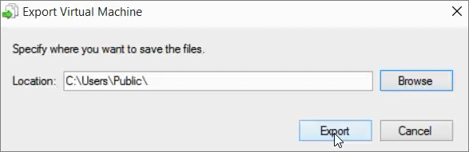
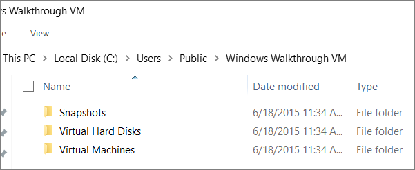

ms.ContentId: B971C429-CEF0-4DAB-8456-3B08AEC0C233
title: Step 7: Export and import a virtual machine

# Step 7: Export and import a virtual machine 

You can quickly copy a virtual machine or move a virtual machine by using the export and import functionality.

## Export the VM 

Exporting a virtual machine exports all of the pieces of the VM, including the checkpoints.

1. In Hyper-V Manager, right-click the virtual machine and select **Export**.

  
2. Click **Browse** in the dialog box and navigate to  C:\Users\Public\Export and then click **Select Folder**. 

3. In the **Export Virtual Machine** dialog, make sure the path looks okay and then click **Export**.

  
4. While the VM is being exported, you can see the progress in the Status section:

   

## Did the export work? 

To verify that the virtual machine was exported, right-click on your **Start** menu and select **File Explorer**.
1. Navigate to C:\Users\Public\Export\Windows Walkthrough VM.
2. You should see another folder called Windows Walkthrough VM and inside that folder should be three folders with the files for your exported virtual machine:
 - Snapshots
 - Virtual Hard Disks
 - Virtual Machines 
 
  

## Import the VM 
1. In **Hyper-V Manager**, in the **Action** menu, click **Import Virtual Machine**.
2. In the **Locate Folder** section, click Browse and navigate to C:\Users\Public\Export\Windows Walkthrough VM  and then click **Next**.
3. In the Select the virtual machine to import and then click **Next**.
4. In the Choose Import Type section, you can choose how to import the virtual machine:

	- **Register** - uses the existing unique ID of the virtual machine and registers it in-place. Choose this option if the virtual machines files are already in the correct location. 
	- **Restore** - uses the original virtual machine’s unique ID and also copies the virtual machine files to the default location specified for the host. 
	- **Copy** - creates a new unique ID for the virtual machine and also copies the virtual machine files to the default location specified for the host. 
	
5. After selecting how to import the VM, click **Next**.
6. In the Choose Destination section, you can choose where to store the files for the virtual machine or leave them in their current location. When you are finished, click **Next**.
7. In Choose Storage folders, you can select another place to store the .vhdx file or leave them where they are. When you are finished, click **Next**.
8. When you have finished importing the VM, you will see the summary page describing where the new VM files are located.

## Did the import work? 

To make sure the import worked, just right-click the imported VM in **Hyper-V Manager** and click **Connect**. 

## Next Step: 
[Step 8: Experiment with Windows Powershell](walkthrough_powershell.md)