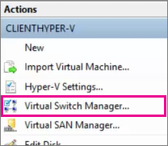
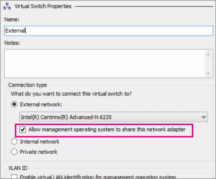
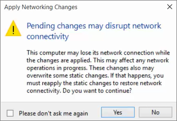

ms.ContentId: 95FE9554-3968-4EED-B65D-E03F06A7598D
title: Step 3: Create a virtual switch

# Create a virtual switch 

Virtual switch allow you to create a network connection for your virtual machine.  They are used just like the network interface on your physical computer.  

For this example, we are going to create an External switch.  The external switch will allow your virtual machine to access the host machine's network adapter.  If your host machine is connected to the internet, your virtual machine will be as well. 
 
We'll also set the switch to allow the host to share this network adapter. This makes it so both the virtual machines and the host can use the same network.

<!-- We should have a userguide for setting up a private network/virtual network -->

1. In Hyper-V manager, click **Virtual Switch Manager**.

  
  
2. Select **New virtual network switch**.

  
  
3. Select **External** and **Create Virtual Switch**.

  
  
4. Under **Name**, type **External**. 
5. Under **External network**, select the correct network adapter (there will probably be only one option).  
6. Select **Allow management operating system to share this network adapter** and click **OK**. 
  
    
  
7. You will get a message warning you that your network might disconnect while the virtual switch is created. Just click **Yes**.  Your network will be unavailable for a short time.
  
  

## Next step: 
[Step 4: Create a Windows virtual machine from an .iso file](walkthrough_create_vm.md)
