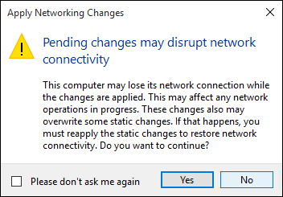

# Create a Virtual Switch 

Before you create a virtual machine in Hyper-V, you may want to provide a way for this virtual machine to connect to a physical network. Hyper-V includes software-based networking technology that allows a virtual machine's network card to connect to a virtual switch, providing network connectivity. Each virtual switch created in Hyper-V can be configured with one of three connection types:

- **External Network** – the virtual switch is connected to a physical network adapter which provides connectivity between the physical network, the Hyper-V host, and the virtual machine. In this configuration, you can also enable or disable the host's ability to communicate over the physically connected network card. This can be useful to isolate only VM traffic to a particular physical network card.

- **Internal Network** – the virtual switch is not connected to a physical network adapter. However, network connectivity exists between the Hyper-V host and any virtual machines connected to this switch.

- **Private Network** – the virtual switch is not connected to a physical network adapter and connectivity does not exist between the Hyper-V host and any virtual machines connected to this switch.

## Manually Create a Virtual Switch

This exercise walks through how to create an external virtual switch using the Hyper-V Manager. When completed, your Hyper-V host contains a virtual switch that can be used to connect virtual machines to a physical network. 

1. Open up Hyper-V Manager.

2. Right-click on the name of the Hyper-V host and select **Virtual Switch Manager...**

3. Under ‘Virtual Switches’, select **New virtual network switch**.

4. Under ‘What type of virtual switch do you want to create?’, select **External**.

5. Select the **Create Virtual Switch** button.

6. Under ‘Virtual Switch Properties’, give the new switch a name such as **External VM Switch**.

7. Under ‘Connection Type’, ensure that **External Network** has been selected.

8. Select the physical network card to be paired with the new virtual switch. This is the network card that is physically connected to the network.  

	

9. Select **Apply** to create the virtual switch. At this point you will most likely see the following message. Click **Yes** to continue.

	  

10. Select **OK** to close the Virtual Switch Manager Window.

## Create a Virtual Switch with PowerShell

The following steps can be used to create a virtual switch with an external connection using PowerShell. 

1. Use **Get-NetAdapter** to return a list of network adapters connected to the Windows 10 system.

	```powershell
	PS C:\> Get-NetAdapter

	Name                      InterfaceDescription                    ifIndex Status       MacAddress             LinkSpeed
	----                      --------------------                    ------- ------       ----------             ---------
	Ethernet 2                Broadcom NetXtreme 57xx Gigabit Cont...       5 Up           BC-30-5B-A8-C1-7F         1 Gbps
	Ethernet                  Intel(R) PRO/100 M Desktop Adapter            3 Up           00-0E-0C-A8-DC-31        10 Mbps  
	```

2. Select the network adapter to use with the Hyper-V switch and place an instance in a variable named **$net**.

	```
	$net = Get-NetAdapter -Name 'Ethernet'
	```

3. Execute the following command to create the new Hyper-V virtual switch.

	```
	New-VMSwitch -Name "External VM Switch" -AllowManagementOS $True -NetAdapterName $net.Name
	```

## Virtual Switches and Laptops

If running Windows 10 Hyper-V on a laptop, you may want to create a virtual switch for both the Ethernet and wireless network cards. With this configuration, you can change your virtual machines between these switches depending on how the laptop is connected to the network. Virtual machines will not automatically switch between wired and wireless.

## Next Step - Create a Virtual Machine
[Create a Windows Virtual Machine](walkthrough_create_vm.md)
