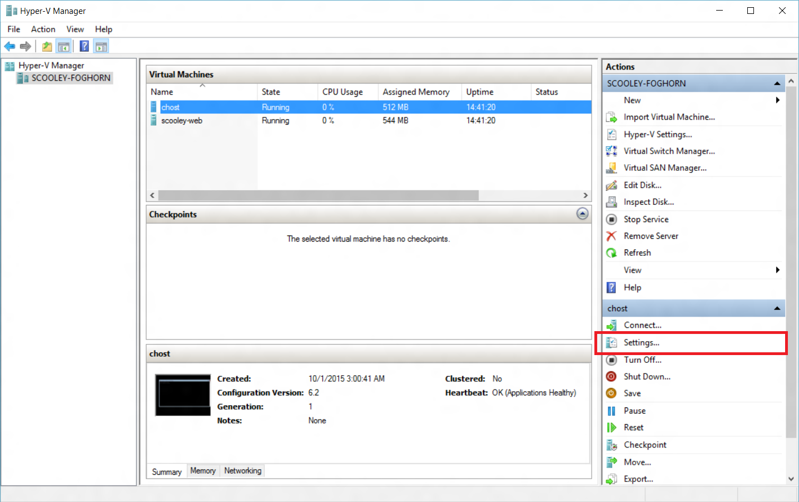
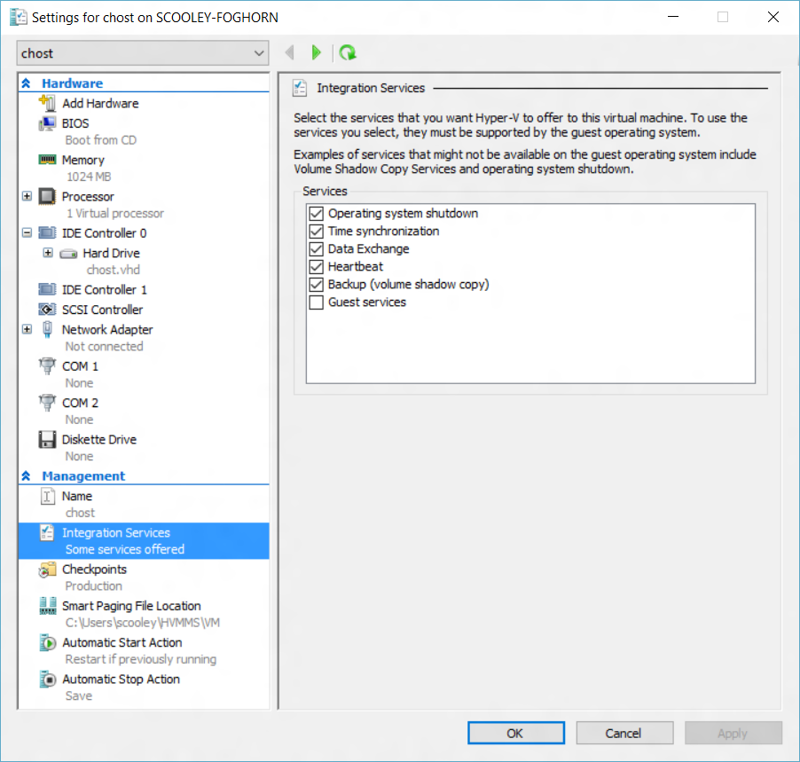
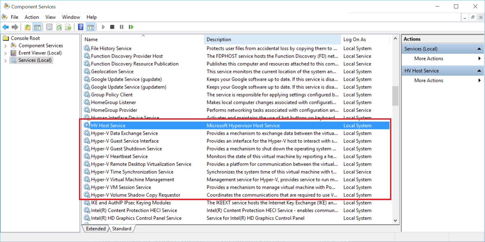

ms.ContentId: c0da5ae7-69b6-49a5-934a-6315b5538d6c
title: Managing integration services

# Managing Hyper-V Integration Services
Integration services (often called integration components), are services that allow the virtual machine to communicate with the Hyper-V host. Many of these services are conveniences (such as guest file copy), while others can be quite important to the guest operating system's ability to function correctly (time synchronization).

This article will detail how to manage integration services using both Hyper-V manager and PowerShell in Windows 10. For more information on each individual integration service, see [Integration Services]( https://technet.microsoft.com/en-us/library/dn798297.aspx) .

## Enable or Disable Integration Services using Hyper-V Manager

1. Select a virtual machine and open settings.
  
  
2. From the virtual machine settings window, go to the Integration Services tab under Management.
  

  
  Here you can see all integration services available on this Hyper-V host.  It's worth noting that the guest operating system may or may not support all of the integration services listed.

## Enable or Disable Integration Services Using PowerShell

Integration services can also be enabled and disabled with PowerShell by running [`Enable-VMIntegrationService`](https://technet.microsoft.com/en-us/library/hh848500.aspx) and [`Disable-VMIntegrationService`](https://technet.microsoft.com/en-us/library/hh848488.aspx).

In this example, we'll enable and then disable the guest file copy integration service on the "demovm" virtual machine seen above.

1. See what integration services are running
  
  ``` PowerShell
  Get-VMIntegrationService -VMName "demovm"
  ```

  The output will look like this:  
  ``` PowerShell
  VMName      Name                    Enabled PrimaryStatusDescription SecondaryStatusDescription
  ------      ----                    ------- ------------------------ --------------------------
  demovm      Guest Service Interface False   OK
  demovm      Heartbeat               True    OK                       OK
  demovm      Key-Value Pair Exchange True    OK
  demovm      Shutdown                True    OK
  demovm      Time Synchronization    True    OK
  demovm      VSS                     True    OK
  ```

2. Enable the `Guest Service Interface` integration service

   ``` PowerShell
   Enable-VMIntegrationService -VMName "demovm" -Name "Guest Service Interface"
   ```
   
   If you run `Get-VMIntegrationService -VMName "demovm"` you will see that the Guest Service Interface integration service is enabled.
 
3. Disable the `Guest Service Interface` integration service

   ``` PowerShell
   Disable-VMIntegrationService -VMName "demovm" -Name "Guest Service Interface"
   ```
   
Integration services were designed such that they need to be enabled in both the host and the guest in order to function.  While all integration services are enabled by default on Windows guest operating systems, they can be disabled.  See how in the next section.


## Manage Integration Services from Guest OS (Windows)

> **Note:** disabling integration services may severely affect the hosts ability to manage your virtual machine.  Integration services must be enabled on both the host and guest to operate.

Integration services appear as services in Windows. To enable or disable an integration services from inside the virtual machine, open the Windows Services manager.

 

Find the services containing Hyper-V in the name. Right click on the service you'd like to enable or disable and start or stop the service.

Alternately, to see all integration services with PowerShell, run:

```PowerShell
Get-Service -Name vm*
```

that will return a list that looks something like this:

```PowerShell
Status   Name               DisplayName
------   ----               -----------
Running  vmicguestinterface Hyper-V Guest Service Interface
Running  vmicheartbeat      Hyper-V Heartbeat Service
Running  vmickvpexchange    Hyper-V Data Exchange Service
Running  vmicrdv            Hyper-V Remote Desktop Virtualizati...
Running  vmicshutdown       Hyper-V Guest Shutdown Service
Running  vmictimesync       Hyper-V Time Synchronization Service
Stopped  vmicvmsession      Hyper-V VM Session Service
Running  vmicvss            Hyper-V Volume Shadow Copy Requestor
```

Start or stop services using [`Start-Service`](https://technet.microsoft.com/en-us/library/hh849825.aspx) or [`Stop-Service`](https://technet.microsoft.com/en-us/library/hh849790.aspx) .

By default, all integration services are enabled in the guest operation system.

## Manage Integration Services from Guest OS (Linux)

Linux integration services are provided through the Linux kernel.

On Linux virtual machines you can check to see if the integration services driver and daemons are running by running the following commands in your Linux guest operating system.

``` BASH
lsmod|grep hv_utils
```

Run the following command in your Linux guest operating system to see if the required daemons are running.

``` BASH
ps –eaf|grep hv
```

## Integration service maintainance

Keep integration services current in order to recieve the best virtual machine performance and features possible.

**For virtual machines running on Windows 10 hosts:**

| Guest OS | Update mechanism | Notes |
|:---------|:---------|:---------|
| Windows 10 | Windows Update | |
| Windows 8.1 | Windows Update | |
| Windows 8 | Windows Update | Requires the Data Exchange integration service. |
| Windows 7 | Windows Update | Requires the Data Exchange integration service. |
| Windows Vista | Windows Update | Requires the Data Exchange integration service. |
| - | | |
| Windows Server 2012 R2 | Windows Update | |
| Windows Server 2012 | Windows Update | Requires the Data Exchange integration service. |
| Windows Server 2008 R2 | Windows Update | Requires the Data Exchange integration service. |
| Windows Server 2008 (SP 2) | Windows Update | Requires the Data Exchange integration service. |
| Windows Home Server 2011 | | |
| Windows Small Business Server 2011 | | |


**For virtual machines running on Windows 8.1 hosts:**

| Guest OS | Update mechanism | Notes |
|:---------|:---------|:---------|
| Windows 10 | Windows Update | |
| Windows 8.1 | Windows Update | |
| Windows 8 | Integration Services disk | |
| Windows 7 | Integration Services disk | |
| Windows Vista | Integration Services disk | |
| - | | |
| Windows Server 2012 R2 | Windows Update | |
| Windows Server 2012 | Integration Services disk | |
| Windows Server 2008 R2 | Integration Services disk | |
| Windows Server 2008 (SP 2) | Integration Services disk | |
| Windows Home Server 2011 | Integration Services disk | |
| Windows Small Business Server 2011 | Integration Services disk | |
| Windows Server 2003 R2 (SP 2) | Integration Services disk | |
| Windows Server 2003 (SP 2) | Integration Services disk | |

**For virtual machines running on Windows 8 hosts:**

| Guest OS | Update mechanism | Notes |
|:---------|:---------|:---------|
| Windows 8.1 | Windows Update | |
| Windows 8 | Integration Services disk | |
| Windows 7 | Integration Services disk | |
| - | | |
| Windows Server 2012 R2 | Windows Update | |
| Windows Server 2012 | Integration Services disk | |
| Windows Server 2008 R2 | Integration Services disk | |
| Windows Server 2008 (SP 2) | Integration Services disk | |
| Windows Home Server 2011 | Integration Services disk | |
| Windows Small Business Server 2011 | Integration Services disk | |
| Windows Server 2003 R2 (SP 2) | Integration Services disk | |
| Windows Server 2003 (SP 2) | Integration Services disk | |

Instructions for updating via Integration Services disk for Windows 8 and Windows 8.1 are avialable here.
