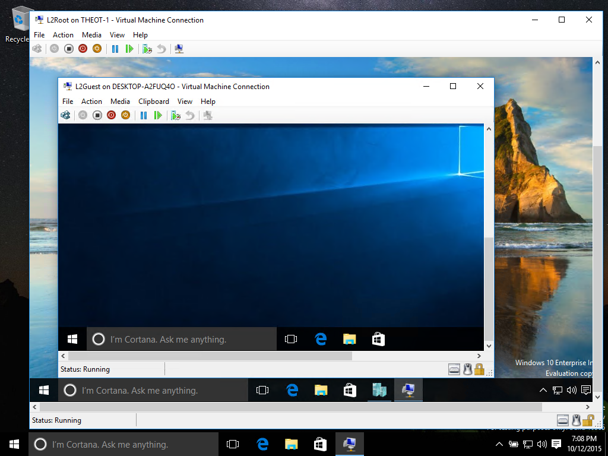
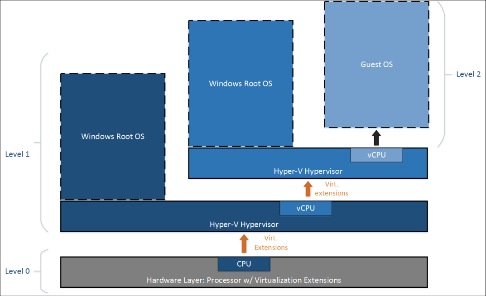

ms.ContentId: a772cbbf-f825-4465-b048-0ca066e4ded7
title: Insiders - Nesting Hyper-V

# Windows Insiders Preview - Nested Virtualization

> **Note:** This feature is only available to Windows Insiders running Build 10565 or later.  
  It is an early preview with no performance or stability guarantees.  
  If you run into issues, check the [FAQ](#FAQandTroubleshooting).

Nested virtualization is running virtualization inside a virtualized environment.  In other words, nesting allows you to run the Hyper-V server role inside a virtual machine.




## Enable nested virtualization

1. Create a virtual machine running the same build as your host -- [instructions here](../quick_start/walkthrough_create_vm.md).

2. Run [this script](https://github.com/Microsoft/Virtualization-Documentation/blob/master/hyperv-tools/Nested/Enable-NestedVm.ps1) as administrator on the Hyper-V host.
  
  In this early preview, nesting comes with a few configuration requirements.  To make things easier, [this PowerShell script](https://github.com/Microsoft/Virtualization-Documentation/blob/master/hyperv-tools/Nested/Enable-NestedVm.ps1) script will check your configuration, change anything which is incorrect, and enable nested virtualization for the specified virtual machine.
  
  ``` PowerShell
  Invoke-WebRequest https://raw.githubusercontent.com/Microsoft/Virtualization-Documentation/master/hyperv-tools/Nested/Enable-NestedVm.ps1 -OutFile ~/Enable-NestedVm.ps1 
  ~/Enable-NestedVm.ps1 -VmName "DemoVM"
  ```

3. Install Hyper-V in the virtual machine.

  ``` PowerShell
  Invoke-Command -VMName "DemoVM" -ScriptBlock { Enable-WindowsOptionalFeature -FeatureName Microsoft-Hyper-V -Online; Restart-Computer }
  ```
  
4. Create nested virtual machines!

## How does nesting work?
Hyper-V relies on hardware virtualization support (e.g. Intel VT-x and AMD-V) to run virtual machines. Typically, once Hyper-V is installed, the hypervisor hides this capability from guest virtual machines.  This prevents guest virtual machines from running Hyper-V server role amoung other hypervisors.

Nested virtualization exposes those hardware virtualization support components to guest virtual machine.

The diagram below shows Hyper-V without nesting.  The Hyper-V hypervisor takes full control of the hardware virtualization extensions (orange arrow), and does not expose them to the guest operating system.


In contrast, the diagram below shows Hyper-V with nesting. In this case, Hyper-V exposes the hardware virtualization extensions to its virtual machines. With nesting enabled, a guest virtual machine can install its own hypervisor and run its own guest VMs.



## FAQ and troubleshooting

### My virtual machine won’t start, what should I do?
1. Make sure dynamic memory is OFF.
2. Run this PowerShell script on your host machine from an elevated prompt.
  
  This script reports whether your host and VMs are configured properly for nested.

  ``` PowerShell
  Invoke-WebRequest https://raw.githubusercontent.com/Microsoft/Virtualization-Documentation/master/hyperv-tools/Nested/Get-NestedVirtStatus.ps1 -OutFile ~/Get-NestedVirtStatus.ps1 
  ~/Get-NestedVirtStatus.ps1
  ```

### Virtual Machine Connection keeps being lost.
If you are using a blank password, this is a known issue.  Please change your password and the issue should be resolved.

### My issue isn't here.
Don't see your issue?  Have feedback?  Contact us.

Report them through the Windows feedback app, the [virtualization forums](https://social.technet.microsoft.com/Forums/windowsserver/En-us/home?forum=winserverhyperv), or through [GitHub](https://github.com/Microsoft/Virtualization-Documentation).