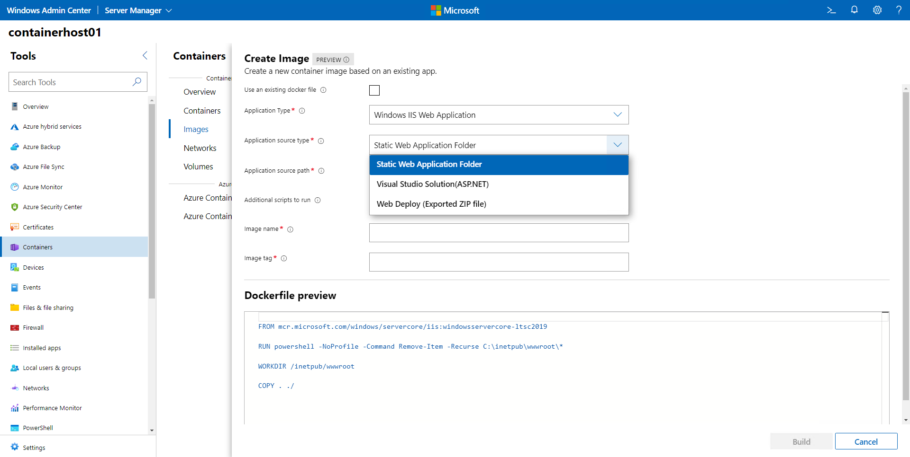

# Manage Container images on Windows Admin Center

This topic describes how to manage container images on Windows Admin Center. Container images are used to create new containers on Windows machines or other cloud services, such as Azure Kubernetes Service. For more information on Windows images, check out the [Container images overview](https://docs.microsoft.com/en-us/virtualization/windowscontainers/about/#container-images).

# Pull container images

After deploying a container host, the next loggical action is to pull (or download) container images so new containers can be created from said images. You can use Windows Admin Center to pull new container images by opening the Containers extension on your targeted container host, selecting Images on the left-hand side menu under Container Host and clicking Pull.

On the Pull menu you can provide the repository and tag for the image you want to pull. You can also select the option to pull all tagged images on that repository.

If the image you want to pull is on a private repository you can provide the username and passoword to authenticate against that repository. If your repository is hosted on Azure Container Registry you can use the native Azure authentication on Windows Admin Center to access the image. This requires the Windows Admin Center instance to be connected to Azure and authenticated with your Azure account. For more information on how to connect a Windows Admin Center instance to Azure, check out the [documentation](https://docs.microsoft.com/en-us/windows-server/manage/windows-admin-center/azure/azure-integration).

If you are not certain which image to pull, Windows Admin Center also provides a list of common images available. You can expend the Common Windows images tab to see a list of base images that are commonly pulled. Select the image you want to pull and Windows Admin Center will fill out the repository and tag fields.

# Push container images

Once you have your own container image created, it's a good practice to push that image to a centralized repository to allow other container hosts or cloud services to pull the image.

On the Images tab in the Containers extension of Windows Admin Center, select the image you wan to push and click Push.

On the Push menu, you can change the image name and tag before pushing (uploading) it and select to either a generic reposiroty or a repository on Azure Container Registry. For a generic repository, you will need to provide a username and password. For Azure Container Registry, you can use the integrated authentication on Windows Admin Center. For Azure, you can also select which subscription and registry you want to push the image to.

# Create new container images

When working with containers, you will find yourself writing instructions to Docker on how your container image works so Docker can create a new container image based on these instructions. These instructions are saved on a file called "dockerfile" which is saved on the same folder on which your application resides. 

Windows Admin Center can drastically reduce the overhead of writing these dockerfiles or even completely remove the need to manually write down these files. To get start, on the Containers extension select the option Create New on the Images tab.

The Create new functionality allows for different options while creating a new container image:

- Existing Docker File: This option allows you to rebuild a new container image based on an existing dockerfile. This is very useful when you need to make small changes to an existing dockerfile or simply re-run the container creation to catch an application update.
- IIS Web Application/Static Web Application Folder: This option will create a new container image using the IIS base image and copy the content of a folder to the container image to add it as a web site. No framework is added on this option.
- IIS Web Application/Visual Studio Solution(ASP.Net): This option can be used to create a new container image based on an existing Visual Studio Solution. This option will use a multi-image stage approac to stage the application, compile the necessary binaries and store only the necessary assets on the final image. The ASP.Net container image will be used as base image. This option will also ask for the folder on which the Visual Studio resides and will list the existing projects for you to select which one you'd like to containerize.
- IIS Web Application/Web Deploy (Exported Zip file): This option an be used to create a container image from the artifacts exported from a running server. You can use Web Deploy to expert the application into a Zip file and use Windows Admin Center to create a new container image based on the exported Zip file. The ASP.Net container image wil ne used as base image.

Once you select the initial option of which type of appliation you want to containerize, you can select common options to finalize the creation of your image:

- Framework version: Both the Visual Studio Solution and Web Deploy options will use the ASP.Net image as base for your container image. However, you can select which version of the .Net Framework you want to use in order to accomodate your application.
- Additional scripts to run: This option allows you to select a PowerShell script to be used at build time. Windows Admin Center will add an instruction to the dockerfile to copy the .PS1 file to the container image and run this script when the container image is created. This can be very helpful if your application requires you to run any additional steps that are not contemplated in the application itself.
- Image Name: The final image name to be used. This can be changed later when you push the image to a container registry.
- Image tag: This is used to differentiate multiple versions of the same image. Provide a identifier so your image is properly tagged.

Once you have all the options for your container image selected, you can review the dockerfile. You can also edit the dockerfile by hand if necessary. This dockerfile will be saved on the location of the application you specified in the earlier step. 

>[!Note]
>If a dockerfile exists in the location of the application you are trying to containerize, Windows Admin Center will replace that file with the new one it just created.

## Next steps

> [!div class="nextstepaction"]
> [Run containers on Windows Admin Center](./WAC-Containers.md)