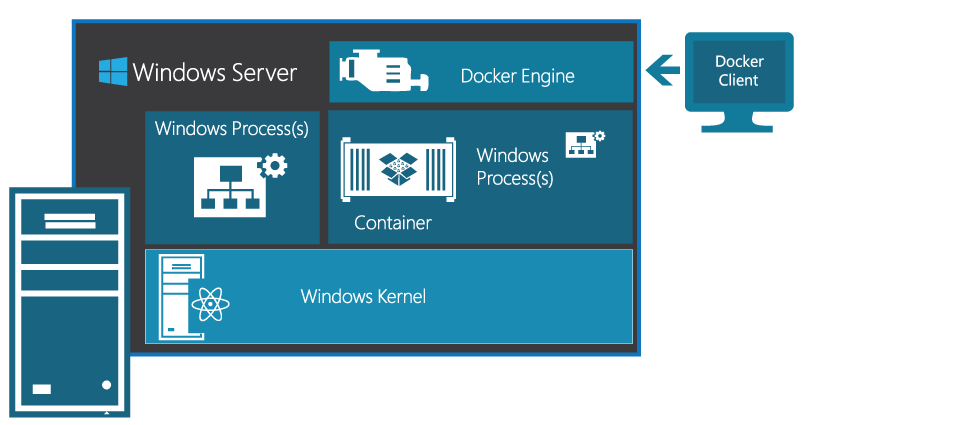

ms.ContentId: 526e4f1a-2936-4c61-b3be-d41b4cf9d10f
title: About Windows Server Containers

# Windows Server Containers #

Applications fuel innovation in the cloud and mobile era. Containers, and the ecosystem that is developing around them, will empower software developers to create the next generation of applications experiences.

## What are containers? ##  

They are an isolated, resource controlled and portable operating environment. 

Basically, a container is an isolated place where an application can run without affecting the rest of the system and without the system affecting the application. Containers are the next evolution in virtualization.

If you were inside a container, it would look very much like you were inside a physical computer or a virtual machine. And, to [Docker](https://www.docker.com/), a Windows Server Container looks like any other container.

## Containers for Developers ##

When you containerize an app, only the app and the components needed to run the app are combined into an "image". Containers are then created from this image as you need them. You can also use an image as a baseline to create another image, making image creation even faster.  Multiple containers can share the same image, which means containers start very quickly and use fewer resources. For example, you can use containers to spin up light-weight and portable app components – or ‘micro-services’ – for distributed apps and quickly scale each service separately. 

Because the container has everything it needs to run your application, they are very portable and can run on any machine that is running Windows Server 2016. You can create and test containers locally, then deploy that same container image to your company's private cloud, public cloud or service provider. The natural agility of Containers supports modern app development patterns in large scale, virtualized and cloud environments.

With containers, developers can build an app in any language. These apps are completely portable and can run anywhere - laptop, desktop, server, private cloud, public cloud or service provider - without any code changes.  

Containers helps developers build and ship higher-quality applications, faster. 

## Containers for IT Professionals ##

IT Professionals can use containers to provide standardized environments for their development, QA, and production teams. They no longer have to worry about complex installation and configuration steps. By using containers, systems administrators abstract away differences in OS installations and underlying infrastructure.

Containers help admins create an infrastructure that is simpler to update and maintain.

## What else do I get? ##

Containers and the container ecosystem provide agility, productivity, and freedom-of-choice in building, deploying, and managing modern apps.

When combined with Docker, Visual Studio, and Azure, containers become an important part of a robust ecosystem. Read more about the [Windows Server Container ecosystem](container_ecosystem.md).

## Next Steps ##

**Coming soon**: Get started with your own Windows containers with our [Hello world!](..\quick_start\hello_world.md)

