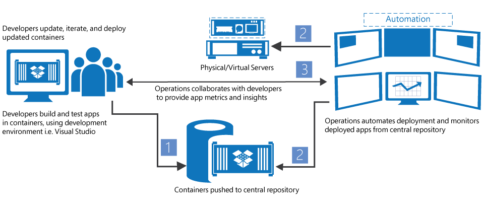

ms.ContentId: fbd49f81-b6cb-4030-9296-413d68a9428f
title: Container Ecosystem

# Building a Container Ecosystem #

Windows containers are a small component of a large container ecosystem.

The ecosystem provides ways to manage containers, share containers, develop apps that run in containers, and even orchestrate resource division across many containers.

As part of our open and ecosystem friendly approach, we’re working across industry to deliver developer choice at each layer of the solution stack.     
* Microsoft wants to empower developer choice and productivity as they build these next-gen apps.  Our goal is to fuel developer productivity by enabling applications to target any Microsoft cloud without having to modify, rewrite or reconfigure code. 

* Microsoft is committed to being open and ecosystem friendly.  We actively support the coming together of multiple developer ecosystems of interest – such as Windows and Linux – to drive ‘dev-ops’ innovation. 

## Development ecosystem ##

Containers make it easy for developers to produce applications which evolve rapidly and organically. 

Using containers, a developer can begin writing an application, containerize that application including the development environment, and pass the container on to someone else. When they start the container, the entire environment is there and ready to use. Because containers can be imported and exported easily based on container images, they can also be stored in a central repository where the container images can be shared, searched, and modified.

This is useful for iterative development andtest frameworks.

## Partner ecosystem ##

* Frictionless app deployment/ portability across Microsoft-powered and non-Microsoft clouds (including third party infrastructure fabrics based on VMware or open source hypervisors) 

* Seamless interoperability among Windows and Linux application ecosystems, spanning on-premises, hosted, and Microsoft Azure deployments: 
### Partnership with Docker ###

First-class support for Docker, including rich integration with Docker Engine and Docker Hub (across on-premises and Azure) 

Our partnership with Docker enables developers to create Docker container-based applications that leverage Windows Server in addition to Linux. Developers targeting Windows Server will no longer have to make a choice between using the vast range of Windows Server technologies and building containerized applications.  

Microsoft will be delivering container capabilities as part of the next release of Windows Server. Developers and organizations who want to create distributed, container-based applications using Docker will be able to use Windows Server – either on premises or in a cloud deployment in Azure – and be able to leverage the same growing Docker ecosystem of users, applications and tools.  Docker Hub, a community-driven repository shared across a vast ecosystem of developers, will also be integrated into Microsoft Azure through the Azure management portal and Gallery of applications. Today’s announcements extend our previous collaboration with Docker, where we have already made the Docker Engine for Linux available to Microsoft Azure customers via a first-class experience.  

The new Windows Server container technologies will be available for customers to run in their on-premises server environments or in the cloud. We intend to make these Windows Server containers, with the Docker integration, available on Microsoft Azure as well. 

Docker is two things, the open source group of projects and Docker the company. We consider this partnership to include both. Docker is successful, in part, because of the vibrant ecosystem that has built up around the Docker container technology. Microsoft will be bringing resources and its ecosystem to the Docker open source project.  Microsoft will be instrumental in the creation of an open source Docker Engine for Windows Server that will provide uniform functionality to the community.  

o Container orchestration support for Linux-based containers (with Microsoft Azure Service Fabric) 

o Support for third-party container cluster orchestration, such as Apache Mesosphere  

o Support for third-party development environments, such as Eclipse

## Hosting ecosystem ##

Opportunity for high density hosting in situations where having a shared kernel is not a security concern. If it is a security concern, use a VM as the trust boundary then containers within the VM.
