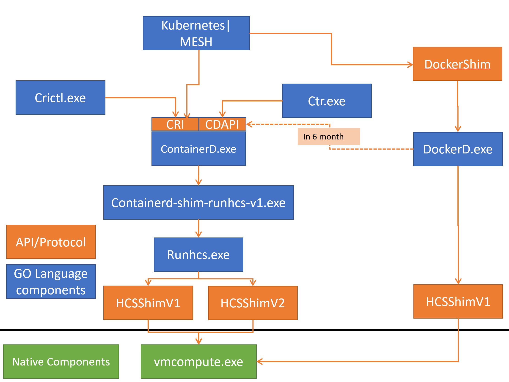

# Container platform tools in Windows

We're building container primitives that match Linux container primitives in accordance to OCI specs.  We're building a Windows-based version if runc.  We're also contributing to containerd/containerd and containerd/cri to use runhcs on Windows so the windows container ecosystem can mirror the Linux container ecosystem.

This makes it easier for orchestrators like Kubernetes to choose between docker and containerd.

Some set up required :)

