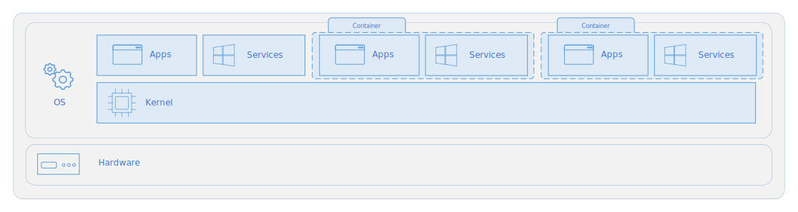
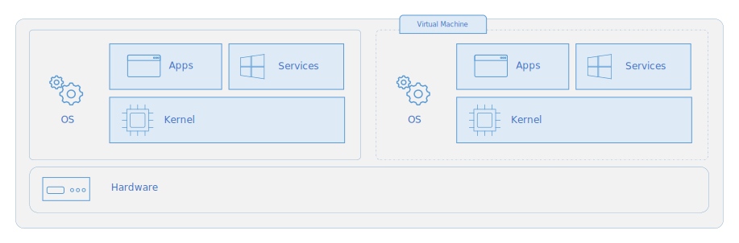

# Containers vs. virtual machines

> Applies to: Windows Server 2022, Windows Server 2019, Windows Server 2016

This topic discusses some of the key similarities and differences between containers and virtual machines (VMs), and when you might want to use each. Containers and VMs each have their uses–in fact, many deployments of containers use VMs as the host operating system rather than running directly on the hardware, especially when running containers in the cloud.

For an overview of containers, see [Windows and containers](index.md).

## Container architecture

A container is an isolated, lightweight silo for running an application on the host operating system. Containers build on top of the host operating system's kernel (which can be thought of as the buried plumbing of the operating system), and contain only apps and some lightweight operating system APIs and services that run in user mode, as shown in this diagram.

## Virtual machine architecture

In contrast to containers, VMs run a complete operating system–including its own kernel–as shown in this diagram.

## Containers vs. virtual machines

The following table shows some of the similarities and differences of these complementary technologies.

|Feature    | Virtual machine  | Container  |
| --------------  | ---------------- | ---------- |
| Isolation       | Provides complete isolation from the host operating system and other VMs. This is useful when a strong security boundary is critical, such as hosting apps from competing companies on the same server or cluster. | Typically provides lightweight isolation from the host and other containers, but doesn't provide as strong a security boundary as a VM. (You can increase the security by using [Hyper-V isolation mode](../manage-containers/hyperv-container.md) to isolate each container in a lightweight VM). |
| Operating system | Runs a complete operating system including the kernel, thus requiring more system resources (CPU, memory, and storage). | Runs the user mode portion of an operating system, and can be tailored to contain just the needed services for your app, using fewer system resources. |
| Guest compatibility | Runs just about any operating system inside the virtual machine | Runs on the [same operating system version as the host](../deploy-containers/version-compatibility.md) (Hyper-V isolation enables you to run earlier versions of the same OS in a lightweight VM environment)
| Deployment     | Deploy individual VMs by using Windows Admin Center or Hyper-V Manager; deploy multiple VMs by using PowerShell or System Center Virtual Machine Manager. | Deploy individual containers by using Docker via command line; deploy multiple containers by using an orchestrator such as Azure Kubernetes Service. |
| Operating system updates and upgrades | Download and install operating system updates on each VM. Installing a new operating system version requires upgrading or often just creating an entirely new VM. This can be time-consuming, especially if you have a lot of VMs... | Updating or upgrading the operating system files within a container is the same:  <ol><li>Edit your container image's build file (known as a Dockerfile) to point to the latest version of the Windows base image. </li><li>Rebuild your container image with this new base image.</li><li>Push the container image to your container registry.</li> <li>Redeploy using an orchestrator. The orchestrator provides powerful automation for doing this at scale. For details, see [Tutorial: Update an application in Azure Kubernetes Service](/azure/aks/tutorial-kubernetes-app-update).</li></ol> |
| Persistent storage | Use a virtual hard disk (VHD) for local storage for a single VM, or an SMB file share for storage shared by multiple servers | Use Azure Disks for local storage for a single node, or Azure Files (SMB shares) for storage shared by multiple nodes or servers. |
| Load balancing | Virtual machine load balancing moves running VMs to other servers in a failover cluster. | Containers themselves don't move; instead an orchestrator can automatically start or stop containers on cluster nodes to manage changes in load and availability. |
| Fault tolerance | VMs can fail over to another server in a cluster, with the VM's operating system restarting on the new server.  | If a cluster node fails, any containers running on it are rapidly recreated by the orchestrator on another cluster node. |
| Networking     | Uses virtual network adapters. | Uses an isolated view of a virtual network adapter, providing a little less virtualization–the host's firewall is shared with containers–while using less resources. For more, see [Windows container networking](../container-networking/architecture.md). |