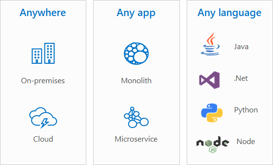

# Windows and containers

> Applies to: Windows Server 2022, Windows Server 2019, Windows Server 2016

Containers are a technology for packaging and running Windows and Linux applications across diverse environments on-premises and in the cloud. Containers provide a lightweight, isolated environment that makes apps easier to develop, deploy, and manage. Containers start and stop quickly, making them ideal for apps that need to rapidly adapt to changing demand. The lightweight nature of containers also make them a useful tool for increasing the density and utilization of your infrastructure.

To view a roadmap of planned and currently available features, see the [Windows Server containers roadmap](https://github.com/microsoft/Windows-Containers/projects/1). Also, see [Events](../deploy-containers/events.md) to view recent video presentations and blog posts for Windows Containers.

## The Microsoft container ecosystem

Microsoft provides a number of tools and platforms to help you develop and deploy apps in containers:

- <strong>Run Windows-based or Linux-based containers on Windows 10</strong> for development and testing using [Docker Desktop](https://store.docker.com/editions/community/docker-ce-desktop-windows), which makes use of containers functionality built-in to Windows. You can also [run containers natively on Windows Server](../quick-start/set-up-environment.md#windows-server-1).
- <strong>Develop, test, publish, and deploy Windows-based containers</strong> using the [powerful container support in Visual Studio](/visualstudio/containers/overview) and [Visual Studio Code](https://code.visualstudio.com/docs/azure/docker), which include support for Docker, Docker Compose, Kubernetes, Helm, and other useful technologies.
- <strong>Publish your apps as container images</strong> to the public DockerHub for others to use, or to a private [Azure Container Registry](https://azure.microsoft.com/services/container-registry/) for your org's own development and deployment, pushing and pulling directly from within Visual Studio and Visual Studio Code.
- <strong>Deploy containers at scale on Azure</strong> or other clouds:

  - Pull your app (container image) from a container registry, such as the Azure Container Registry, and then deploy and manage it at scale using an orchestrator such as [Azure Kubernetes Service (AKS)](/azure/aks/intro-kubernetes).
  - Azure Kubernetes Service deploys containers to Azure virtual machines and manages them at scale, whether that's dozens of containers, hundreds, or even thousands. The Azure virtual machines run either a customized Windows Server image (if you're deploying a Windows-based app), or a customized Ubuntu Linux image (if you're deploying a Linux-based app).
- <strong>Deploy containers on-premises</strong> by using [AKS on Azure Stack HCI](/azure-stack/aks-hci/), [Azure Stack with the AKS Engine](/azure-stack/user/azure-stack-kubernetes-aks-engine-overview), or [Azure Stack with OpenShift](/azure/virtual-machines/linux/openshift-azure-stack). You can also set up Kubernetes yourself on Windows Server (see [Kubernetes on Windows](../kubernetes/getting-started-kubernetes-windows.md)), and we're working on support for running [Windows containers on RedHat OpenShift Container Platform](https://techcommunity.microsoft.com/t5/Networking-Blog/Managing-Windows-containers-with-Red-Hat-OpenShift-Container/ba-p/339821) as well.

## How containers work

A container is an isolated, lightweight package for running an application on the host operating system. Containers build on top of the host operating system's kernel (which can be thought of as the buried plumbing of the operating system), as shown in the diagram below.

While a container shares the host operating system's kernel, the container doesn't get unfettered access to it. Instead, the container gets an isolated–and in some cases virtualized–view of the system. For example, a container can access a virtualized version of the file system and registry, but any changes affect only the container and are discarded when it stops. To save data, the container can mount persistent storage such as an [Azure Disk](https://azure.microsoft.com/services/storage/disks/) or a file share (including [Azure Files](https://azure.microsoft.com/services/storage/files/)).

A container builds on top of the kernel, but the kernel doesn't provide all of the APIs and services an app needs to run–most of these are provided by system files (libraries) that run above the kernel in user mode. Because a container is isolated from the host's user mode environment, the container needs its own copy of these user mode system files, which are packaged into something known as a base image. The base image serves as the foundational layer upon which your container is built, providing it with operating system services not provided by the kernel. But we'll talk more about container images later.

## Containers vs. virtual machines

In contrast to a container, a virtual machine (VMs) runs a complete operating system–including its own kernel–as shown in this diagram.

Containers and virtual machines each have their uses–in fact, many deployments of containers use virtual machines as the host operating system rather than running directly on the hardware, especially when running containers in the cloud.

For more details on the similarities and differences of these complementary technologies, see [Containers vs. virtual machines](containers-vs-vm.md).

## Container images

All containers are created from container images. A container image is a bundle of files organized into a stack of layers that resides on your local machine or in a remote container registry. The container image consists of the user mode operating system files needed to support your app, any runtimes or dependencies of your app, and any other miscellaneous configuration file your app needs to run properly.

Microsoft offers several images (called base images) that you can use as a starting point to build your own container image:

* <strong>Windows</strong> - contains the full set of Windows APIs and system services (minus server roles).
* <strong>Windows Server</strong> - contains the full set of Windows APIs and system services.
* <strong>Windows Server Core</strong> - a smaller image that contains a subset of the Windows Server APIs–namely the full .NET framework. It also includes most but not all server roles (for example Fax Server is not included).
* <strong>Nano Server</strong> - the smallest Windows Server image and includes support for the .NET Core APIs and some server roles.

As mentioned earlier, container images are composed of a series of layers. Each layer contains a set of files that, when overlaid together, represent your container image. Because of the layered nature of containers, you don't have to always target a base image to build a Windows container. Instead, you could target another image that already carries the framework you want. For example, the .NET team publishes a [.NET core image](https://hub.docker.com/_/microsoft-dotnet-core) that carries the .NET core runtime. It saves users from needing to duplicate the process of installing .NET core–instead they can reuse the layers of this container image. The .NET core image itself is built based upon Nano Server.

For more details, see [Container Base Images](../manage-containers/container-base-images.md).

## Container users

### Containers for developers

Containers help developers build and ship higher-quality apps, faster. With containers, developers can create a container image that deploys in seconds, identically across environments. Containers act as an easy mechanism to share code across teams and to bootstrap a development environment without impacting your host filesystem.

Containers are portable and versatile, can run apps written in any language, and they're compatible with any machine running Windows 10, version 1607 or later, or Windows Server 2016 or later. Developers can create and test a container locally on their laptop or desktop, and then deploy that same container image to their company's private cloud, public cloud, or service provider. The natural agility of containers supports modern app development patterns in large-scale, virtualized cloud environments. The most useful benefit to developers is perhaps the ability to isolate your environment so that your app always gets the version of libraries that you specify, avoiding conflicts with dependencies.

### Containers for IT professionals

Containers help admins create infrastructure that's easier to update and maintain, and that more fully utilizes hardware resources. IT professionals can use containers to provide standardized environments for their development, QA, and production teams. By using containers, systems administrators abstract away differences in operating system installations and the underlying infrastructure.

You can also use the interactive mode of containers to run conflicting instances of a command line tool on the the same system.

## Container orchestration

Orchestrators are a critical piece of infrastructure when setting up a container-based environment. While you can manage a few containers manually using Docker and Windows, apps often make use of five, ten, or even hundreds of containers, which is where orchestrators come in.

Orchestrators help you grow containerized apps at scale, providing functionality for:

- Deploying at scale
- Workload scheduling
- Health monitoring
- Failing over when a node fails
- Scaling up or down
- Networking
- Service discovery
- Coordinating app upgrades
- Cluster node affinity

There are many different orchestrators that you can use with Windows containers; here are the options Microsoft provides:
- [Azure Kubernetes Service (AKS)](/azure/aks/intro-kubernetes) - use a managed Azure Kubernetes service
- [Azure Kubernetes Service (AKS) on Azure Stack HCI](/azure-stack/aks-hci/overview) - use Azure Kubernetes Service on-premises

## Try containers on Windows

To get started with containers on Windows Server or Windows 10, see the following:
> [!div class="nextstepaction"]
> [Get started: Configure Your Environment for Containers](../quick-start/set-up-environment.md)

For help deciding which Azure services are right for your scenario, see [Azure container services](https://azure.microsoft.com/product-categories/containers/) and [Choosing what Azure services to use to host your application](/azure/architecture/guide/technology-choices/compute-decision-tree).

## Resources

To view resources for using Windows Server containers:

- For current issues and planned feature upgrades, see the [Windows Server containers roadmap](https://github.com/microsoft/Windows-Containers/projects/1).

- To view container events, see [Windows container and the Azure Kubernetes Service}](https://azure.microsoft.com/resources/videos/ignite-2019-windows-container-and-the-azure-kubernetes-service/) and [other recent containers events and slideshows](../deploy-containers/events.md).

- To contact the Windows Server containers team, send email to [Windows Containers Customers](mailto:win-containers@microsoft.com).
