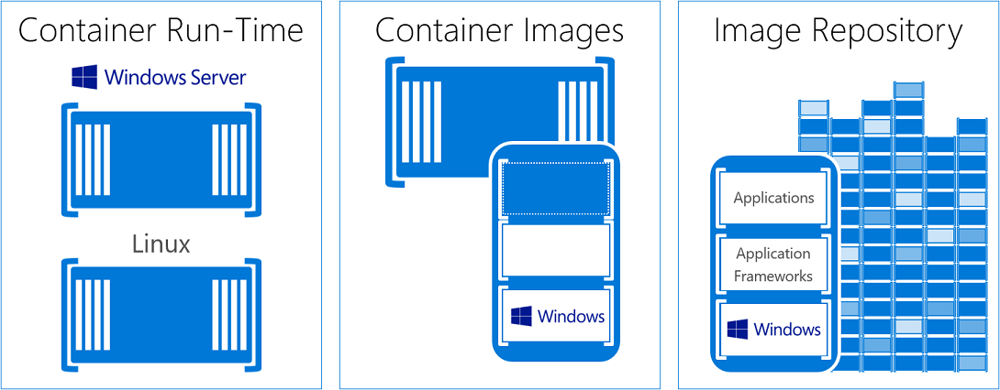

# About Windows containers

Imagine a kitchen. Inside this single room is everything you need to have a functioning kitchen: the oven, pans, sink, and so on. This is our container.

Now imagine putting this kitchen inside a building as easily as sliding a book into a bookshelf. Since everything the kitchen needs to function is already there, all we need to start cooking is to connect the electricity and plumbing.

Why stop there? You can customize your building any way you like; fill it with many kinds of rooms, fill it with identical rooms, or have a mix of the two.

Containers act like this room by putting an app and everything that app needs to run into its own isolated box. As a result, the isolated app has no knowledge of any other apps or processes that exist outside its container. Because the container has everything the app needs to run, the container can be moved anywhere, using only the resources its host provisions without touching any resources provisioned for other containers.

The following video will tell you more about what Windows containers can do for you, as well as how Microsoft's partnership with Docker helps create a frictionless environment for open-source container development:
<iframe width="800" height="450" src="https://www.youtube.com/embed/Ryx3o0rD5lY" frameborder="0" allow="accelerometer; autoplay; encrypted-media; gyroscope; picture-in-picture" allowfullscreen></iframe>

## Container fundamentals

Let's get to know some terms you'll find useful as you start to work with Windows containers:

- Container host: A physical or virtual computer system configured with the Windows container feature. The container host will run one or more Windows containers.
- Sandbox: The layer that captures all write actions (such as file system modifications, registry modifications, or software installations) when you start the container.
- Container OS image: The first layer in the image layers of a container that provides the container's operating system environment. A container OS image can't be modified.
- Container image: An image that captures a modified container's sandbox and can be used to recreate that modified image in new containers. For example, let’s say you've deployed a container from the Windows Server Core OS image, and then install MySQL on the container. If you create a new image from this modified container, you can deploy that image in a new container with the changes you made to the first container (in this case, installing MySQL). However, the container image would function as a layer on top of the container OS image instead of replacing it altogether.
- Container repository: The local repository that stores your container image and its dependencies each time you create a new image. You can reuse stored images as many times as you want on the container host. You can also store the container images in a public or private registry, such as Docker Hub, so they can be used across many different container hosts.

Someone familiar with virtual machines might think containers and virtual machines seem similar. A container runs an operating system, has a file system, and can be accessed over a network much like a physical or virtual computer system. However, the technology and concepts behind containers are vastly different from virtual machines. To learn more about what these concepts are, read Mark Russinovich's [blog post](https://azure.microsoft.com/blog/containers-docker-windows-and-trends/) that explains the differences in more detail.

## Windows container types

Windows containers include two different container types, also known as runtimes.

Windows Server containers provide application isolation through process and namespace isolation technology. A Windows Server container shares a kernel with the container host and all containers running on the host. These containers don't provide a hostile security boundary and shouldn't be used to isolate untrusted code. Because of the shared kernel space, these containers require the same kernel version and configuration.

Hyper-V isolation expands on the isolation provided by Windows Server containers by running each container in a highly optimized virtual machine. In this configuration, the container host doesn't share its kernel with other containers on the same host. These containers are designed for hostile multitenant hosting with the same security assurances of a virtual machine. Since these containers don't share the kernel with the host or other containers on the host, they can run kernels with different versions and configurations (within supported versions). For example, all Windows containers on Windows 10 use Hyper-V isolation to utilize the Windows Server kernel version and configuration.

Running a container on Windows with or without Hyper-V isolation is a runtime decision. You can initially create the container with Hyper-V isolation, and then later at runtime choose to run it as a Windows Server container instead.

## What is Docker?

[Docker](https://www.docker.com) is an automated process that packages and delivers container images. Docker produces images that can be run anywhere as a container, whether it's on-premises, in the cloud, or on a personal machine. You can manage a Windows Server container with Docker, just like any other container.

## Containers for developers

Containers help developers build and ship higher-quality applications faster. Developers can create a Docker image that will deploy identically across all environments in seconds. There's a massive and growing ecosystem of applications packaged in Docker containers. DockerHub, a public containerized-application registry maintained by Docker, has published more than 180,000 applications in its public community repository, and that number is still growing.

When a developer containerizes an app, only the app and the components it needs to run are combined into an image. Containers are then created from this image as you need them. You can also use an image as a baseline to create another image, making image creation even faster. Multiple containers can share the same image, which means containers start up very quickly and use fewer resources. For example, a developer can use containers to spin up lightweight and portable app components, also known as microservices, for distributed apps and quickly scale each service separately.

Containers are portable and versatile, can be written in any language, and they're compatible with any machine running Windows Server 2016. Developers can create and test a container locally on their laptop or desktop, then deploy that same container image to their company's private cloud, public cloud, or service provider. The natural agility of containers supports modern app development patterns in large-scale, virtualized cloud environments.

## Containers for IT professionals

Containers help admins create infrastructure that's easier to update and maintain. IT professionals can use containers to provide standardized environments for their development, QA, and production teams. They no longer have to worry about complex installation and configuration procedures. By using containers, systems administrators abstract away differences in OS installations and the underlying infrastructure.

## Container orchestrators

Because of their small size and application orientation, containers are perfect for agile delivery environments and microservice-based architectures. However, an environment that uses containers and microservers can have hundreds or thousands of components to keep track of. You might be able to manually manage a few dozen virtual machines or physical servers, but there's no way to properly manage a production-scale container environment without automation. This task should fall to your orchestrator, which is a process that automates and manages a large number of containers and how they interact.

Orchestrators perform the following tasks:

- Scheduling: When given a container image and a resource request, the orchestrator finds a suitable machine on which to run the container.
- Affinity/Anti-affinity: Specify whether a set of containers should run near each other for performance or far apart for availability.
- Health monitoring: Watch for container failures and automatically reschedule them.
- Failover: Keep track of what's running on each machine and reschedule containers from failed machines to healthy nodes.
- Scaling: Add or remove container instances to match demand, manually or automatically.
- Networking: Provide an overlay network that coordinates containers to communicate across multiple host machines.
- Service discovery: Enable containers to locate each other automatically even as they move between host machines and change IP addresses.
- Coordinated application upgrades: Manage container upgrades to avoid application down time and enable rollback if something goes wrong.

Azure offers two container orchestrators: Azure Kubernetes Service (AKS) and Service Fabric.

[Azure Kubernetes Service (AKS)](/azure/aks/) makes it simple to create, configure, and manage a cluster of virtual machines preconfigured to run containerized applications. This enables you to use your existing skills and draw upon a large and growing body of community expertise to deploy and manage container-based applications on Microsoft Azure. By using AKS, you can take advantage of the enterprise-grade features of Azure while still maintaining application portability through Kubernetes and the Docker image format.

[Azure Service Fabric](/azure/service-fabric/) is a distributed systems platform that makes it easy to package, deploy, and manage scalable and reliable microservices and containers. Service Fabric addresses the significant challenges in developing and managing cloud native applications. Developers and administrators can avoid complex infrastructure problems and focus on implementing mission-critical, demanding workloads that are scalable, reliable, and manageable. Service Fabric represents the next-generation platform for building and managing these enterprise-class, tier-1, cloud-scale applications running in containers.

## Video overview

The following video gives a more in-depth overview of Windows containers and Docker.

<iframe src="https://channel9.msdn.com/Blogs/containers/Containers-101-with-Microsoft-and-Docker/player" width="800" height="450" allowFullScreen="true" frameBorder="0" scrolling="no"></iframe>

## Try Windows Server containers

Ready to begin leveraging the awesome power of containers? The following articles will help you get started:

To set up a container on Windows Server, see the [Windows Server quickstart](../quick-start/quick-start-windows-server.md).

To set up a container on Windows 10, see the [Windows 10 quickstart](../quick-start/quick-start-windows-10.md).