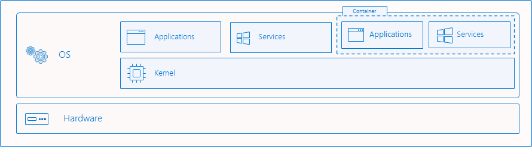

# Windows and containers

Containers are a virtualization technology for packaging and running apps--including Windows apps--across diverse environments on-premises and in the cloud. Containers provide a lightweight layer of virtualization that makes apps easier to develop, deploy, and manage. Containers start and stop more quickly than virtual machines and most monolithic apps, making them ideal for applications that need to rapidly adapt to changing demand or cluster node availability.

Microsoft and Windows help you develop and deploy apps in containers:

- Develop and test Windows-based or Linux-based containers on Windows 10 with built-in support for Docker (the most common environment for running containers).
- Deploy containers in the cloud on Azure (or other clouds):
  - Azure Kubernetes Service (AKS) orchestrates deployment and management of containers at scale.
  - Containers are deployed to Azure virtual machines, which act as the Kubernetes cluster nodes.
  - The Azure virtual machines run either a customized Ubuntu Linux operating system image, or a customized Windows Server 2019 image, providing support for both Linux and Windows-based apps running in containers.
- Optionally deploy containers on-premises by using [Azure Stack with the AKS Engine](https://docs.microsoft.com/azure-stack/user/azure-stack-kubernetes-aks-engine-overview). You can also set up Kubernetes yourself on Windows Server, though the process is more complex.

<em>Maybe add a graphic here illustrating the above?</em>

<!--
Containers are a technology for packaging and delivering applications on top of the Windows across any environment. Containers are purpose-built to carry only the dependencies and configuration needed to successfully run the enclosed application. Containers are incredibly portable by nature; they can move across any environment with ease--from a developer's machine, into a private datacenter, and out to the public cloud.

Today's world demands that information be at a user's fingertips and that services maintain zero downtime availability. Time-to-deployment for both new features and critical fixes are tablestakes of the internet-connected society we live in. Now more than ever businesses are building out solutions that must deploy across a variety of locales--the edge, on-prem datacenters, multiple public cloud providers, and more--to meet the needs of their customers and satisfy their own demands for consuming compute to unlock critical business insights. Just as we at Microsoft have built the Azure cloud to help customers meet these needs, we too have also built Windows containers to help our Windows customers deliver on these requirements.

-->

## How containers work

To understand containers, it can be helpful to compare them with virtual machines, which are a complementary virtualization technology:

- Virtual machines provide a complete virtualization of a computer, running an operating system in the virtual machine as if it were on physical hardware. Your apps run in the VM.
- Containers provide a partial virtualization of the operating system so that each container doesn't need to run an entire operating system. Instead, the containers include a lightweight operating system that consists only of the user mode where apps run, sharing the kernel with the host operating system.
 
 

Containers are natively supported in Windows, similar to Win32 (desktop) apps, with Windows managing all low-level resources. Containers, like virtual machines, are isolated from the host operating system so that they have a restricted view of the file system, Windows registry, and other system resources. This provides a consistent environment for running apps across systems, and optionally provides security boundaries when using the Hyper-V isolation mode (which we talk about later).

## Container users

## How containers work

<!--Containers provide an isolated environment for your application to run within. A container runs an operating system, has a file system, and can be accessed over a network much like a physical or virtual machine. However, the technology and concepts behind containers are vastly different from virtual machines. Whereas virtual machines sit on top of a layer called the hypervisor which virtualizes the underlying hardware of a machine, containers share the kernel of the host's operating system.

That means Microsoft built containers into the Windows OS itself. Similar to how applications can depend on the OS to manage low-level resource control and scheduling, the OS also can provide containers as an isolated environment by which your app can execute in. Windows takes care of setting up the container environment--isolating the view of the filesystem, isolating the view of the Windows registry, restricting which apps are seen running in a container, etc. There is no hypervisor involved--just the Windows host OS itself. -->

### Container Images

All containers are created from container images. Container images are a bundle of files organized into a stack of layers that reside on your local machine or in a remote container registry. The container image consists of a lightweight operating system, your application, any runtimes or dependencies of your application, and any other miscellaneous configuration file your application needs to run properly.

Microsoft offers several starter images (called **base images**) that you can use as a starting point to build your own container image:

* Windows Server Core
* Nano Server
* Windows

> [!TIP]
> Learn more about the [use cases and differences]() between each base image by checking the "Concepts" area of our docs.

As mentioned earlier, container images are composed of a series of layers. Each layer contains a set of files that, when overlaid together, represent your container image. Because of the layered nature of containers, you do not have to always target a base image to build a Windows container. Instead, you could target another image that already carries the framework you want. For example, the .NET team publishes a [.NET core image](https://hub.docker.com/_/microsoft-dotnet-core) that carries the .NET core runtime. It saves users from needing to duplicate the process of installing .NET core--instead they can re-use the layers of this container image. The .NET core image itself is built based upon Nano Server.

## Container users

### Containers for developers

Containers help developers build and ship higher-quality applications, faster. With containers, developers can create a Docker image that will deploy identically across all environments in a matter of seconds. Containers act as an easy mechanism to share code across teams and to bootstrap a development environment without impacting your host filesystem.

Containers are portable and versatile, can be written in any language, and they're compatible with any machine running Windows Server 2016 and Windows 10, version 1607 or later. Developers can create and test a container locally on their laptop or desktop, then deploy that same container image to their company's private cloud, public cloud, or service provider. The natural agility of containers supports modern app development patterns in large-scale, virtualized cloud environments.

### Containers for IT professionals

Containers help admins create infrastructure that's easier to update and maintain. IT professionals can use containers to provide standardized environments for their development, QA, and production teams. They no longer have to worry about complex installation and configuration procedures. By using containers, systems administrators abstract away differences in OS installations and the underlying infrastructure.

Explain value prop here.

## Container Tooling and Ecosystem

Mention here.

## Container Orchestration

Orchestrators are a critical piece of infrastructure that you should be mindful of when embarking on a journey with containers. Managing one or two containers manually can be done successfully on your own. However, most applications are composed of more than just one or two containers. Most applications could be powered by five, ten, or even hundreds of containers. Container orchestrators were built to help manage containers at scale and in production. Orchestrators provide functionality for:

> [!div class="checklist"]
> * Workload scheduling
> * Affinity
> * Health monitoring
> * Failover
> * Scaling
> * Networking
> * Service discovery
> * Coordinated app upgrades

To learn more about container orchestrators with Windows containers, visit the [Kubernetes on Windows](../kubernetes/getting-started-kubernetes-windows.md) tutorial.

## Windows Containers in Azure

Microsoft Azure provides comprehensive end-to-end services to help you get up and running with Windows containers. You can use Azure container instances to run containers without needing to worry about the underlying infrastructure, use Azure Kubernetes Service to take advantage of a fully managed Kubernetes solution with just a few clicks, and more.

<ul class="hubpage cardsM cols cols4" style="display: flex;">
    <li>
        <a href="https://docs.microsoft.com/en-us/azure/app-service/app-service-web-get-started-windows-container" data-linktype="external">
            

                

                    

	                    

                            

                                
                            

                        

                        

                            <h3>App Service</h3>
                            

                            
Deploy web apps or APIs using containers in a PaaS environment

                        

                    

                

            

        </a>
    </li>
    <li>
        <a href="https://docs.microsoft.com/en-us/azure/service-fabric/service-fabric-quickstart-containers" data-linktype="external">
            

                

                    

	                    

                            

                                
                            

                        

                        

                            <h3>Service Fabric</h3>
                            

                            
Modernize .NET applications to microservices using Windows Server containers

                        

                    

                

            

        </a>
    </li>
    <li>
        <a href="https://docs.microsoft.com/en-us/azure/aks/windows-container-cli" data-linktype="external">
            

                

                    

	                    

                            

                                
                            

                        

                        

                            <h3>Kubernetes Service</h3>
                            

                            
Scale and orchestrate Linux containers using Kubernetes

                        

                    

                

            

        </a>
    </li>
    <li>
        <a href="https://docs.microsoft.com/en-us/azure/container-instances/container-instances-overview#linux-and-windows-containers" data-linktype="external">
            

                

                    

	                    

                            

                                
                            

                        

                        

                            <h3>Container Instances</h3>
                            

                            
Elastically burst from your Azure Kubernetes Service (AKS) cluster

                        

                    

                

            

        </a>
    </li>
</ul>

## Try containers on Windows

To get started with containers on Windows Server or Windows 10, follow this link.
> [!div class="nextstepaction"]
> [Get started: Configure Your Environment for Containers](../quick-start/set-up-environment.md)
