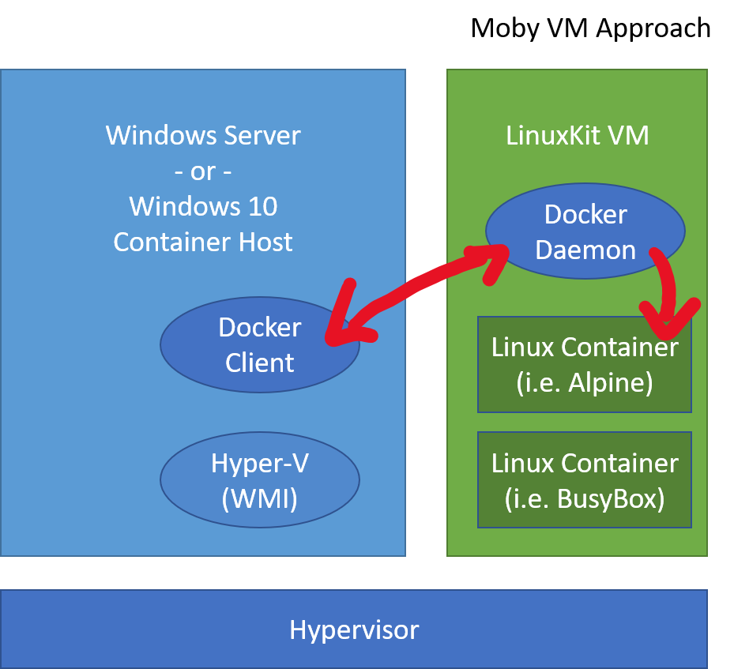

# Linux Containers on Windows

Linux containers make up a huge percent of the overall container ecosystem and are fundamental to both developer experiences and production environments.  Since containers share a kernel with the container host, however, running Linux containers directly on Windows isn't an option[*](lcow.md#other-options-we-considered).  This is where virtualization comes to the rescue.

Right now there are two ways to run Linux containers with Docker for Windows:

1. Run Linux containers in a full Linux VM - this is what Docker typically does today.
1. Run Linux containers with [Hyper-V Isolation](../manage-containers/hyperv-container.md) (LCOW) - this is a new option in Docker for Windows.

This article explores each of these ways of running Linux containers on Windows.

## Linux Containers in a Moby VM

Docker has been able to run Linux containers on Windows desktop since it was first released in 2016 (before Hyper-V isolation or LCOW were available) using a Linux virtual machine running on Hyper-V.

In this model, Docker Client runs on Windows desktop but calls into Docker Daemon on the Linux VM.

All Linux containers run on the same [LinuxKit](https://github.com/linuxkit/linuxkit) based virtual machine.

In this model, all Linux containers:

* Share a kernel with each other and the Moby VM, but not with the Windows host.
* Have consistent storage and networking properties with Linux containers running on Linux (since they are running on a Linux VM).
* May have difficulty sharing data with the Windows container host

### Signs that Moby VM is currently enabled

There are a few ways to see of containers are running with the Moby VM approach:

1. Docker version
1. Hyper-V Manager shows Moby VM
1. `C:\Program Files\Linux Containers` isn't present (more on this in the LCOW section)

## Linux Containers with Hyper-V isolation

Linux kernel with just enough OS to support containers.  The changes to Windows and Hyper-V to build this started in the _Windows 10 Fall Creators Update_ and _Windows Server, version 1709_, but bringing this together also required work with the open source [Moby project](https://www.github.com/moby/moby) on which Docker technology is built, as well as the Linux kernel.

Other projects are beginning to build similar highly-tuned Linux kernels for projects like Kata.

### System requirements

* Windows Server 1709 or Windows 10 Fall Creators Update or later
* Docker EE preview or Docker for Windows CE

### Signs that LCOW is currently enabled

### Run a Hyper-V isolated Linux Container

Follow these [instructions](https://blog.docker.com/2018/02/docker-for-windows-18-02-with-windows-10-fall-creators-update/) from Docker.

### Current development: Bind mounts

Bind mounting volumes with `docker run -v ...` stores the files on the Windows NTFS filesystem, so some translation is needed for POSIX operations. Some filesystem operations are currently partially or not implemented, which may cause incompatibilities for some apps.

These operations are not currently working for bind-mounted volumes:

- MkNod
- XAttrWalk
- XAttrCreate
- Lock
- Getlock
- Auth
- Flush
- INotify

There are also a few that are not fully implemented:

- GetAttr – The Nlink count is always reported as 2
- Open – Only ReadWrite, WriteOnly, and ReadOnly flags are implemented

### Known app issues

These applications all require volume mapping, which has some limitations covered under [Bind mounts](#Bind-mounts). They will not start or run correctly.

- MySQL
- PostgreSQL
- WordPress
- Jenkins
- MariaDB
- RabbitMQ

### Extra information

[Linux Container Video](https://sec.ch9.ms/ch9/1e5a/08ff93f2-987e-4f8d-8036-2570dcac1e5a/LinuxContainer.mp4)

[LinuxKit LCOW-kernel plus build instructions](https://github.com/linuxkit/lcow)

## Other options we considered

This section is a behind the scenes glance at some of the engineering conversations we had when working on LCOW.

### Run Linux containers on WSL

When we were looking at ways to run Linux containers on Windows, we considered WSL.  Ultimately, we chose a virtualization based approach so that Linux containers on Windows have the same app compat as Linux containers on Linux.  There are some places where networking or storage mounting vary, but containers do run consistently.