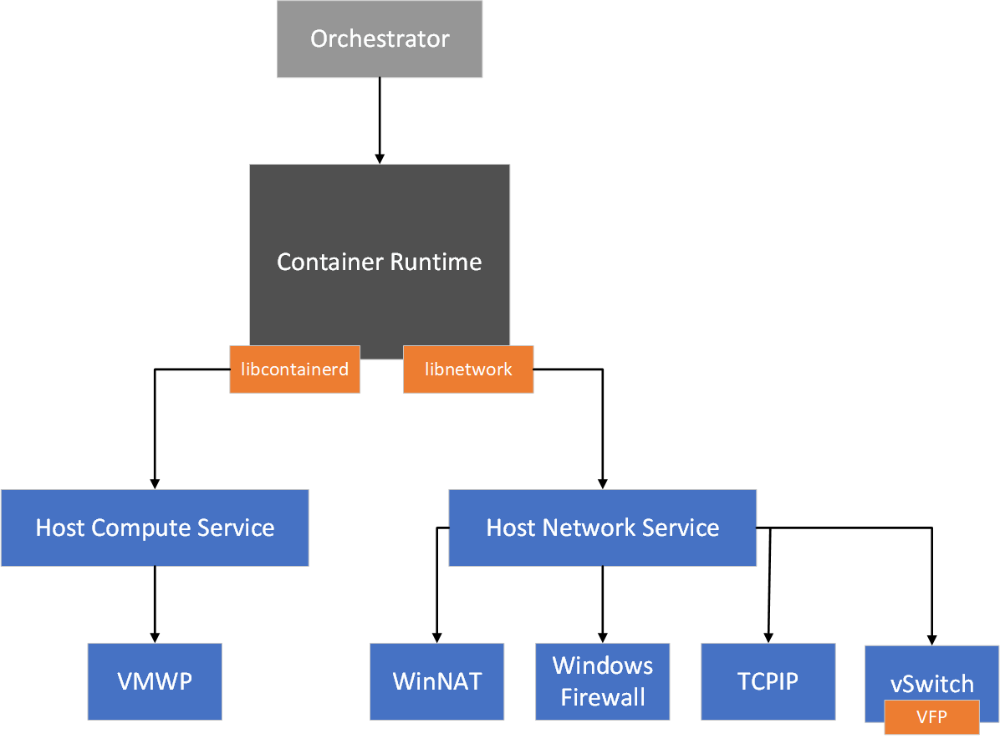

---
title: Windows container networking
description: Gentle intro to architecture of Windows container networks.
keywords: docker, containers
author: jmesser81
ms.date: 03/27/2018
ms.topic: article
ms.prod: windows-containers
ms.service: windows-containers
ms.assetid: 538871ba-d02e-47d3-a3bf-25cda4a40965
---
# Windows container networking

>[!IMPORTANT]
>Please reference [Docker Container Networking](https://docs.docker.com/engine/userguide/networking/) for general docker networking commands, options, and syntax.*** With the exception of any cases described in [unsupported features and network options](#unsupported-features-and-network-options), all Docker networking commands are supported on Windows with the same syntax as on Linux. However, the Windows and Linux network stacks are different, and as such you will find that some Linux network commands (for example, ifconfig) are not supported on Windows.

## Basic networking architecture

This topic provides an overview of how Docker creates and manages host networks on Windows. Windows containers function similarly to virtual machines in regards to networking. Each container has a virtual network adapter (vNIC) which is connected to a Hyper-V virtual switch (vSwitch). Windows supports five different [networking drivers or modes](./network-drivers-topologies.md) which can be created through Docker: *nat*, *overlay*, *transparent*, *l2bridge*, and *l2tunnel*. Depending on your physical network infrastructure and single- vs multi-host networking requirements, you should choose the network driver which best suits your needs.

The first time the docker engine runs, it will create a default NAT network, 'nat', which uses an internal vSwitch and a Windows component named `WinNAT`. If there are any pre-existing external vSwitches on the host which were created through PowerShell or Hyper-V Manager, they will also be available to Docker using the *transparent* network driver and can be seen when you run the ``docker network ls`` command.  

- An **internal** vSwitch is one that isn't directly connected to a network adapter on the container host.
- An **external** vSwitch is one that is directly connected to a network adapter on the container host.

The 'nat' network is the default network for containers running on Windows. Any containers that are run on Windows without any flags or arguments to implement specific network configurations will be attached to the default 'nat' network, and automatically assigned an IP address from the 'nat' network's internal prefix IP range. The default internal IP prefix used for 'nat' is 172.16.0.0/16. 

## Container Network Management with Host Network Service

The Host Networking Service (HNS) and the Host Compute Service (HCS) work together to create containers and attach endpoints to a network.

### Network Creation

- HNS creates a Hyper-V virtual switch for each network
- HNS creates NAT and IP pools as required

### Endpoint Creation

- HNS creates network namespace per container endpoint
- HNS/HCS places v(m)NIC inside network namespace
- HNS creates (vSwitch) ports
- HNS assigns IP address, DNS information, routes, etc. (subject to networking mode) to the endpoint

### Policy Creation

- Default NAT network: HNS creates WinNAT port forwarding rules / mappings with corresponding Windows Firewall ALLOW rules
- All other networks: HNS utilizes the Virtual Filtering Platform (VFP) for policy creation
    - This includes: load balancing, ACLs, encapsulation, etc.
    - Look for our HNS APIs and schema published [here](https://docs.microsoft.com/en-us/windows-server/networking/technologies/hcn/hcn-top)

## Unsupported features and network options

The following networking options are currently **NOT** supported on Windows:

- Windows containers attached to l2bridge, NAT, and overlay networks do not support communicating over the IPv6 stack.
- Encrypted container communication via IPsec.
- HTTP proxy support for containers.
- Attaching endpoints to running in Hyper-V isolation (hot-add).
- Networking on virtualized Azure infrastructure via the transparent network driver.

| Command        | Unsupported option   |
|---------------|:--------------------:|
| ``docker run``|   ``--ip6``, ``--dns-option`` |
| ``docker network create``| ``--aux-address``, ``--internal``, ``--ip-range``, ``--ipam-driver``, ``--ipam-opt``, ``--ipv6``, ``--opt encrypted`` |
