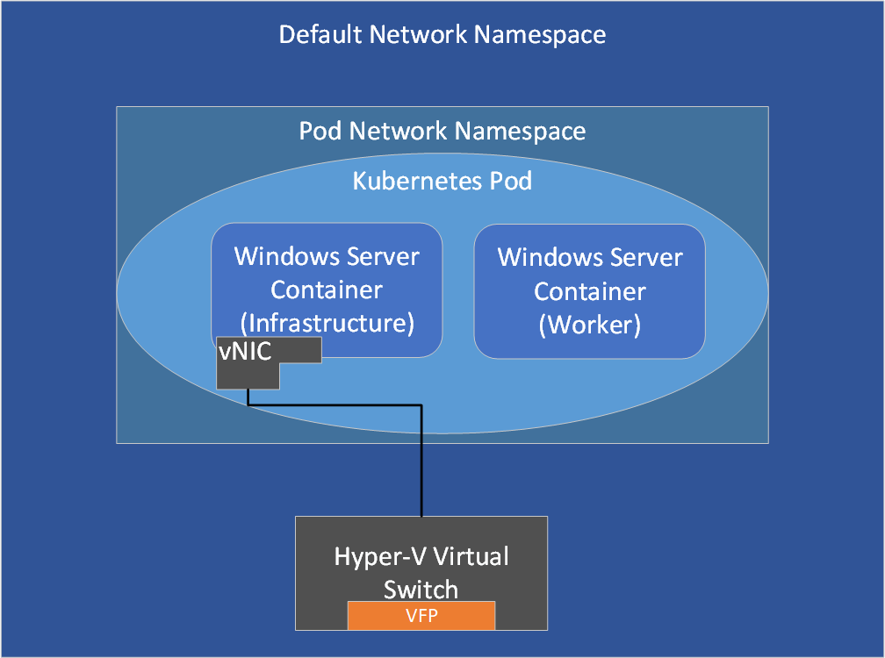

# Network isolation and security

> Applies to: Windows Server 2022, Windows Server 2019, Windows Server 2016

## Isolation with network namespaces

Each container endpoint is placed in its own __network namespace__. The management host virtual network adapter and host network stack are located in the default network namespace. To enforce network isolation between containers on the same host, a network namespace is created for each Windows Server container and containers run under Hyper-V isolation into which the network adapter for the container is installed. Windows Server containers use a host virtual network adapter to attach to the virtual switch. Hyper-V isolation uses a synthetic VM network adapter (not exposed to the utility VM) to attach to the virtual switch.


Run the following Powershell cmdlet to get all network compartments in the protocol stack:

```powershell
Get-NetCompartment
```

## Network security

Depending on which container and network driver is used, port ACLs are enforced by a combination of the Windows Firewall and [Azure Virtual Filtering Platform (VFP)](https://www.microsoft.com/research/project/azure-virtual-filtering-platform/).

### Windows Server containers

The following values use the Windows hosts' firewall (enlightened with network namespaces) as well as VFP:

- Default Outbound: ALLOW ALL
- Default Inbound: ALLOW ALL (TCP, UDP, ICMP, IGMP) unsolicited network traffic
  - DENY ALL other network traffic not from these protocols

> [!NOTE]
> Prior to Windows Server version 1709 and Windows 10 Fall Creators Update, the default inbound rule was DENY all. Users running these older releases can create inbound ALLOW rules with ``docker run -p`` (port forwarding).

### Hyper-V isolation

Containers running in Hyper-V isolation have their own isolated kernel, and therefore, run their own instance of Windows Firewall with the following configuration:

- Default ALLOW ALL in both Windows Firewall (running in the utility VM) and VFP.


### Kubernetes pods

In a [Kubernetes pod](https://kubernetes.io/docs/concepts/workloads/pods/), an infrastructure container is first created to which an endpoint is attached. Containers that belong to the same pod, including infrastructure and worker containers, share a common network namespace (such as the same IP and port space).



### Customizing default port ACLs

If you want to modify the default port ACLs, review the [Host Networking Service](multi-subnet.md) topic before changing the ports. You'll need to update policies inside the following components:

> [!NOTE]
> For Hyper-V isolation in Transparent and NAT mode, currently you can't reconfigure the default port ACLs, which is reflected by an "X" in the table below:

| Network driver | Windows Server containers | Hyper-V isolation  |
| -------------- |-------------------------- | ------------------- |
| Transparent | Windows Firewall | X |
| NAT | Windows Firewall | X |
| L2Bridge | Both | VFP |
| L2Tunnel | Both | VFP |
| Overlay  | Both | VFP |
