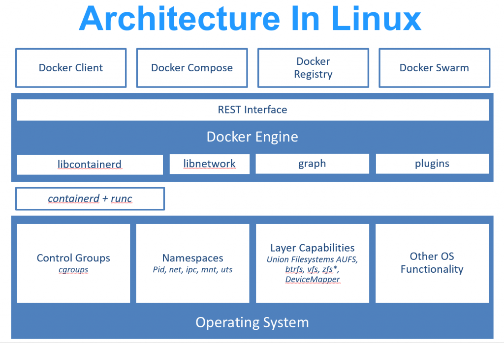
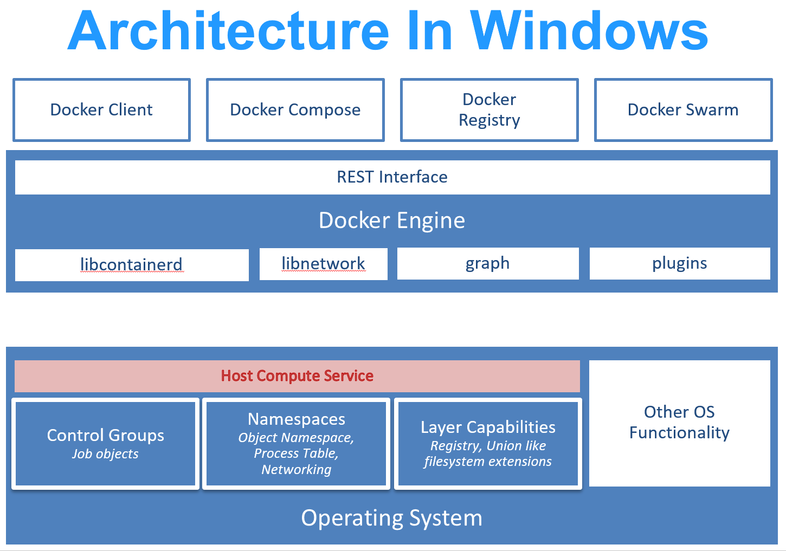
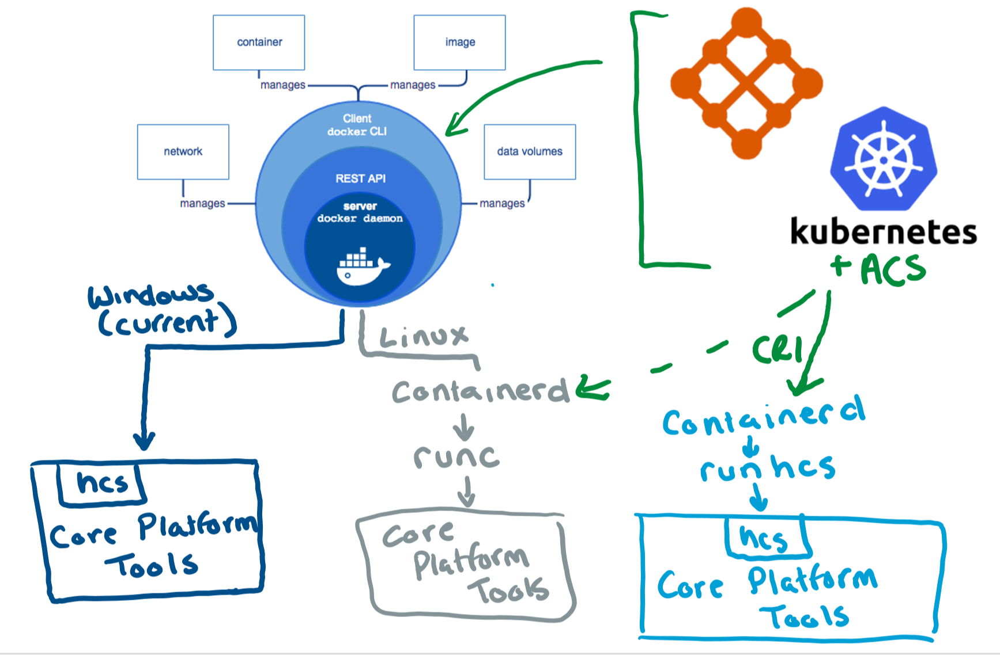

# Container platform tools on Windows

The Windows container platform is expanding! Docker was the first piece of the container journey, now we are building other container platform tools.

* [containerd/cri](https://github.com/containerd/cri) - new in Windows Server 2019/Windows 10 1809.
* [runhcs](https://github.com/Microsoft/hcsshim/tree/master/cmd/runhcs) - a Windows container host counterpart to runc.
* [hcs](https://docs.microsoft.com/virtualization/api/) - the Host Compute Service + handy shims to make it easier to use.
  * [hcsshim](https://github.com/microsoft/hcsshim)
  * [dotnet-computevirtualization](https://github.com/microsoft/dotnet-computevirtualization)

This article will talk about the Windows and Linux container platform as well as each container platform tool.

## Windows and Linux container platform

In Linux environments, container management tools like Docker are built on a more granular set of container tools: [runc](https://github.com/opencontainers/runc) and [containerd](https://containerd.io/).



`runc` is a Linux command-line tool for creating and running containers according to the [OCI container runtime specification](https://github.com/opencontainers/runtime-spec).

`containerd` is a daemon that manages container life cycle from downloading and unpacking the container image to container execution and supervision.

On Windows, we took a different approach.  When we started working with Docker to support Windows containers, we built directly on the HCS (Host Compute Service).  [This blog post](https://techcommunity.microsoft.com/t5/Containers/Introducing-the-Host-Compute-Service-HCS/ba-p/382332) is full of information about why we built the HCS and why we took this approach to containers initially.



At this point, Docker still calls directly into the HCS. Going forward, however, container management tools expanding to include Windows containers and the Windows container host could call into containerd and runhcs the way they call on containerd and runc on Linux.

## runhcs

`runhcs` is a fork of `runc`.  Like `runc`, `runhcs` is a command line client for running applications packaged according to the Open Container Initiative (OCI) format and is a compliant implementation of the Open Container Initiative specification.

Functional differences between runc and runhcs include:

* `runhcs` runs on Windows.  It communicates with the [HCS](containerd.md#hcs) to create and manage containers.
* `runhcs` can run a variety of different container types.

  * Windows and Linux [Hyper-V isolation](../manage-containers/hyperv-container.md)
  * Windows process containers (container image must match the container host)

**Usage:**

``` cmd
runhcs run [ -b bundle ] <container-id>
```

`<container-id>` is your name for the container instance you are starting. The name must be unique on your container host.

The bundle directory (using `-b bundle`) is optional.  
As with runc, containers are configured using bundles. A container's bundle is the directory with the container's OCI specification file, "config.json".  The default value for "bundle" is the current directory.

The OCI spec file, "config.json", has to have two fields to run correctly:

* A path to the container's scratch space
* A path to the container's layer directory

Container commands available in runhcs include:

* Tools to create and run a container
  * **run** creates and runs a container
  * **create** create a container

* Tools to manage processes running in a container:
  * **start** executes the user defined process in a created container
  * **exec** runs a new process inside the container
  * **pause** pause suspends all processes inside the container
  * **resume** resumes all processes that have been previously paused
  * **ps** ps displays the processes running inside a container

* Tools to manage a container's state
  * **state** outputs the state of a container
  * **kill** sends the specified signal (default: SIGTERM) to the container's init process
  * **delete** deletes any resources held by the container often used with detached container

The only command that could be considered multi-container is **list**.  It lists running or paused containers started by runhcs with the given root.

### HCS

We have two wrappers available on GitHub to interface with the HCS. Since the HCS is a C API, wrappers make it easy to call the HCS from higher level languages.  

* [hcsshim](https://github.com/microsoft/hcsshim) - HCSShim is written in Go and it's the basis for runhcs.
Grab the latest from AppVeyor or build it yourself.
* [dotnet-computevirtualization](https://github.com/microsoft/dotnet-computevirtualization) - dotnet-computevirtualization is a C# wrapper for the HCS.

If you want to use the HCS (either directly or via a wrapper), or you want to make a Rust/Haskell/InsertYourLanguage wrapper around the HCS, please leave a comment.

For a deeper look at the HCS, watch [John Stark’s DockerCon presentation](https://www.youtube.com/watch?v=85nCF5S8Qok).

## containerd/cri

> [!IMPORTANT]
> CRI support is only available in Server 2019/Windows 10 1809 and later.  We're also still actively developing containerd for Windows.
> Dev/test only.

While OCI specs defines a single container, [CRI](https://github.com/kubernetes/kubernetes/blob/master/pkg/kubelet/apis/cri/runtime/v1alpha2/api.proto) (container runtime interface) describes containers as workload(s) in a shared sandbox environment called a pod.  Pods can contain one or more container workloads.  Pods let container orchestrators like Kubernetes and Service Fabric Mesh handle grouped workloads that should be on the same host with some shared resources such as memory and vNETs.

containerd/cri enables the following compatibility matrix for pods:

| Host OS | Container OS | Isolation | Pod Support? |
|:-------------------------------------------------------------------------|:-----------------------------------------------------------------------------|:---------------------|:-----------------------------------------------------------------------------------------------------------------------------------------------------|
| <ul><li>Windows Server 2019/1809</ul></li><ul><li>Windows 10 version 1809</ul></li> | Linux | `hyperv` | Yes—Supports true multi-container pods. |
|  | Windows Server 2019/1809 | `process`* or `hyperv` | Yes—Supports true multi-container pods if each workload container OS matches the utility VM OS. |
|  | Windows Server 2016 Windows Server version 1709 Windows Server version 1803 | `hyperv` | Partial—Supports pod sandboxes that can support a single process-isolated container per utility VM if the Container OS matches the utility VM OS. |

\*Windows 10 hosts only support Hyper-V isolation

Links to the CRI spec:

* [RunPodSandbox](https://github.com/kubernetes/kubernetes/blob/master/pkg/kubelet/apis/cri/runtime/v1alpha2/api.proto#L24) - Pod Spec
* [CreateContainer](https://github.com/kubernetes/kubernetes/blob/master/pkg/kubelet/apis/cri/runtime/v1alpha2/api.proto#L47) - Workload Spec



While runHCS and containerd both can manage on any Windows system Server 2016 or later, supporting Pods (groups of containers) required breaking changes to container tools in Windows.  CRI support is available on Windows Server 2019/Windows 10 1809 and later.
