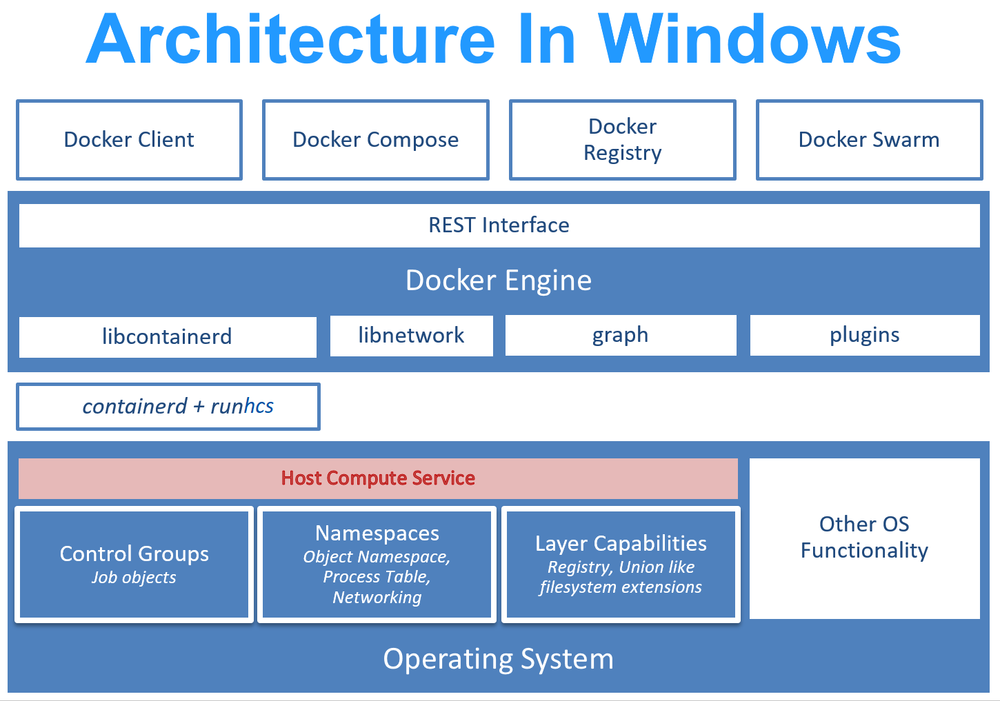

# Container platform tools in Windows

To make it easier for container management tools to run on a Windows with as little extra integration work as possible, we're introducing a Windows counterpart to runc - [runhcs](https://github.com/Microsoft/hcsshim/tree/master/cmd/runhcs).  We have also worked closely with the containerd project to integrate runhcs into [containerd/containerd](https://github.com/containerd/containerd) and [containerd/cri](https://github.com/containerd/cri).

This article will talk about the Windows and Linux container platform, `runhcs`, HCS (Host Compute Service), and `containerd` on Windows.

## Windows and Linux container platform

In Linux environments, container management tools like Docker are built on another, more granular, set of container tools - [runc](https://github.com/opencontainers/runc) and [containerd](https://containerd.io/).


`runc` is a Linux command line tool for creating and running containers according to the [OCI container runtime specification](https://github.com/opencontainers/runtime-spec).

`containerd` is a daemon that manages container life cycle from downloading and unpacking the container image through container execution and supervision.

On Windows, we initially took a different approach.  When we started working with Docker to support Windows containers, we built directly on the HCS (Host Compute Service).  [This blog post](https://blogs.technet.microsoft.com/virtualization/2017/01/27/introducing-the-host-compute-service-hcs/) is full of information about why we built the HCS and why we took this approach to containers initially.


At this point, Docker still calls directly into the HCS. Going forward, however, container management tools could call into containerd and runhcs the way they call on containerd and runc on Linux.



## runhcs

RunHCS is a fork of runc.  Like runc, runhcs is a command line client for running applications packaged according to the Open Container Initiative (OCI) format and is a compliant implementation of the Open Container Initiative specification.  The biggest difference between the two, besides running on Windows, is that runhcs can run both Windows and Linux [Hyper-V containers](../manage-containers/hyperv-container.md) in addition to Windows process containers.

Usage:

``` cmd
runhcs run [ -b bundle ] <container-id>
```

`<container-id>` is your name for the container instance you are starting. The name must be unique on your container host.

The bundle directory (using `-b bundle`) is optional.  
As with runc, containers are configured using bundles. A container's bundle is the directory with the container's OCI specification file, "config.json".  The default value for "bundle" is the current directory.

The OCI spec file, "config.json", has to have two fields to run correctly:

1. A path to the container's scratch space
1. A path to the container's layer directory

Container commands available in runhcs include:

* Tools to create and run a container
  * **run** creates and runs a container
  * **create** create a container
  * **exec** runs a new process inside the container

* Tools to manage processes running in a container:
  * **start** executes the user defined process in a created container
  * **pause** pause suspends all processes inside the container
  * **resume** resumes all processes that have been previously paused
  * **ps** ps displays the processes running inside a container

* Tools to manage a container's state
  * **state** outputs the state of a container
  * **kill** sends the specified signal (default: SIGTERM) to the container's init process
  * **delete** deletes any resources held by the container often used with detached container

The only command that could be considered multi-container is **list**.  It lists running (or paused) containers started by runhcs with the given root.

## containerd/cri

While OCI specs define a single container, CRI (container runtime interface) spec defines a multi-container environment for container orchestrators like Kubernetes and Service Fabric Mesh.


## HCS

We have two wrappers available on GitHub to interface with the HCS. Since the HCS is a C API, wrappers make it easy to call the HCS from higher level languages.  

### HCSShim

HCSShim is written in Go and it's the basis for runhcs.
Grab the latest from AppVeyor or build it yourself.

Check it out in [GitHub](https://github.com/microsoft/hcsshim).

### dotnet-computevirtualization

dotnet-computevirtualization is a C# wrapper for the HCS.

Check it out on [GitHub](https://github.com/microsoft/dotnet-computevirtualization).

If you want to use the HCS (either directly or via a wrapper), or you want to make a Rust/Haskell/InsertYourLanguage wrapper around the HCS, please leave a comment.

For a deeper look at the HCS, watch [John Stark’s DockerCon presentation](https://www.youtube.com/watch?v=85nCF5S8Qok).

### call stack reference

