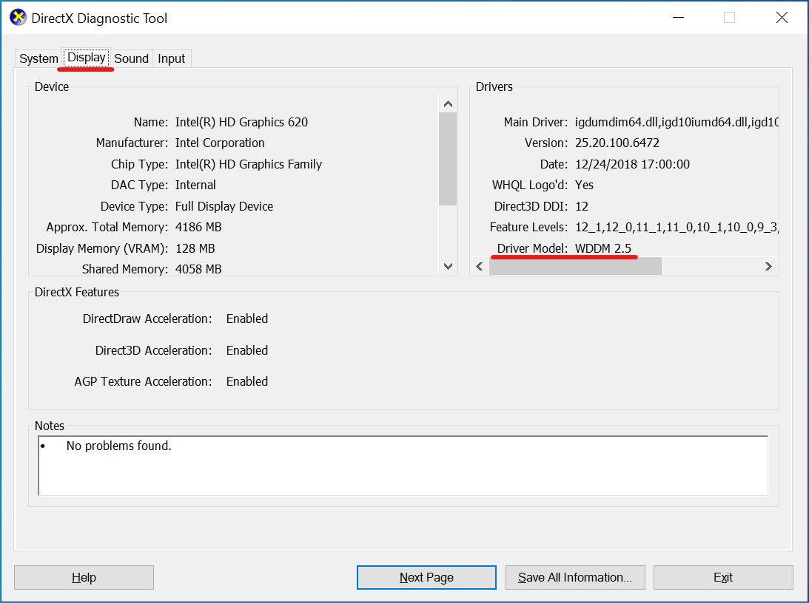

# GPU acceleration in Windows containers

For many containerized workloads, CPU compute resources provide sufficient performance. However, for a certain class of workload, the massively parallel compute power offered by GPUs (graphics processing units) can speed up operations  by orders of magnitude, bringing down cost and improving throughput immensely.

GPUs are already a common tool for many popular workloads, from traditional rendering and simulation to machine learning training and inference. Windows containers support GPU acceleration for DirectX and all the frameworks built on top of it.

> [!NOTE]
> This feature is available in Docker Desktop, version 2.1 and Docker Engine - Enterprise, version 19.03 or later.

## Prerequisites

For this feature to work, your environment must meet the following requirements:

- The container host must be running Windows Server 2019 or Windows 10, version 1809 or newer.
- The container base image must be [mcr.microsoft.com/windows:1809](https://hub.docker.com/r/microsoft/windows) or newer. Windows Server Core and Nano Server container images are not currently supported.
- The container host must be running Docker Engine 19.03 or newer.
- The container host must have a GPU running display drivers version WDDM 2.5 or newer.

To check the WDDM version of your display drivers, run the DirectX Diagnostic Tool (dxdiag.exe) on your container host. In the tool's "Display" tab, look in the "Drivers" section as indicated below.



## Run a container with GPU acceleration

To start a container with GPU acceleration, run the following command:

```shell
docker run --isolation process --device class/5B45201D-F2F2-4F3B-85BB-30FF1F953599 mcr.microsoft.com/windows:1809
```

> [!IMPORTANT]
> DirectX (and all the frameworks built on top of it) are the only APIs that can be accelerated with a GPU today. 3rd party frameworks are not supported.

## Hyper-V-isolated Windows Container Support

GPU acceleration for workloads in Hyper-V-isolated Windows containers is not currently supported.

## Hyper-V-isolated Linux Container Support

GPU acceleration for workloads in Hyper-V-isolated Linux containers is not currently supported.

## More information

For a complete example of a containerized DirectX app that leverages GPU acceleration, see [DirectX container sample](https://github.com/MicrosoftDocs/Virtualization-Documentation/tree/master/windows-container-samples/directx).
