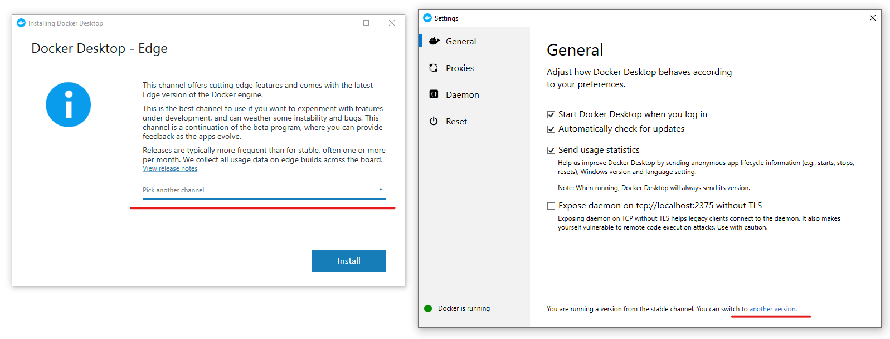

# Use containers with the Windows Insider program

This exercise will walk you through the deployment and use of the Windows container feature on the latest insider build of Windows Server from the Windows Insider Preview program. During this exercise, you will install the container role and deploy a preview edition of the base OS images. If you need to familiarize yourself with containers, you can find this information in [About Containers](../about/index.md).

> [!NOTE]
> This content is specific to Windows Server containers on the Windows Server Insider Preview program. If you're looking for non-insider instructions for using Windows containers, please see the [Get Started](../quick-start/set-up-environment.md) guide.

## Join the Windows Insider Program

In order to run the insider version of Windows containers, you must have a host running the latest build of Windows Server from the Windows Insider program and/or the latest build of Windows 10 from the Windows Insider program. Join the [Windows Insider Program](https://insider.windows.com/GettingStarted) and review the Terms of Use.

> [!IMPORTANT]
> You must use a build of Windows Server from the Windows Server Insider Preview program or a build of Windows 10 from the Windows Insider Preview program to use the base image described below. If you are not using one of these builds, the use of these base images will result in failure to start a container.

## Install Docker

<!-- start tab view -->
# [Windows Server Insider](#tab/Windows-Server-Insider)

To install Docker EE, we'll use the OneGet provider PowerShell module. The provider will enable the containers feature on your machine and install Docker EE - this will require a reboot. Open an elevated PowerShell session and run the following commands.

> [!NOTE]
> Installing Docker EE with Windows Server Insider builds requires a different OneGet provider than the one used for non-Insider builds. If Docker EE and the DockerMsftProvider OneGet provider are already installed remove them before continuing.

```powershell
Stop-Service docker
Uninstall-Package docker
Uninstall-Module DockerMsftProvider
```

Install the OneGet PowerShell module for use with Windows Insider builds.

```powershell
Install-Module -Name DockerProvider -Repository PSGallery -Force
```

Use OneGet to install the latest version of Docker EE Preview.

```powershell
Install-Package -Name docker -ProviderName DockerProvider -RequiredVersion Preview
```

When the installation is complete, reboot the computer.

```powershell
Restart-Computer -Force
```

# [Windows 10 Insider](#tab/Windows-10-Insider)

On Windows 10 Insider, Docker Edge is installed through the same installer as Docker Desktop stable. Download [Docker Desktop](https://store.docker.com/editions/community/docker-ce-desktop-windows) and run the installer. You will be required to login. Create an account if you don't have one already. More detailed installation instructions are available in the [Docker documentation](https://docs.docker.com/docker-for-windows/install).

After installation, open Docker's settings and switch to the "Edge" channel.



---
<!-- stop tab view -->

## Pull an insider container image

Before working with Windows containers, a base image needs to be installed. By being part of the Windows Insider program, you can use our latest builds for the base images. YOu can read more about the available base images in the [Container base images](../manage-containers/container-base-images.md) doc.

To pull the Nano Server Insider base image run the following:

```console
docker pull mcr.microsoft.com/nanoserver/insider
```

To pull the Windows Server Core insider base image run the following:

```console
docker pull mcr.microsoft.com/windows/servercore/insider
```

> [!IMPORTANT]
> Please read the Windows containers OS image [EULA](../images-eula.md ) and the Windows Insider program [Terms of Use](https://www.microsoft.com/software-download/windowsinsiderpreviewserver).
