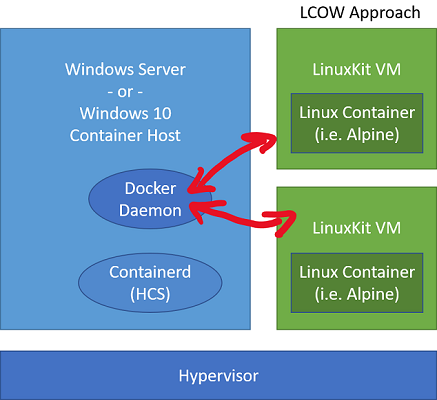
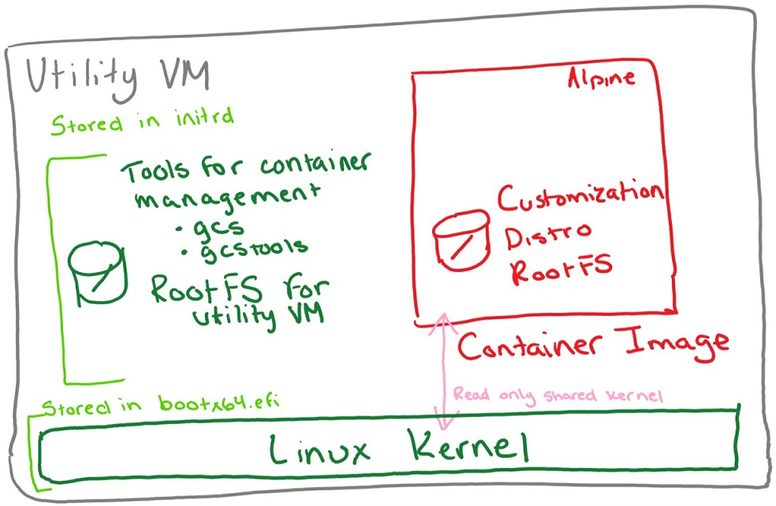

# Linux Containers on Windows - LCOW and Moby VM

Linux containers make up a huge percent of the overall container ecosystem and are fundamental to both developer experiences and production environments.  Since containers share a kernel with the container host, however, running Linux containers directly on Windows isn't an option[*](linux-containers.md#other-options-we-considered).  This is where virtualization comes into the picture.

Right now there are two ways to run Linux containers with Docker for Windows and Hyper-V:

1. Run Linux containers in a full Linux VM - this is what Docker typically does today.
1. Run Linux containers with [Hyper-V Isolation](../manage-containers/hyperv-container.md) (LCOW) - this is a new option in Docker for Windows.

This article outlines how each approach works, provides guidance about when to choose which solution, and shares work in progress.

## Linux Containers in a Moby VM

To run Linux containers in a Linux VM, follow the instructions in [Docker's get-started guide](https://docs.docker.com/docker-for-windows/).

Docker has been able to run Linux containers on Windows desktop since it was first released in 2016 (before Hyper-V isolation or LCOW were available) using a [LinuxKit](https://github.com/linuxkit/linuxkit) based virtual machine running on Hyper-V.

In this model, Docker Client runs on Windows desktop but calls into Docker Daemon on the Linux VM.

In this model, all Linux containers share a single Linux-based container host and all Linux containers:

* Share a kernel with each other and the Moby VM, but not with the Windows host.
* Have consistent storage and networking properties with Linux containers running on Linux (since they are running on a Linux VM).

It also means the Linux container host (Moby VM) needs to be running Docker Daemon and all of Docker Daemon's dependencies.

To see if you're running with Moby VM, check Hyper-V Manager for Moby VM using either the Hyper-V Manager UI or by running `Get-VM` in a elevated PowerShell window.

### When to use Moby VM

Right now, we recommend the Moby VM method of running Linux containers to people who:

1. Want a stable container environment.  This is the Docker for Windows default.
1. Run Windows or Linux containers, but rarely both at the same time.
1. Have complicated or custom networking requirements between Linux containers.
1. Don't need kernel isolation (Hyper-V isolation) between Linux containers.

## Linux Containers with Hyper-V isolation

To try LCOW, follow the Linux container instructions in [this get-started guide](../quick-start/quick-start-windows-10.md)

Linux Containers with Hyper-V isolation run each Linux container (LCOW) in an optimized Linux VM with just enough OS to run containers.  In contrast to the Moby VM approach, each LCOW has it's own kernel and it's own VM sandbox.  They're also managed by Docker on Windows directly.

Taking a closer look at how container management differs between the Moby VM approach and LCOW, in the LCOW model container management stays on Windows and each LCOW management happens via GRPC and containerd.  This means the Linux distro containers use for LCOW can have a much smaller inventory.  Right now, we're using LinuxKit for the optimized distro containers use but other projects like Kata are building similar highly-tuned Linux distros (Clear Linux) as well.

Here's a closer look at each LCOW:

To see if you're running LCOW, navigate to `C:\Program Files\Linux Containers`.  If Docker is configured to use LCOW, there will be a few files here containing the minimal LinuxKit distro that runs in each Hyper-V container.  Notice the optimized VM components are less than 100 MB, much smaller than the LinuxKit image in Moby VM.

### Work in progress

LCOW is under active development.  Track ongoing progress in the Moby project on [GitHub](https://github.com/moby/moby/issues/33850)

#### Bind mounts

Bind mounting volumes with `docker run -v ...` stores the files on the Windows NTFS filesystem, so some translation is needed for POSIX operations. Some filesystem operations are currently partially or not implemented, which may cause incompatibilities for some apps.

These operations are not currently working for bind-mounted volumes:

* MkNod
* XAttrWalk
* XAttrCreate
* Lock
* Getlock
* Auth
* Flush
* INotify

There are also a few that are not fully implemented:

* GetAttr – The Nlink count is always reported as 2
* Open – Only ReadWrite, WriteOnly, and ReadOnly flags are implemented

These applications all require volume mapping and will not start or run correctly.

* MySQL
* PostgreSQL
* WordPress
* Jenkins
* MariaDB
* RabbitMQ

### When to use LCOW

Right now, we recommend LCOW to people who:

1. Want to test our newest technology.
1. Run Windows and Linux containers at the same time.
1. Need kernel isolation (Hyper-V isolation) between Linux containers.

### Extra information

[Docker blog describing LCOW](https://blog.docker.com/2017/11/docker-for-windows-17-11/)

[Linux Container Video](https://sec.ch9.ms/ch9/1e5a/08ff93f2-987e-4f8d-8036-2570dcac1e5a/LinuxContainer.mp4)

[LinuxKit LCOW-kernel plus build instructions](https://github.com/linuxkit/lcow)

## Other options we considered

When we were looking at ways to run Linux containers on Windows, we considered WSL.  Ultimately, we chose a virtualization based approach so that Linux containers on Windows have the same app compatibility as Linux containers on Linux.  Using Hyper-V also makes LCOW more secure and more flexible.

With that said, there are also gap in functionality when running containers on WSL.  Storage gets complicated since many linux containers rely on mounted storage and WSL doesn't include an ext4 driver.

We may re-evaluate in the future, but for now, LCOW will continue to use Hyper-V.  If you have thoughts, please send feedback through github or UserVoice.