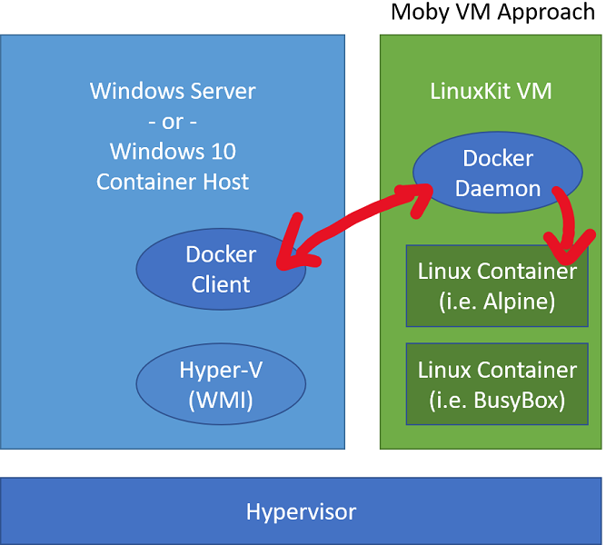

# Linux containers on Windows 10

Linux containers make up a huge percent of the overall container ecosystem and are fundamental to both developer experiences and production environments.  Since containers share a kernel with the container host, however, running Linux containers directly on Windows isn't an option. This is where virtualization comes into the picture.

## Linux containers in a Moby VM

To run Linux containers in a Linux VM, follow the instructions in [Docker's get-started guide](https://docs.docker.com/docker-for-windows/).

Docker has been able to run Linux containers on Windows desktop since it was first released in 2016 (before Hyper-V isolation or Linux containers on Windows were available) using a [LinuxKit](https://github.com/linuxkit/linuxkit) based virtual machine running on Hyper-V.

In this model, Docker Client runs on Windows desktop but calls into Docker Daemon on the Linux VM.

In this model, all Linux containers share a single Linux-based container host and all Linux containers:

* Share a kernel with each other and the Moby VM, but not with the Windows host.
* Have consistent storage and networking properties with Linux containers running on Linux (since they are running on a Linux VM).

It also means the Linux container host (Moby VM) needs to be running Docker Daemon and all of Docker Daemon's dependencies.

To see if you're running with Moby VM, check Hyper-V Manager for Moby VM using either the Hyper-V Manager UI or by running `Get-VM` in an elevated PowerShell window.
