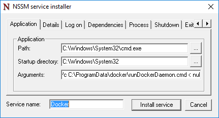

# Docker and Windows

**This is preliminary content and subject to change.** 

The Docker engine is not included with Windows and will need to be installed and configured individually. The steps used to run the Docker Engine on Windows will vary from those used to run in on Linux. This document will step through installing and configuring the Docker engine on Windows Server 2016, Nano Server, and Windows Client. Also note, the Docker engine and command line interface have recently been split into two files. This document includes instructions for installing both.

For more information on Docker and the Docker toolset visit [Docker.com](https://www.docker.com/). 

> The Windows container feature must be enabled before Docker can be used to create and manage Windows containers. For instructions on enabling this feature, see the [Container host deployment guide](./docker_windows.md).

## Windows Server 2016

### Install Docker daemon <!--1-->

Download dockerd.exe from `https://aka.ms/tp5/dockerd` and place it in the System32 directory on the container Host.

```none
wget https://aka.ms/tp5/dockerd -OutFile $env:SystemRoot\system32\dockerd.exe
```

Create a directory named `c:\programdata\docker`. In this directory create a file named `runDockerDaemon.cmd`.

```none
New-Item -ItemType File -Path C:\ProgramData\Docker\runDockerDaemon.cmd -Force
```

Copy the following text into the `runDockerDaemon.cmd` file.

```none
@echo off
set certs=%ProgramData%\docker\certs.d

if exist %ProgramData%\docker (goto :run)
mkdir %ProgramData%\docker

:run
if exist %certs%\server-cert.pem (if exist %ProgramData%\docker\tag.txt (goto :secure))

if not exist %systemroot%\system32\dockerd.exe (goto :legacy)

dockerd -H npipe:// 
goto :eof

:legacy
docker daemon -H npipe:// 
goto :eof

:secure
if not exist %systemroot%\system32\dockerd.exe (goto :legacysecure)
dockerd -H npipe:// -H 0.0.0.0:2376 --tlsverify --tlscacert=%certs%\ca.pem --tlscert=%certs%\server-cert.pem --tlskey=%certs%\server-key.pem
goto :eof

:legacysecure
docker daemon -H npipe:// -H 0.0.0.0:2376 --tlsverify --tlscacert=%certs%\ca.pem --tlscert=%certs%\server-cert.pem --tlskey=%certs%\server-key.pem
```
Download nssm.exe from [https://nssm.cc/release/nssm-2.24.zip](https://nssm.cc/release/nssm-2.24.zip).

```none
wget https://nssm.cc/release/nssm-2.24.zip -OutFile $env:ALLUSERSPROFILE\nssm.zip
```

Extract the compressed package.

```none
Expand-Archive -Path $env:ALLUSERSPROFILE\nssm.zip $env:ALLUSERSPROFILE
```

Copy `nssm-2.24\win64\nssm.exe` into the `c:\windows\system32` directory.

```none
Copy-Item $env:ALLUSERSPROFILE\nssm-2.24\win64\nssm.exe $env:SystemRoot\system32
```
Run `nssm install` to configure the Docker service.

```none
start-process nssm install
```

Enter the following data into the corresponding fields in the NSSM service installer.

Application Tab:

**Path:** C:\Windows\System32\cmd.exe

**Startup Directory:** C:\Windows\System32

**Arguments:** /s /c C:\ProgramData\docker\runDockerDaemon.cmd < nul

**Service Name** - Docker



Details Tab:

**Display name:** Docker

**Description:** The Docker Daemon provides management capabilities of containers for docker clients.


IO Tab:

**Output (stdout):** C:\ProgramData\docker\daemon.log

**Error (stderr):** C:\ProgramData\docker\daemon.log


When finished, click the `Install Service` button.

The Docker daemon is now configured as a Windows service.

### Firewall <!--1-->

If you wish to enable remote Docker management, you also need to open TCP port 2376.

```none
netsh advfirewall firewall add rule name="Docker daemon " dir=in action=allow protocol=TCP localport=2376
```

### Removing Docker <!--1-->

The following command will remove the Docker service.

```none
sc.exe delete Docker
```

### Install Docker CLI

Download docker.exe from `https://aka.ms/tp5/docker` and place it in the System32 directory of the container host or any other system where you will run Docker commands.

```none
wget https://aka.ms/tp5/docker -OutFile $env:SystemRoot\system32\docker.exe
```

## Nano Server

### Install Docker <!--2-->

Download dockerd.exe from `https://aka.ms/tp5/dockerd` and copy it to the `windows\system32` folder of the Nano Server Container host.

Create a directory named `c:\programdata\docker`. In this directory, create a file named `runDockerDaemon.cmd`.

```none
New-Item -ItemType File -Path C:\ProgramData\Docker\runDockerDaemon.cmd -Force
```

Copy the following text into the `runDockerDaemon.cmd` file.

```none
@echo off
set certs=%ProgramData%\docker\certs.d

if exist %ProgramData%\docker (goto :run)
mkdir %ProgramData%\docker

:run
if exist %certs%\server-cert.pem (if exist %ProgramData%\docker\tag.txt (goto :secure))

if not exist %systemroot%\system32\dockerd.exe (goto :legacy)

dockerd -H npipe:// 
goto :eof

:legacy
docker daemon -H npipe:// 
goto :eof

:secure
if not exist %systemroot%\system32\dockerd.exe (goto :legacysecure)
dockerd -H npipe:// -H 0.0.0.0:2376 --tlsverify --tlscacert=%certs%\ca.pem --tlscert=%certs%\server-cert.pem --tlskey=%certs%\server-key.pem
goto :eof

:legacysecure
docker daemon -H npipe:// -H 0.0.0.0:2376 --tlsverify --tlscacert=%certs%\ca.pem --tlscert=%certs%\server-cert.pem --tlskey=%certs%\server-key.pem
```

The following script can be used to create a scheduled task, that will start the Docker daemon when Windows boots.

```none
# Creates a scheduled task to start docker.exe at computer start up.

$dockerData = "$($env:ProgramData)\docker"
$dockerDaemonScript = "$dockerData\runDockerDaemon.cmd"
$dockerLog = "$dockerData\daemon.log"
$action = New-ScheduledTaskAction -Execute "cmd.exe" -Argument "/c $dockerDaemonScript > $dockerLog 2>&1" -WorkingDirectory $dockerData
$trigger = New-ScheduledTaskTrigger -AtStartup
$settings = New-ScheduledTaskSettingsSet -Priority 5
Register-ScheduledTask -TaskName Docker -Action $action -Trigger $trigger -Settings $settings -User SYSTEM -RunLevel Highest | Out-Null
Start-ScheduledTask -TaskName Docker 
```

### Firewall <!--2-->

If you wish to enable remote Docker management, you also need to open TCP port 2376.

```none
netsh advfirewall firewall add rule name="Docker daemon " dir=in action=allow protocol=TCP localport=2376
```

### Interactive Nano session

Nano server is managed through a remote PowerShell session. For more information on remotely managing Nano Server, see [Getting Started with Nano Server]( https://technet.microsoft.com/en-us/library/mt126167.aspx#bkmk_ManageRemote).

Not all docker operations, such as 'docker attach' can be performed through this remote PowerShell session. To get around this, and as a best practice in general, manage Docker from a remote client through a secure TCP connection.

To do so, ensure that the Docker daemon has been configured to listen on a TCP port, and that the Docker command line interface is available on a remote client machine. When configured, docker commands can be issued to the host with the -H parameter. For more information on accessing the Docker daemon from a remote system, see [Daemon socket options on Docker.com](https://docs.docker.com/engine/reference/commandline/daemon/#daemon-socket-option).

To remotely deploy a container and enter an interactive session, run the following command.

```none
docker -H tcp://<ipaddress of server>:2376 run -it nanoserver cmd
```

An environmental variable DOCKER_HOST can be created that will remove the -H parameter requirement. The following PowerShell command can be used for this.

```none
$env:DOCKER_HOST = "tcp://<ipaddress of server:2376"
```

With this variable set, the command would now look like this.

```none
docker run -it nanoserver cmd
```

### Removing Docker <!--2-->

To remove the docker daemon and cli from Nano Server, delete `docker.exe` from the Windows\system32 directory.

```none
Remove-Item $env:SystemRoot\system32\docker.exe
``` 

Run the following to un-register the Docker scheduled task.

```none
Get-ScheduledTask -TaskName Docker | UnRegister-ScheduledTask
```

### Install Docker CLI

Download docker.exe from `https://aka.ms/tp5/docker` and copy it to the windows\system32 folder of the Nano Server Container host.

```none
wget https://aka.ms/tp5/docker -OutFile $env:SystemRoot\system32\docker.exe
```

## Configuring Docker Startup

Several startup options are available for the Docker daemon. In this section, some of these relevant to the Docker daemon on Windows will be detailed. For complete coverage of all daemon options, see the [Docker daemon documentation on docker.com]( https://docs.docker.com/engine/reference/commandline/daemon/)

### Listening TCP port

The Docker daemon can be configured to listen for incoming connections locally through a named pipe or remotely through a TCP connection. The default startup behavior is to listen on only the named pipe, which will prevent remote connections.

```none
docker daemon -D
```

This can be modified to listen for secure incoming connections with the following startup command. For more information on securing the connection, see the [Security Configuration docs on docker.com](https://docs.docker.com/engine/security/https/).

```none
docker daemon -D -H npipe:// -H tcp://0.0.0.0:2376 --tlsverify --tlscacert=%certs%\ca.pem --tlscert=%certs%\server-cert.pem --tlskey=%certs%\server-key.pem
``` 

### Named pipe access

Docker commands run locally on the container host are received through a named pipe. In order to run these commands, administrative access is needed. Another option is to specify a group that will have access to the named pipe. In the following example, a Windows group named `docker` is given this access.

```none
dockerd -H npipe:// -G docker
```  


### Default runtime

Windows containers have two distinct runtime types, Windows Server and Hyper-V. The Docker daemon is configured to use the Windows Server runtime by default, however this can be changed. To set Hyper-V as the default runtime, specify ‘—exec-opt isolation=hyperv` when initializing the Docker daemon.

```none
docker daemon -D —exec-opt isolation=hyperv
```

