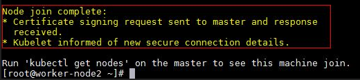

# Joining Linux Nodes to a Cluster

Once you have [setup a Kubernetes master node](creating-a-linux-master.md) and [selected your desired network solution](network-topologies.md), you are ready to join Linux nodes to your cluster. This requires some [preparation on the Linux node](joining-linux-workers.md#preparing-a-linux-node) before joining.
> [!tip]
> The Linux instructions are tailored towards **Ubuntu 16.04**. Other Linux distributions certified to run Kubernetes should also offer equivalent commands that you can substitute. They will also interoperate successfully with Windows.

## Preparing a Linux node

> [!NOTE]
> Unless explicitly specified otherwise, run any commands in an **elevated, root-user shell**.

First, get into a root shell:

```bash
sudo –s
```

Make sure your machine is up to date:

```bash
apt-get update && apt-get upgrade
```

## Install Docker

To be able to use containers, you need a container engine, such as Docker. To get the most recent version, you can use [these instructions](https://docs.docker.com/install/linux/docker-ce/ubuntu/) for Docker installation. You can verify that docker is installed correctly by running `hello-world` image:

```bash
docker run hello-world
```

## Install kubeadm

Download `kubeadm` binaries for your Linux distribution and initialize your cluster.

> [!Important]  
> Depending on your Linux distribution, you may need to replace `kubernetes-xenial` below with the correct [codename](https://wiki.ubuntu.com/Releases).

``` bash
curl -s https://packages.cloud.google.com/apt/doc/apt-key.gpg | apt-key add -
cat <<EOF >/etc/apt/sources.list.d/kubernetes.list
deb http://apt.kubernetes.io/ kubernetes-xenial main
EOF
apt-get update && apt-get install -y kubelet kubeadm kubectl 
```

## Disable swap

Kubernetes on Linux requires swap space to be turned off:

``` bash
nano /etc/fstab  # (remove a line referencing 'swap.img' , if it exists)
swapoff -a
```

## (Flannel Only) Enable bridged IPv4 traffic to iptables

If you chose Flannel as your networking solution it is recommended to enable bridged IPv4 traffic to iptables chains. You should have [already done this for the master](network-topologies.md#flannel-in-host-gateway-mode) and now need to repeat it for the Linux node intending to join. It can be done using the following command:

``` bash
sudo sysctl net.bridge.bridge-nf-call-iptables=1
```

## Copy Kubernetes certificate

**As regular, (non-root) user**, perform the following 3 steps.

1. Create Kubernetes for Linux directory:

```bash
mkdir -p $HOME/.kube
```

2. Copy the Kubernetes certificate file (`$HOME/.kube/config`) [from master](./creating-a-linux-master.md#collect-cluster-information) and save as `$HOME/.kube/config` on the worker.

> [!tip]
> You can use scp-based tools such as [WinSCP](https://winscp.net/eng/download.php) to transfer the config file between nodes.

3. Set file ownership of the copied config file as follows:

``` bash
sudo chown $(id -u):$(id -g) $HOME/.kube/config
```

## Joining node

Finally, to join the cluster, run the `kubeadm join` command [we noted down earlier](./creating-a-linux-master.md#initialize-master) **as root**:

```bash
kubeadm join <Master_IP>:6443 --token <some_token> --discovery-token-ca-cert-hash <some_hash>
```

If successful, you should see similar output to this:



## Next steps

In this section, we covered how to join Linux workers to our Kubernetes cluster. Now you are ready for step 6:
> [!div class="nextstepaction"]
> [Deploying Kubernetes resources](./deploying-resources.md)