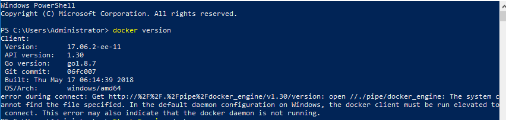
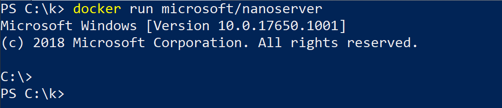
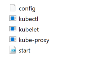

# Joining Windows Server Nodes to a Cluster #
Once you have [setup a Kubernetes master node](./creating-a-linux-master.md) and [selected your desired network solution](./network-topologies.md), you are ready to join Windows Server nodes to form a cluster. This requires some [preparation on the Windows nodes](#preparing-a-windows-node) before joining.

## Preparing a Windows node ##
> [!NOTE]  
> All code snippets in Windows sections are to be run in _elevated_ PowerShell.

### Install Docker (requires reboot) ###
Kubernetes uses [Docker](https://www.docker.com/) as its container engine, so we need to install it. You can follow the [official Docs instructions](../manage-docker/configure-docker-daemon.md#install-docker), the [Docker instructions](https://store.docker.com/editions/enterprise/docker-ee-server-windows), or try these steps:

```powershell
Install-Module -Name DockerMsftProvider -Repository PSGallery -Force
Install-Package -Name Docker -ProviderName DockerMsftProvider
Restart-Computer -Force
```

If you are behind a proxy, the following PowerShell environment variables must be defined:
```powershell
[Environment]::SetEnvironmentVariable("HTTP_PROXY", "http://proxy.example.com:80/", [EnvironmentVariableTarget]::Machine)
[Environment]::SetEnvironmentVariable("HTTPS_PROXY", "http://proxy.example.com:443/", [EnvironmentVariableTarget]::Machine)
```

If after reboot you see the following error:



Then start the docker service manually:

```powershell
Start-Service docker
```

### Create the "pause" (infrastructure) image ###
> [!Important]
> It's important to be careful of conflicting container images; not having the expected tag can cause a `docker pull` of an incompatible container image, causing [deployment problems](./common-problems.md#when-deploying-docker-containers-keep-restarting) such as indefinite `ContainerCreating` status.

Now that `docker` is installed, you need to prepare a "pause" image that's used by Kubernetes to prepare the infrastructure pods. There are three steps to this: 
  1. [pulling the image](#pull-the-image)
  2. [tagging it](#tag-the-image) as microsoft/nanoserver:latest
  3. and [running it](#run-the-container)


#### Pull the image ####     
 Pull the image for your specific Windows release. For example, if you are running Windows Server 2019:

 ```powershell
docker pull mcr.microsoft.com/windows/nanoserver:1809
 ```

#### Tag the image ####
The Dockerfiles you will use later in this guide look for the `:latest` image tag. Tag the nanoserver image you just pulled as follows:

```powershell
docker tag mcr.microsoft.com/windows/nanoserver:1809 microsoft/nanoserver:latest
```

#### Run the container ####
Double-check that the container actually runs on your computer:

```powershell
docker run microsoft/nanoserver:latest
```

You should see something like this:



> [!tip]
> If you cannot run the container please see: [matching container host version with container image](https://docs.microsoft.com/virtualization/windowscontainers/deploy-containers/version-compatibility#matching-container-host-version-with-container-image-versions)


#### Prepare Kubernetes for Windows directory ####
Create a "Kubernetes for Windows" directory to store Kubernetes binaries as well as any deployment scripts and config files.

```powershell
mkdir c:\k
```

#### Copy Kubernetes certificate #### 
Copy the Kubernetes certificate file (`$HOME/.kube/config`) [from master](./creating-a-linux-master.md#collect-cluster-information) to this new `C:\k` directory.

> [!tip]
> You can use tools such as [xcopy](https://docs.microsoft.com/windows-server/administration/windows-commands/xcopy) or [WinSCP](https://winscp.net/eng/download.php) to transfer the config file between nodes.

#### Download Kubernetes binaries ####
To be able to run Kubernetes, you first need to download the `kubectl`, `kubelet`, and `kube-proxy` binaries. You can download these from the links in the `CHANGELOG.md` file of the [latest releases](https://github.com/kubernetes/kubernetes/releases/).
 - For example, here are the [v1.14 Node Binaries](https://github.com/kubernetes/kubernetes/blob/master/CHANGELOG-1.14.md#node-binaries).
 - Use a tool like [Expand-Archive](https://docs.microsoft.com/en-us/powershell/module/microsoft.powershell.archive/expand-archive?view=powershell-6) to extract the archive and place the binaries into `C:\k\`.

#### (Optional) Setup kubectl on Windows ####
Should you wish to control the cluster from Windows, you can do so using the `kubectl` command. First, to make `kubectl` available outside of the `C:\k\` directory, modify the `PATH` environment variable:

```powershell
$env:Path += ";C:\k"
```

If you would like to make this change permanent, modify the variable in machine target:

```powershell
[Environment]::SetEnvironmentVariable("Path", $env:Path + ";C:\k", [EnvironmentVariableTarget]::Machine)
```

Next, we will verify that the [cluster certificate](#copy-kubernetes-certificate) is valid. In order to set the location where `kubectl` looks for the configuration file, you can pass the `--kubeconfig` parameter or modify the `KUBECONFIG` environment variable. For example, if the configuration is located at `C:\k\config`:

```powershell
$env:KUBECONFIG="C:\k\config"
```

To make this setting permanent for current user's scope:

```powershell
[Environment]::SetEnvironmentVariable("KUBECONFIG", "C:\k\config", [EnvironmentVariableTarget]::User)
```

Finally, to check if the configuration has been discovered properly, you can use:

```powershell
kubectl config view
```

If you are receiving a connection error,

```
Unable to connect to the server: dial tcp [::1]:8080: connectex: No connection could be made because the target machine actively refused it.
```

You should double-check the kubeconfig location or try to copy it over again.

If you see no errors the node is now ready to join the cluster.

## Joining the Windows node ##
Depending on [networking solution you chose](./network-topologies.md), you can:
1. [Join Windows Server nodes to a Flannel (vxlan or host-gw) cluster](#joining-a-flannel-cluster)
2. [Join Windows Server nodes to a cluster with a ToR switch](#joining-a-tor-cluster)

### Joining a Flannel cluster ###
There is a collection of Flannel deployment scripts on [this Microsoft repository](https://github.com/Microsoft/SDN/tree/master/Kubernetes/flannel/overlay) that helps you join this node to the cluster.

Download the [Flannel start.ps1](https://github.com/Microsoft/SDN/blob/master/Kubernetes/flannel/start.ps1) script, the contents of which should be extracted to `C:\k`:

```powershell
[Net.ServicePointManager]::SecurityProtocol = [Net.SecurityProtocolType]::Tls12
wget https://raw.githubusercontent.com/Microsoft/SDN/master/Kubernetes/flannel/start.ps1 -o c:\k\start.ps1
```

Assuming you [prepared your Windows node](#preparing-a-windows-node), and your `c:\k` directory looks as below, you are ready to join the node.



#### Join node #### 
To simplify the process of joining a Windows node, you only need to run a single Windows script to launch `kubelet`, `kube-proxy`, `flanneld`, and join the node.

> [!Note]
> [start.ps1](https://github.com/Microsoft/SDN/blob/master/Kubernetes/flannel/start.ps1) references [install.ps1](https://github.com/Microsoft/SDN/blob/master/Kubernetes/windows/install.ps1), which will download additional files such as the `flanneld` executable and the [Dockerfile for infrastructure pod](https://github.com/Microsoft/SDN/blob/master/Kubernetes/windows/Dockerfile) *and install those for you*. For overlay networking mode, the [firewall](https://github.com/Microsoft/SDN/blob/master/Kubernetes/windows/helper.psm1#L111) will be opened for local UDP port 4789. There may be multiple powershell windows being opened/closed as well as a few seconds of network outage while the new external vSwitch for the pod network is being created the first time.

```powershell
cd c:\k
.\start.ps1 -ManagementIP <Windows Node IP> -NetworkMode <network mode>  -ClusterCIDR <Cluster CIDR> -ServiceCIDR <Service CIDR> -KubeDnsServiceIP <Kube-dns Service IP> -LogDir <Log directory>
```
# [ManagementIP](#tab/ManagementIP)
The IP address assigned to the Windows node. You can use `ipconfig` to find this.

|  |  | 
|---------|---------|
|Parameter     | `-ManagementIP`        |
|Default Value    | n.A. **required**        |

# [NetworkMode](#tab/NetworkMode)
The network mode `l2bridge` (flannel host-gw) or `overlay` (flannel vxlan) chosen as a [network solution](./network-topologies.md).

> [!Important] 
> `overlay` networking mode (flannel vxlan) requires Kubernetes v1.14 binaries (or above) and [KB4489899](https://support.microsoft.com/help/4489899).

|  |  | 
|---------|---------|
|Parameter     | `-NetworkMode`        |
|Default Value    | `l2bridge`        |


# [ClusterCIDR](#tab/ClusterCIDR)
The [cluster subnet range](./getting-started-kubernetes-windows.md#cluster-subnet-def).

|  |  | 
|---------|---------|
|Parameter     | `-ClusterCIDR`        |
|Default Value    | `10.244.0.0/16`        |


# [ServiceCIDR](#tab/ServiceCIDR)
The [service subnet range](./getting-started-kubernetes-windows.md#service-subnet-def).

|  |  | 
|---------|---------|
|Parameter     | `-ServiceCIDR`        |
|Default Value    | `10.96.0.0/12`        |


# [KubeDnsServiceIP](#tab/KubeDnsServiceIP)
The [Kubernetes DNS service IP](./getting-started-kubernetes-windows.md#plan-ip-addressing-for-your-cluster).

|  |  | 
|---------|---------|
|Parameter     | `-KubeDnsServiceIP`        |
|Default Value    | `10.96.0.10`        |


# [InterfaceName](#tab/InterfaceName)
The name of the network interface of the Windows host. You can use `ipconfig` to find this.

|  |  | 
|---------|---------|
|Parameter     | `-InterfaceName`        |
|Default Value    | `Ethernet`        |


# [LogDir](#tab/LogDir)
The directory where kubelet and kube-proxy logs are redirected into their respective output files.

|  |  | 
|---------|---------|
|Parameter     | `-LogDir`        |
|Default Value    | `C:\k`        |


---

> [!tip]
> You already noted down the cluster subnet, service subnet, and kube-DNS IP from the Linux master [earlier](./creating-a-linux-master.md#collect-cluster-information)

After running this you should be able to:
  * View joined Windows nodes using `kubectl get nodes`
  * See 3 powershell windows open, one for `kubelet`, one for `flanneld`, and another for `kube-proxy`
  * See host-agent processes for `flanneld`, `kubelet`, and `kube-proxy` running on the node

If successful, continue to the [next steps](#next-steps).

## Joining a ToR cluster ##
> [!NOTE]
> You can skip this section if you chose Flannel as your networking solution [previously](./network-topologies.md#flannel-in-host-gateway-mode).

To do this, you need to follow the instructions for [Setting up Windows Server containers on Kubernetes for Upstream L3 Routing Topology](https://kubernetes.io/docs/getting-started-guides/windows/#for-1-upstream-l3-routing-topology-and-2-host-gateway-topology). This includes making sure you configure your upstream router such that the pod CIDR prefix assigned to a node maps to its respective node IP.

Assuming the new node is listed as "Ready" by `kubectl get nodes`, kubelet + kube-proxy is running, and you have configured your upstream ToR router, you are ready for the next steps.

## Next steps ##
In this section, we covered how to join Windows workers to our Kubernetes cluster. Now you are ready for step 5:

> [!div class="nextstepaction"]
> [Joining Linux workers](./joining-linux-workers.md)

Alternatively, if you don't have any Linux workers feel free to skip ahead to step 6:

> [!div class="nextstepaction"]
> [Deploying Kubernetes resources](./deploying-resources.md)
