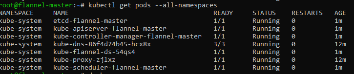
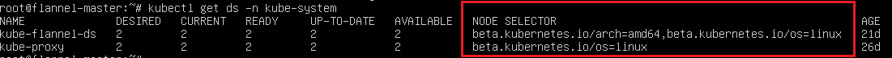

# Network Solutions #

Once you have [setup a Kubernetes master node](./creating-a-linux-master.md) you are ready to pick a networking solution. There are multiple ways to make the virtual [cluster subnet](./getting-started-kubernetes-windows.md#cluster-subnet-def) routable across nodes. Pick one of the following options for Kubernetes on Windows today:

1. Use a CNI plugin such as [Flannel](#flannel-in-vxlan-mode) to setup an overlay network for you.
2. Use a CNI plugin such as [Flannel](#flannel-in-host-gateway-mode) to program routes for you.
3. Configure a smart [top-of-rack (ToR) switch](#configuring-a-tor-switch) to route the subnet.

> [!tip]  
> There is a fourth networking solution on Windows which leverages Open vSwitch (OvS) and Open Virtual Network (OVN). Documenting this is out of scope for this document, but you can read [these instructions](https://kubernetes.io/docs/getting-started-guides/windows/#for-3-open-vswitch-ovs-open-virtual-network-ovn-with-overlay) to set it up.

## Flannel in vxlan mode

Flannel in vxlan mode can be used to setup a configurable virtual overlay network which uses VXLAN tunneling to route packets between nodes.

### Prepare Kubernetes master for Flannel
Some minor preparation is recommended on the [Kubernetes master](./creating-a-linux-master.md) in our cluster. It is recommended to enable bridged IPv4 traffic to iptables chains when using Flannel. This can be done using the following command:

```bash
sudo sysctl net.bridge.bridge-nf-call-iptables=1
```

###  Download & configure Flannel ###
Download the most recent Flannel manifest:

```bash
wget https://raw.githubusercontent.com/coreos/flannel/master/Documentation/kube-flannel.yml
```

There are two sections you should modify to enable the vxlan networking backend:

1. In the `net-conf.json` section of your `kube-flannel.yml`, double-check:
 * The cluster subnet (e.g. "10.244.0.0/16") is set as desired.
 * VNI 4096 is set in the backend
 * Port 4789 is set in the backend
2. In the `cni-conf.json` section of your `kube-flannel.yml`, change the network name to `"vxlan0"`.

After applying the above steps, your `net-conf.json` should look as follows:
```json
  net-conf.json: |
    {
      "Network": "10.244.0.0/16",
      "Backend": {
        "Type": "vxlan",
        "VNI" : 4096,
        "Port": 4789
      }
    }
```

> [!NOTE]  
> The VNI must be set to 4096 and port 4789 for Flannel on Linux to interoperate with Flannel on Windows. Support for other VNIs is coming soon. See [VXLAN](https://github.com/coreos/flannel/blob/master/Documentation/backends.md#vxlan) for an explanation of these fields.

Your `cni-conf.json` should look as follows:
```json
cni-conf.json: |
    {
      "name": "vxlan0",
      "plugins": [
        {
          "type": "flannel",
          "delegate": {
            "hairpinMode": true,
            "isDefaultGateway": true
          }
        },
        {
          "type": "portmap",
          "capabilities": {
            "portMappings": true
          }
        }
      ]
    }
```
> [!tip]  
> For more information on the above options, please consult official CNI [flannel](https://github.com/containernetworking/plugins/tree/master/plugins/meta/flannel#network-configuration-reference), [portmap](https://github.com/containernetworking/plugins/tree/master/plugins/meta/portmap#port-mapping-plugin), and [bridge](https://github.com/containernetworking/plugins/tree/master/plugins/main/bridge#network-configuration-reference) plugin docs for Linux.

### Launch Flannel & validate ###
Launch Flannel using:

```bash
kubectl apply -f kube-flannel.yml
```

Next, since the Flannel pods are Linux-based, apply the Linux [NodeSelector](https://github.com/Microsoft/SDN/tree/master/Kubernetes/flannel/l2bridge/manifests/node-selector-patch.yml) patch to `kube-flannel-ds` DaemonSet to only target Linux (we will launch the Flannel "flanneld" host-agent process on Windows later when joining):

```
kubectl patch ds/kube-flannel-ds-amd64 --patch "$(cat node-selector-patch.yml)" -n=kube-system
```
> [!tip]  
> If any nodes aren't x86-64 based, replace `-amd64` above with your processor architecture.

After a few minutes, you should see all the pods as running if the Flannel pod network was deployed.

```bash
kubectl get pods --all-namespaces
```



The Flannel DaemonSet should also have the NodeSelector `beta.kubernetes.io/os=linux` applied.

```bash
kubectl get ds -n kube-system
```



> [!tip]  
> For the remaining flannel-ds-* DaemonSets, these can be either ignored or deleted as they won't be scheduled if there are no nodes matching that processor architecture.

> [!tip]  
> Confused? Here is a complete [example kube-flannel.yml](https://github.com/Microsoft/SDN/blob/master/Kubernetes/flannel/overlay/manifests/kube-flannel-example.yml) for Flannel v0.11.0 with these steps pre-applied for default cluster subnet `10.244.0.0/16`.

Once successful, continue to the [next steps](#next-steps).

## Flannel in host-gateway mode

Alongside [Flannel vxlan](#flannel-in-vxlan-mode), another option for Flannel networking is *host-gateway mode* (host-gw), which entails the programming of static routes on each node to other node's pod subnets using the target node's host address as a next hop.

### Prepare Kubernetes master for Flannel

Some minor preparation is recommended on the [Kubernetes master](./creating-a-linux-master.md) in our cluster. It is recommended to enable bridged IPv4 traffic to iptables chains when using Flannel. This can be done using the following command:

```bash
sudo sysctl net.bridge.bridge-nf-call-iptables=1
```


###  Download & configure Flannel ###
Download the most recent Flannel manifest:

```bash
wget https://raw.githubusercontent.com/coreos/flannel/master/Documentation/kube-flannel.yml
```

There is one file you need to change in order to enable host-gw networking across both Windows/Linux.

In the `net-conf.json` section of your kube-flannel.yml, double-check that:
1. The type of network backend being used is set to `host-gw` instead of `vxlan`.
2. The cluster subnet (e.g. "10.244.0.0/16") is set as desired.

After applying the 2 steps, your `net-conf.json` should look as follows:
```json
net-conf.json: |
    {
      "Network": "10.244.0.0/16",
      "Backend": {
        "Type": "host-gw"
      }
    }
```

### Launch Flannel & validate ###
Launch Flannel using:

```bash
kubectl apply -f kube-flannel.yml
```

Next, since the Flannel pods are Linux-based, apply our Linux [NodeSelector](https://github.com/Microsoft/SDN/tree/master/Kubernetes/flannel/l2bridge/manifests/node-selector-patch.yml) patch to `kube-flannel-ds` DaemonSet to only target Linux (we will launch the Flannel "flanneld" host-agent process on Windows later when joining):

```
kubectl patch ds/kube-flannel-ds-amd64 --patch "$(cat node-selector-patch.yml)" -n=kube-system
```
> [!tip]  
> If any nodes aren't x86-64 based, replace `-amd64` above with the desired processor architecture.

After a few minutes, you should see all the pods as running if the Flannel pod network was deployed.

```bash
kubectl get pods --all-namespaces
```


The Flannel DaemonSet should also have the NodeSelector applied.

```bash
kubectl get ds -n kube-system
```


> [!tip]  
> For the remaining flannel-ds-* DaemonSets, these can be either ignored or deleted as they won't be scheduled if there are no nodes matching that processor architecture.

> [!tip]  
> Confused? Here is a complete [example kube-flannel.yml](https://github.com/Microsoft/SDN/blob/master/Kubernetes/flannel/l2bridge/manifests/kube-flannel-example.yml) For Flannel v0.11.0 with these 2 steps pre-applied for default cluster subnet `10.244.0.0/16`.

Once successful, continue to the [next steps](#next-steps).

## Configuring a ToR switch ##
> [!NOTE]
> You can skip this section if you chose [Flannel as your networking solution](#flannel-in-host-gateway-mode).
Configuration of the ToR switch occurs outside of your actual nodes. For more details on this, please see [official Kubernetes docs](https://kubernetes.io/docs/getting-started-guides/windows/#upstream-l3-routing-topology).


## Next steps ## 
In this section, we covered how to pick and configure a networking solution. Now you are ready for step 4:

> [!div class="nextstepaction"]
> [Joining Windows workers](./joining-windows-workers.md)