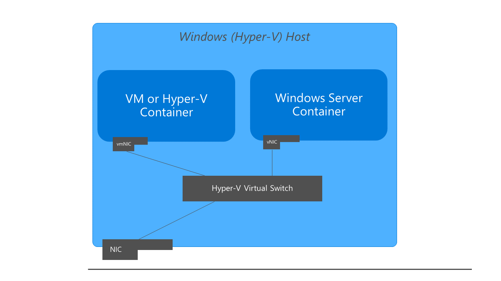
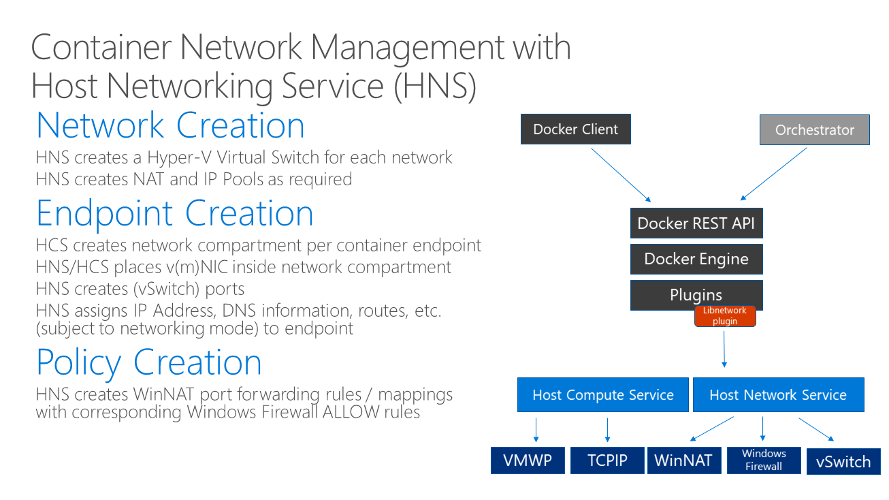

---
title: Windows Container Networking
description: Configure networking for Windows containers.
keywords: docker, containers
author: jmesser81
ms.date: 08/22/2016
ms.topic: article
ms.prod: windows-containers
ms.service: windows-containers
ms.assetid: 538871ba-d02e-47d3-a3bf-25cda4a40965
---

# Windows Container Networking
> ***Please reference [Docker Container Networking](https://docs.docker.com/engine/userguide/networking/) for general docker networking commands, options, and syntax.*** With the exception of any cases described in this document all Docker networking commands are supported on Windows with the same syntax as on Linux. Please note, however, that the Windows and Linux network stacks are different, and as such you will find that some Linux network commands (e.g. ifconfig) are not supported on Windows.

## Basic networking architecture
This topic provides an overview of how Docker creates and manages networks on Windows. Windows containers function similarly to virtual machines in regards to networking. Each container has a virtual network adapter (vNIC) which is connected to a Hyper-V virtual switch (vSwitch). Windows support five different networking drivers or modes which can be created through Docker: *nat*, *overlay*, *transparent*, *l2bridge*, and *l2tunnel*. Depending on your physical network infrastructure and single- vs multi-host networking requirements, you should choose the network driver which best suits your needs.

<figure>
  
</figure>  

The first time the docker engine runs, it will create a default NAT network, 'nat', which uses an internal vSwitch and a Windows component named `WinNAT`. If there are any pre-existing external vSwitches on the host which were created through PowerShell or Hyper-V Manager, they will also be available to Docker using the *transparent* network driver and can be seen when you run the ``docker network ls`` command  

<figure>
  
</figure>

> - An ***internal*** vSwitch is one which is not directly connected to a network adapter on the container host 

> - An ***external*** vSwitch is one which _is_ directly connected to a network adapter on the container host  

<figure>
  
</figure>

The 'nat' network is the default network for containers running on Windows. Any containers that are run on Windows without any flags or arguments to implement specific network configurations will be attached to the default 'nat' network, and automatically assigned an IP address from the 'nat' network's internal prefix IP range. The default internal IP prefix used for 'nat' is 172.16.0.0/16. 


## Windows Container Network Drivers  

In addition to leveraging the default 'nat' network created by Docker on Windows, users can define custom container networks. User-defined networks can be created using using the Docker CLI, [`docker network create -d <NETWORK DRIVER TYPE> <NAME>`](https://docs.docker.com/engine/reference/commandline/network_create/), command. On Windows, the following network driver types are available:

- **nat** – containers attached to a network created with the 'nat' driver will receive an IP address from the user-specified (``--subnet``) IP prefix. Port forwarding / mapping from the container host to container endpoints is supported.
> Note: Multiple NAT networks are now supported with Windows 10 Creators Update! 

- **transparent** – containers attached to a network created with the 'transparent' driver will be directly connected to the physical network. IPs from the physical network can be assigned statically (requires user-specified ``--subnet`` option) or dynamically using an external DHCP server. 

- **overlay** - __New!__  when the docker engine is running in [swarm mode](./swarm-mode.md), contaiers attached to an overlay network can communicate with other containers attached to the same network across multiple container hosts. Each overlay network that is created on a Swarm cluster is created with its own IP subnet, defined by a private IP prefix. The overlay network driver uses VXLAN encapsulation.
> Requires Windows Server 2016 with [KB4015217](https://support.microsoft.com/en-us/help/4015217/windows-10-update-kb4015217) or Windows 10 Creators Update 

- **l2bridge** - containers attached to a network created with the 'l2bridge' driver will be will be in the same IP subnet as the container host. The IP addresses must be assigned statically from the same prefix as the container host. All container endpoints on the host will have the same MAC address due to Layer-2 address translation (MAC re-write) operation on ingress and egress.
> Requires Windows Server 2016 or Windows 10 Creators Update

- **l2tunnel** - _this driver should only be used in a Microsoft Cloud Stack_

> To learn how to connect container endpoints to an overlay virtual network with the Microsoft SDN stack, reference the [Attaching Containers to a Virtual Network](https://technet.microsoft.com/en-us/windows-server-docs/networking/sdn/manage/connect-container-endpoints-to-a-tenant-virtual-network) topic.

> Windows 10 Creators Update introduced platform support to add a new container endpoint to a running container (i.e. 'hot-add'). This will light-up end-to-end pending an [outstanding Docker pull request](https://github.com/docker/libnetwork/pull/1661)

## Network Topologies and IPAM
The table below shows how network connectivity is provided for internal (container-to-container) and external connections for each network driver.

<figure>
  
</figure>

### IPAM 
IP Addresses are allocated and assigned differently for each networking driver. Windows uses the Host Networking Service (HNS) to provide IPAM for the nat driver and works with Docker Swarm Mode (internal KVS) to provide IPAM for overlay. All other network drivers use an external IPAM.

<figure>
  
</figure>

# Details on Windows Container Networking

## Isolation (Namespace) with Network Compartments
Each container endpoint is placed in its own __network compartment__ which is analogous to a network namespace in Linux. The management host vNIC and host network stack are located in the default network compartment. In order to enforce network isolation between containers on the same host, a network compartment is created for each Windows Server and Hyper-V Container into which the network adapter for the container is installed. Windows Server containers use a Host vNIC to attach to the virtual switch. Hyper-V Containers use a Synthetic VM NIC (not exposed to the Utility VM) to attach to the virtual switch. 

<figure>
  
</figure>

```powershell 
Get-NetCompartment
```

## Windows Firewall Security

The Windows Firewall is used to enforce network security through port ACLs.

> Note: by default all container endpoints attached to an overlay network have an ALLOW ALL rule created   

<figure>
  
</figure>

## Container Network Management with Host Network Service

The picture below shows how the Host Networking Service (HNS) and the Host Compute Service (HCS) work together to create containers and attach endpoints to a network. 

<figure>
  
</figure>

# Advanced Network Options in Windows
Several network driver options are supported to take advantage of Windows-specific capabilities and features. 

## Switch Embedded Teaming with Docker Networks

> Applies to all network drivers 

You can take advantage of [Switch Embedded Teaming](https://technet.microsoft.com/en-us/windows-server-docs/networking/technologies/hyper-v-virtual-switch/rdma-and-switch-embedded-teaming#a-namebkmksswitchembeddedaswitch-embedded-teaming-set) when creating container host networks for use by Docker   by specifying multiple network adapters (separated by commas) with the `-o com.docker.network.windowsshim.interface` option. 

```none
C:\> docker network create -d transparent -o com.docker.network.windowsshim.interface="Ethernet 2", "Ethernet 3" TeamedNet
```

## Set the VLAN ID for a Network

> Applies to transparent and l2bridge network drivers 

To set a VLAN ID for a network, use the option, `-o com.docker.network.windowsshim.vlanid=<VLAN ID>` to the `docker network create` command. For instance, you might use the following command to create a transparent network with a VLAN ID of 11:

```none
C:\> docker network create -d transparent -o com.docker.network.windowsshim.vlanid=11 MyTransparentNetwork
```
When you set the VLAN ID for a network, you are setting VLAN isolation for any container endpoints that will be attached to that network.

> Ensure that your host network adapter (physical) is in trunk mode to enable all tagged traffic to be processed by the vSwitch with the vNIC (container endpoint) port in access mode on the correct VLAN.

## Specify the Name of a Network to the HNS Service

> Applies to all network drivers 

Ordinarily, when you create a container network using `docker network create`, the network name that you provide is used by the Docker service but not by the HNS service. If you are creating a network, you can specify the name that it is given by the HNS service using the option, `-o com.docker.network.windowsshim.networkname=<network name>` to the `docker network create` command. For instance, you might use the following command to create a transparent network with a name that is specified to the HNS service:

```none
C:\> docker network create -d transparent -o com.docker.network.windowsshim.networkname=MyTransparentNetwork MyTransparentNetwork
```

## Bind a Network to a Specific Network Interface

> Applies to all network drivers except 'nat'  

To bind a network (attached through the Hyper-V virtual switch) to a specific network interface, use the option, `-o com.docker.network.windowsshim.interface=<Interface>` to the `docker network create` command. For instance, you might use the following command to create a transparent network which is attached to the "Ethernet 2" network interface:

```none
C:\> docker network create -d transparent -o com.docker.network.windowsshim.interface="Ethernet 2" TransparentNet2
```

> Note: The value for *com.docker.network.windowsshim.interface* is the network adapter's *Name*, which can be found with:

>```none
PS C:\> Get-NetAdapter
```
## Specify the DNS Suffix and/or the DNS Servers of a Network

> Applies to all network drivers 

Use the option, `-o com.docker.network.windowsshim.dnssuffix=<DNS SUFFIX>` to specify the DNS suffix of a network, and the option, `-o com.docker.network.windowsshim.dnsservers=<DNS SERVER/S>` to specify the DNS servers of a network. For example, you might use the following command to set the DNS suffix of a network to "example.com" and the DNS servers of a network to 4.4.4.4 and 8.8.8.8:

```none
C:\> docker network create -d transparent -o com.docker.network.windowsshim.dnssuffix=abc.com -o com.docker.network.windowsshim.dnsservers=4.4.4.4,8.8.8.8 MyTransparentNetwork
```

## VFP

The Virtual Filtering Platform (VFP) extension is a Hyper-V virtual switch, forwarding extension used to enforce network policy and manipulate packets. For instance, VFP is used by the 'overlay' network driver to perform VXLAN encapsulation and by the 'l2bridge' driver to perform MAC re-write on ingresss and egress. The VFP extension is only present on Windows Server 2016 and Windows 10 Creators Update. To check and see if this is running correctly a user run two commands:

```powershell
Get-Service vfpext

# This should indicate the extension is Running: True 
Get-VMSwitchExtension  -VMSwitchName <vSwitch Name> -Name "Microsoft Azure VFP Switch Extension"
```
-- KALLIE TODO --

## Tips & Insights
Here's a list of handy tips and insights, inspired by common questions on Windows container networking that we hear from the community...

### Moby Linux VMs use DockerNAT switch with Docker for Windows (a product of [Docker CE](https://www.docker.com/community-edition))
Docker for Windows (the Windows driver for the Docker CE engine) on Windows 10 will use an Internal vSwitch named 'DockerNAT' to connect Moby Linux VMs to the container host. Developers using Moby Linux VMs on Windows should be aware that their hosts are using the DockerNAT vSwitch rather than the vSwitch that is created by the HNS service (which is the default switch used for Windows containers). 

### Enable MACAddressSpoofing to use DHCP for IP assignment on a virtual container host
If the container host is virtualized, and you wish to use DHCP for IP assignment, you must enable MACAddressSpoofing on the virtual machines network adapter. Otherwise, the Hyper-V host will block network traffic from the containers in the VM with multiple MAC addresses.
```none
PS C:\> Get-VMNetworkAdapter -VMName ContainerHostVM | Set-VMNetworkAdapter -MacAddressSpoofing On
```
### Existing vSwitch (not visible to Docker) blocking transparent network creation
If you encounter an error in creating the transparent network, it is possible that there is an external vSwitch on your system which was not automatically discovered by Docker and is therefore preventing the transparent network from being bound to your container host's external network adapter. Reference the below section, 'Existing vSwitch Blocking Transparent Network Creation,' under 'Caveats and Gotchas' for more information.

### Creating multiple transparent networks on a single container host
If you wish to create more than one transparent network you must specify to which (virtual) network adapter the external Hyper-V Virtual Switch (created automatically) should bind.

### Static IP assignment (i.e. *When do I need to specify subnet and gateway?*)
When using static IP assignment, you must first ensure that the *--subnet* and *--gateway* parameters are specified when the network is created. The subnet and gateway IP address should be the same as the network settings for the container host - i.e. the physical network.

### DHCP IP assignment not supported with L2Bridge networks
Why does DHCP not work with l2bridge ? Only static IP assignment is supported with l2bridge networks.

> When using an l2bridge network on an SDN fabric, only dynamic IP assignment is supported. Reference the [Attaching Containers to a Virtual Network](https://technet.microsoft.com/en-us/windows-server-docs/networking/sdn/manage/connect-container-endpoints-to-a-tenant-virtual-network) topic for more information.

Multiple networks which use an external vSwitch for connectivity (e.g. Transparent, L2 Bridge, L2 Transparent) must each use its own network adapter.

```none
C:\> docker run -it --network=MyTransparentNet --ip=10.80.123.32 windowsservercore cmd
```

### IP assignment on stopped vs. running containers
Static IP assignment is performed directly on the container's network adapter and must only be performed when the container is in a STOPPED state. "Hot-add" of container network adapters or changes to the network stack is not supported while the container is running.

 -- END KALLIE TODO --

## Unsupported features and network options 

The following networking options are not supported in Windows and cannot be passed to ``docker run``:
 * Container linking (e.g. ``--link``) - _Alternative is rely on Service Discovery_
 * IPv6 addresses (e.g. ``--ip6``)
 * DNS Options (e.g. ``--dns-option``)
 * Multiple DNS search domains (e.g. ``--dns-search``)
 
The following networking options and features are not supported in Windows and cannot be passed to ``docker network create``:
 * --aux-address
 * --internal
 * --ip-range
 * --ipam-driver
 * --ipam-opt
 * --ipv6 

The following networking options are not supported on Docker services
* Data-plane encryption (e.g. ``opt-encrypted``) 


## Windows Server 2016 Work-arounds 

Although we continue to add new features and drive development, some of these features will not be back-ported to older platforms. Instead, the best plan of action is to "get on the train" for latest updates to Windows 10 and Windows Server.  The section below lists some work-arounds and caveats which apply to Windows Server 2016 and older versions of Windows 10 (i.e. before 1704 Creators Update)

### Multiple NAT networks on WS2016 Container Host

The partitions for any new NAT networks must be created under the larger internal NAT networking prefix. The prefix can be found by running the following command from PowerShell and referencing the "InternalIPInterfaceAddressPrefix" field.

```none
PS C:\> Get-NetNAT
```

For example, the host's NAT network internal prefix might be, 172.16.0.0/16. In this case, Docker can be used to create additional NAT networks *as long as they are a subset of the 172.16.0.0/16 prefix.* For example, two NAT networks could be created with the IP prefixes 172.16.1.0/24 (gateway, 172.16.1.1) and 172.16.2.0/24 (gateway, 172.16.2.1).

```none
C:\> docker network create -d nat --subnet=172.16.1.0/24 --gateway=172.16.1.1 CustomNat1
C:\> docker network create -d nat --subnet=172.16.2.0/24 --gateway=172.16.1.1 CustomNat2
```

The newly created networks can be listed using:
```none
C:\> docker network ls
```

### Docker Compose

[Docker Compose](https://docs.docker.com/compose/overview/) can be used to define and configure container networks alongside the containers/services that will be using those networks. The Compose 'networks' key is used as the top-level key in defining the networks to which containers will be connected. For example, the syntax below defines the preexisting NAT network created by Docker to be the 'default' network for all containers/services defined in a given Compose file.

```none
networks:
 default:
  external:
   name: "nat"
```

Similarly, the following syntax can be used to define a custom NAT network.

> Note: The 'custom NAT network' defined in the below example is defined as a partition of the container host's pre-existing NAT internal prefix. See the above section, 'Multiple NAT Networks,' for more context.

```none
networks:
  default:
    driver: nat
    ipam:
      driver: default
      config:
      - subnet: 172.16.3.0/24
```

For further information on defining/configuring container networks using Docker Compose, refer to the [Compose File reference](https://docs.docker.com/compose/compose-file/).

### Service Discovery
Service Discovery is only supported for certain Windows network drivers.

|  | Local Service Discovery  | Global Service Discovery |
| :---: | :---------------     |  :---                |
| nat | YES | NA |  
| overlay | YES | YES |
| transparent | NO | NO |
| l2bridge | NO | NO |


### Existing vSwitch Blocking Transparent Network Creation

When creating a transparent network, Docker creates an external vSwitch for the network then tries to bind the switch to an (external) network adapter - the adapter could be a VM Network Adapter or the physical network adapter. If a vSwitch has already been created on the container host, *and it is visible to Docker,* the Windows Docker engine will use that switch instead of creating a new one. However, if the vSwitch which was created out-of-band (i.e. created on the container host using HYper-V Manager or PowerShell) and is not yet visible to Docker, the Windows Docker engine will try create a new vSwitch and then be unable to connect the new switch to the container host external network adapter (because the network adapter will already be connected to the switch that was created out-of-band).

For example, this issue would arise if you were to first create a new vSwitch on your host while the Docker service was running, then try to create a transparent network. In this case, Docker would not recognize the switch that you created and it would create a new vSwitch for the transparent network.

There are three approaches for solving this issue:

* You can of course delete the vSwitch that was created out-of-band, which will allow docker to create a new vSwitch and connect it to the host network adapter without issue. Before choosing this approach, ensure that your out-of-band vSwitch is not being used by other services (e.g. Hyper-V).
* Alternatively, if you decide to use an external vSwitch that was created out-of-band, restart the Docker and HNS services to *make the switch visible to Docker.*
```none
PS C:\> restart-service hns
PS C:\> restart-service docker
```
* Another option is to use the '-o com.docker.network.windowsshim.interface' option to bind the transparent network's external vSwitch to a specific network adapter which is not already in use on the container host (i.e. a network adapter other than the one being used by the vSwitch that was created out-of-band). The '-o' option is described further above, in the [Transparent Network](https://msdn.microsoft.com/virtualization/windowscontainers/management/container_networking#transparent-network) section of this document.

