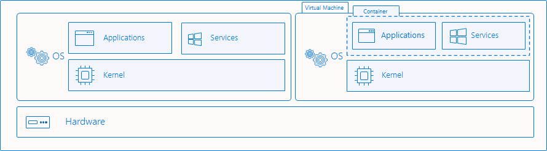

---
title: Isolation modes
description: Explanation of how Hyper-V isolation differs from process isolated containers.
author: cwilhit
ms.author: lizross
ms.date: 06/01/2021
ms.topic: conceptual
ms.assetid: 42154683-163b-47a1-add4-c7e7317f1c04
---

# Isolation Modes

> Applies to: Windows Server 2022, Windows Server 2019, Windows Server 2016

Windows containers offer two distinct modes of runtime isolation: `process` and `Hyper-V` isolation. Containers running under both isolation modes are created, managed, and function identically. They also produce and consume the same container images. The difference between the isolation modes is to what degree of isolation is created between the container, the host operating system, and all of the other containers running on that host.

## Process Isolation

This is the "traditional" isolation mode for containers and is what is described in the [Windows containers overview](../about/index.md). With process isolation, multiple container instances run concurrently on a given host with isolation provided through namespace, resource control, and other process isolation technologies. When running in this mode, containers share the same kernel with the host as well as each other.  This is approximately the same as how Linux containers run.


### What gets isolated

Windows containers virtualize access to various operating system namespaces. A namespace provides access to information, objects, or resources via a name. For example, the file system is probably the best-known namespace. There are numerous namespaces on Windows that get isolated on a per-container basis:

- file system
- registry
- network ports
- process and thread ID space
- Object Manager namespace

### Piercing the isolation boundary

There are cases when it is useful to pierce the isolation boundary. These operations must be deliberately requested by the user and should be done with careful consideration since it may compromise the security posture of the container. Windows containers support the following:

- [mapping shared files or volumes from host into the container](./persistent-storage.md)
- mapping a named pipe from host into the container
- mapping a port from the host into the container
- [customizing and sharing the network namespace](../container-networking/network-isolation-security.md#kubernetes-pods)
- [sharing host device visibility into the container](../deploy-containers/hardware-devices-in-containers.md)

Windows containers don't currently support:

- shared memory
- sharing synchronization objects (semaphores, mutexes, etc)
- shared process namespaces

## Hyper-V isolation

This isolation mode offers enhanced security and broader compatibility between host and container versions. With Hyper-V isolation, multiple container instances run concurrently on a host; however, each container runs inside of a highly optimized virtual machine and effectively gets its own kernel. The presence of the virtual machine provides hardware-level isolation between each container as well as the container host.



## Isolation examples

### Create container

Managing Hyper-V-isolated containers with Docker is nearly identical to managing process-isolated containers. To create a container with Hyper-V isolation using Docker, use the `--isolation` parameter to set `--isolation=hyperv`.

```cmd
docker run -it --isolation=hyperv mcr.microsoft.com/windows/servercore:ltsc2019 cmd
```

To create a container with process isolation through Docker, use the `--isolation` parameter to set `--isolation=process`.

```cmd
docker run -it --isolation=process mcr.microsoft.com/windows/servercore:ltsc2019 cmd
```

Windows containers running on Windows Server default to running with process isolation. Windows containers running on Windows 10 Pro and Enterprise default to running with Hyper-V isolation. Starting with the Windows 10 October 2018 update, users running a Windows 10 Pro or Enterprise host can run a Windows container with process isolation. Users must directly request process isolation by using the `--isolation=process` flag.

> [!WARNING]
> Running with process isolation on Windows 10 Pro and Enterprise is meant for development/testing. Your host must be running Windows 10 build 17763+ and you must have a Docker version with Engine 18.09 or newer.
>
> You should continue to use Windows Server or Windows IoT Enterprise as the host for production deployments. By using this feature on Windows 10 Pro and Enterprise, you must also ensure that your host and container version tags match, otherwise the container may fail to start or exhibit undefined behavior.

### Isolation explanation

This example demonstrates the differences in isolation capabilities between process and Hyper-V isolation.

Here, a process-isolated container is being deployed and will be hosting a long-running ping process.

``` cmd
docker run -d mcr.microsoft.com/windows/servercore:ltsc2019 ping localhost -t
```

Using the `docker top` command, the ping process is returned as seen inside the container. The process in this example has an ID of 3964.

``` cmd
docker top 1f8bf89026c8f66921a55e773bac1c60174bb6bab52ef427c6c8dbc8698f9d7a

3964 ping
```

On the container host, the `get-process` command can be used to return any running ping processes from the host. In this example there is one, and the process id matches that from the container. It is the same process visible from both container and host.

```
get-process -Name ping

Handles  NPM(K)    PM(K)      WS(K) VM(M)   CPU(s)     Id  SI ProcessName
-------  ------    -----      ----- -----   ------     --  -- -----------
     67       5      820       3836 ...71     0.03   3964   3 PING
```

To contrast, this example starts a Hyper-V isolated container with a ping process as well.

```
docker run -d --isolation=hyperv mcr.microsoft.com/windows/servercore:ltsc2019 ping localhost -t
```

Likewise, `docker top` can be used to return the running processes from the container.

```
docker top 5d5611e38b31a41879d37a94468a1e11dc1086dcd009e2640d36023aa1663e62

1732 ping
```

However, when searching for the process on the container host, a ping process is not found and an error is thrown.

```
get-process -Name ping

get-process : Cannot find a process with the name "ping". Verify the process name and call the cmdlet again.
At line:1 char:1
+ get-process -Name ping
+ ~~~~~~~~~~~~~~~~~~~~~~
    + CategoryInfo          : ObjectNotFound: (ping:String) [Get-Process], ProcessCommandException
    + FullyQualifiedErrorId : NoProcessFoundForGivenName,Microsoft.PowerShell.Commands.GetProcessCommand
```

Finally, on the host, the `vmwp` process is visible, which is the running virtual machine that is encapsulating the running container and protecting the running processes from the host operating system.

```
get-process -Name vmwp

Handles  NPM(K)    PM(K)      WS(K) VM(M)   CPU(s)     Id  SI ProcessName
-------  ------    -----      ----- -----   ------     --  -- -----------
   1737      15    39452      19620 ...61     5.55   2376   0 vmwp
```
