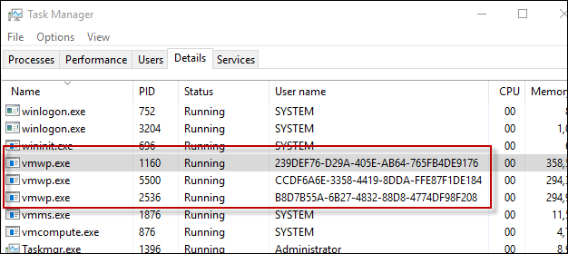

# Hyper-V Containers

**This is preliminary content and subject to change.** 

The Windows Container technology includes two distinct types of containers, Windows Server Containers and Hyper-V Containers. Both types of containers are created, managed, and function identically. What differs between them is the level of isolation created between the container, the host operating system, and all of the other container running on that host.

**Windows Server Containers** – multiple containers run on a host with isolation provided through namespace and process isolation technologies.

**Hyper-V Containers** – multiple containers run on a host, however each container is run inside of a utility virtual machine. This provides kernel level isolation between a Hyper-V container, the container host, and any other containers running on the container host.

## Hyper-V Container PowerShell

### Create Container

A Hyper-V container is created identically to a Widows Server Container with the only difference being a Runtime parameter indicating that that it will be a Hyper-V container.

Example Creating a Hyper-V Container with PowerShell

```powershell
PS C:\> $con = New-Container -Name HYPVCON -ContainerImageName NanoServer -SwitchName "Virtual Switch" -RuntimeType HyperV
```

### Convert Container

In addition to creating a container as a Hyper-V container at build time, containers that have been created with PowerShell can also be converted from a Windows Server Container to a Hyper-V container.

> Currently the only host operating system that supports container runtime conversion is Nano Server.

Create a new Container with the default runtime. 

```powershell
PS C:\> New-Container -Name DEMO -ContainerImageName nanoserver -SwitchName NAT
```
Return the runtime property from the container, notice that the runtime is set as default. 

```powershell
PS C:\> Get-Container | Select ContainerName, RuntimeType

ContainerName RuntimeType
------------- -----------
DEMO              Default
```

Use the `set-container` command to change the container runtime.

```powershell
PS C:\> Set-Container $con -RuntimeType HyperV
```

Finally return the runtime property once again to see the change.

```powershell
PS C:\> Get-Container | select ContainerName, RuntimeType

ContainerName RuntimeType
------------- -----------
DEMO               HyperV
```

## Hyper-V Container Docker

### Create Container

Managing Hyper-V Containers with Docker is almost identical to managing Windows Server Containers. When creating a Hyper-V Container with Docker, the `–issolation=hyperv` parameter is used.

```powershell
docker run -it --isolation=hyperv 646d6317b02f cmd
```

## Internals

### VM Worker Process

For each Hyper-V Container that is created, a corresponding Virtual Machine Worker Process will be created.

```powershell
PS C:\> Get-Container | Select Name, RuntimeType, ContainerID | Where {$_.RuntimeType -eq 'Hyperv'}

Name RuntimeType ContainerId
---- ----------- -----------
TST3      HyperV 239def76-d29a-405e-ab64-765fb4de9176
TST       HyperV b8d7b55a-6b27-4832-88d8-4774df98f208
TST2      HyperV ccdf6a6e-3358-4419-8dda-ffe87f1de184
```

Note that the container can be matched to a process by the container id and process User name.

 

This relationship can also be seen using the `Get-ComputeProcess` command.

```powershell
PS C:\> Get-ComputeProcess

Id                                   Name Owner      Type
--                                   ---- -----      ----
239DEF76-D29A-405E-AB64-765FB4DE9176 TST3 VMMS  Container
B8D7B55A-6B27-4832-88D8-4774DF98F208 TST  VMMS  Container
CCDF6A6E-3358-4419-8DDA-FFE87F1DE184 TST2 VMMS  Container
```

For more information on the `Get-ComputeProcess` command, see [Management Interoperability](./hcs_powershell.md).

## Isolation Demo

### Windows Server Container

The following exercise can be used to demonstrate the isolation of a Hyper-V container. In this exercise both a Windows Server, and a Hyper-V container will be created. The running process on the container host will be examined and will show how the Windows Server container process is shared on the container host, however that the Hyper-V containers process is not.

```powershell
PS C:\> get-process | where {$_.ProcessName -eq 'csrss'}

Handles  NPM(K)    PM(K)      WS(K) VM(M)   CPU(s)     Id  SI ProcessName
-------  ------    -----      ----- -----   ------     --  -- -----------
    255      12     1820       4000 ...98     0.53    532   0 csrss
    116      11     1284       3700 ...94     0.25    608   1 csrss
    246      13     1844       5504 ...17     3.45   3484   2 csrss
```

Create New Windows Server Container:

```powershell
PS C:\> New-Container -Name WINCONT -ContainerImageName WindowsServerCore -SwitchName "Virtual Switch"
```

Start the Container:

```powershell
PS C:\> Start-Container $con
```

Create Remote PS Session with the container.

```powershell
PS C:\> Enter-PSSession -ContainerId $con.ContainerId –RunAsAdministrator
```

From the remote container session return all processes with a process name of csrss. Take note of the process id for the running csrss process (1228 in the example below).

```powershell
[WINCONT]: PS C:\> get-process | where {$_.ProcessName -eq 'csrss'}

Handles  NPM(K)    PM(K)      WS(K) VM(M)   CPU(s)     Id  SI ProcessName
-------  ------    -----      ----- -----   ------     --  -- -----------
    167       9     1276       3720 ...97     0.20   1228   3 csrss
```

Now return the list of csrss process form the container host. Notice that the same csrss process is also returned from the container host.

```powershell
PS C:\> get-process | where {$_.ProcessName -eq 'csrss'}

Handles  NPM(K)    PM(K)      WS(K) VM(M)   CPU(s)     Id  SI ProcessName
-------  ------    -----      ----- -----   ------     --  -- -----------
    252      11     1712       3968 ...98     0.53    532   0 csrss
    113      11     1176       3676 ...93     0.25    608   1 csrss
    175       9     1260       3708 ...97     0.20   1228   3 csrss
    243      13     1736       5512 ...17     3.77   3484   2 csrss
```
### Hyper-V Container

Return a list of csrss process form the container host.

```powershell
PS C:\> get-process | where {$_.ProcessName -eq 'csrss'}

Handles  NPM(K)    PM(K)      WS(K) VM(M)   CPU(s)     Id  SI ProcessName
-------  ------    -----      ----- -----   ------     --  -- -----------
    261      12     1820       4004 ...98     0.53    532   0 csrss
    116      11     1284       3704 ...94     0.25    608   1 csrss
    246      13     1844       5536 ...17     3.83   3484   2 csrss
```

Now, create a Hyper-V container.

```powershell
PS C:\> $con = New-Container -Name HYPVCON -ContainerImageName NanoServer -SwitchName "Virtual Switch" -RuntimeType HyperV
```

Start the Hyper-V Container

```powershell
PS C:\> Start-Container $con
```

Create a remote PS session with the Hyper-V container.

```powershell
PS C:\> Enter-PSSession -ContainerId $con.ContainerId –RunAsAdministrator
```

Return a list of csrss process running inside the Hyper-V container. Take note of the process id for the csrss process (956 in the below example).

```powershell
[HYPVCON]: PS C:\> get-process | where {$_.ProcessName -eq 'csrss'}

Handles  NPM(K)    PM(K)      WS(K) VM(M)   CPU(s)     Id  SI ProcessName
-------  ------    -----      ----- -----   ------     --  -- -----------
              4      452       1520 ...63     0.06    956   1 csrss
```

Now return a list of csrss process on the container host. Notice, unlike with the Windows Server Container, where the csrss process was visible both from within the container and also from the container host, the Hyper-V container process is only visible from within the container itself. This is because a Hyper-V Container is encapsulated in a utility virtual machine, and the process is isolated to only that utility virtual mahchine.

```powershell
PS C:\> get-process | where {$_.ProcessName -eq 'csrss'}

Handles  NPM(K)    PM(K)      WS(K) VM(M)   CPU(s)     Id  SI ProcessName
-------  ------    -----      ----- -----   ------     --  -- -----------
    255      12     1716       3972 ...98     0.56    532   0 csrss
    113      11     1176       3676 ...93     0.25    608   1 csrss
    243      13     1732       5512 ...18     4.23   3484   2 csrss
```
