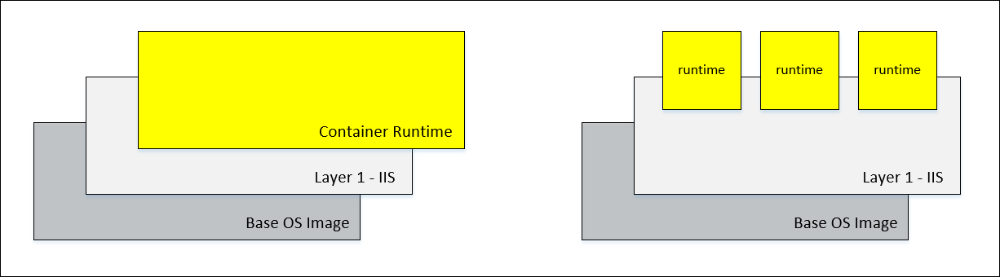

# Container Images

Container images are used to deploy containers. These images can include an operating system, applications, and all application dependencies. For instance, you may develop a container image that has been pre-configured with Nano Server, IIS, and an application running in IIS. This container image can then be stored in a container registry for later use, deployed on any Windows Container host (on-prem, cloud, or even to a container service), and also used as the base for a new container image.

There are two types of container images:

- Base OS Images – these are provided by Microsoft and include the core OS components. 
- Container Images – a container image that has been created from a Base OS Image.

On a Windows Container host, container image type is differentiated when using the `Get-ContainerImage` command.

```powershell
<insert snipp>
```

## Container Image Architecture

<center> </center>

## Managing Container Images

### Listing images on the Container Host

**PowerShell**

```powerhsell
Get-ContainerImage

Name              Publisher    Version      IsOSImage
----              ---------    -------      ---------
NanoServer        CN=Microsoft 10.0.10586.8 True
WindowsServerCore CN=Microsoft 10.0.10586.8 True
```

**Docker**

```powershell
docker images

REPOSITORY             TAG                 IMAGE ID            CREATED              VIRTUAL SIZE
windowsservercoreiis   latest              ca40b33453f8        About a minute ago   44.88 MB
windowsservercore      10.0.10586.0        6801d964fda5        2 weeks ago          0 B
nanoserver             10.0.10586.0        8572198a60f1        2 weeks ago          0 B
```

### Installing Base OS Images

Container OS images can be found and installed using the ContainerProvider PowerShell module. Before using this module, it will need to be installed. The following commands can be used to install the module.

```powershell
Invoke-RestMethod 'https://go.microsoft.com/fwlink/?LinkID=627338&clcid=0x409'
Install-PackageProvider NuGet -Force
Register-PSRepository -name psgetint -SourceLocation http://psget/psgallery/api/v2 
Install-PackageProvider ContainerProvider -Force
```

Return a list of images from PowerShell OneGet package manager:
```powershell
Find-ContainerImage

Name                 Version                 Description
----                 -------                 -----------
NanoServer           10.0.10586.8            Container OS Image of Windows Server 2016 Techn...
NanoServer           10.0.10586.7            Container OS Image of Windows Server 2016 Techn...
NanoServer           10.0.10586.0            Container OS Image of Windows Server 2016 Techn...
NanoServer           10.0.10585.0            Container OS Image of Windows Server 2016 Techn...
NanoServer           10.0.10584.0            Container OS Image of Windows Server 2016 Techn...
NanoServer           10.0.10583.0            Container OS Image of Windows Server 2016 Techn...
NanoServer           10.0.10582.0            Container OS Image of Windows Server 2016 Techn...
NanoServer           10.0.10581.0            Container OS Image of Windows Server 2016 Techn...
NanoServer           10.0.10580.0            Container OS Image of Windows Server 2016 Techn...
NanoServer           10.0.10579.0            Container OS Image of Windows Server 2016 Techn...
WindowsServerCore    10.0.10586.8            Container OS Image of Windows Server 2016 Techn...
WindowsServerCore    10.0.10586.7            Container OS Image of Windows Server 2016 Techn...
WindowsServerCore    10.0.10586.0            Container OS Image of Windows Server 2016 Techn...
WindowsServerCore    10.0.10585.0            Container OS Image of Windows Server 2016 Techn...
WindowsServerCore    10.0.10584.0            Container OS Image of Windows Server 2016 Techn...
WindowsServerCore    10.0.10583.0            Container OS Image of Windows Server 2016 Techn...
WindowsServerCore    10.0.10582.0            Container OS Image of Windows Server 2016 Techn...
WindowsServerCore    10.0.10581.0            Container OS Image of Windows Server 2016 Techn...
WindowsServerCore    10.0.10580.0            Container OS Image of Windows Server 2016 Techn...
WindowsServerCore    10.0.10579.0            Container OS Image of Windows Server 2016 Techn...
```

To download and install the Nano Server base OS image, run the following.

```powershell
Install-ContainerImage -Name NanoServer -Version 10.0.10586.8
Downloaded in 0 hours, 0 minutes, 10 seconds.
```

Likewaise, this command will download and install the Windows Server Core base OS image.

```powershell
Install-ContainerImage -Name WindowsServerCore -Version 10.0.10586.8
Downloaded in 0 hours, 2 minutes, 28 seconds.
```

Verify that the images have been installed using the `Get-ContainerImage` command.

```powershell
Get-ContainerImage

Name              Publisher    Version      IsOSImage
----              ---------    -------      ---------
NanoServer        CN=Microsoft 10.0.10586.8 True
WindowsServerCore CN=Microsoft 10.0.10586.8 True
```  
For more information on Container image management see [Windows Container Images](../management/manage_images.md).

### Creating New Images

**PowerShell**

```powershell
New-ContainerImage -Container $container -Publisher Demo -Name DemoImage -Version 1.0
```

**Docker**

```powershell
docker commit 475059caef8f windowsservercoreiis
ca40b33453f803bb2a5737d4d5dd2f887d2b2ad06b55ca681a96de8432b5999d
```

### Image Dependency

### Storing Images

<!-- Can we do this with PowerShell at TP4 -->

### Removing Images

Container images cannot be removed is any container, even in a stopped state has a dependency on the image.

Remove a single image with PowerShell. 

```powershell
Get-ContainerImage -Name newimage | Remove-ContainerImage -Force
```

**Docker**

when removing an image with docker, the images can be referenced by image name or id.

```powershell
C:\>docker rmi windowsservercoreiis
Untagged: windowsservercoreiis:latest
Deleted: ca40b33453f803bb2a5737d4d5dd2f887d2b2ad06b55ca681a96de8432b5999d
```