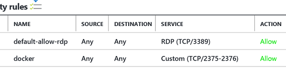

# Remote Management of a Windows Docker Host

Even in the absence of `docker-machine` one can still create a remotely accessible Docker Host on a Windows Server 2016 VM.

The steps are very straight forward:

* Create the certs on the server using [dockertls](https://hub.docker.com/r/stefanscherer/dockertls-windows/).
If you're creating the certs with an IP address, you may want to consider a static IP to avoid having to recreate certs when the IP address changes.

* Restart the docker service `Restart-Service Docker`
* Make port docker's TLS ports 2375 and 2376 available by creating an NSG rule allowing inbound traffic. Note that for secure connections you only need to allow 2376.
  The portal should show an NSG configuration like this:
  

* Allow inbound connections through the Windows Firewall.
```
New-NetFirewallRule -DisplayName 'Docker SSL Inbound' -Profile @('Domain', 'Public', 'Private') -Direction Inbound -Action Allow -Protocol TCP -LocalPort 2376
```
* Copy the files `ca.pem`, 'cert.pem' and 'key.pem' from your user's docker folder on your machine, e.g. `c:\users\chris\.docker` to you local machine. For example, you can ctrl-c, ctrl-v the files from an RDP session.
* Confirm that you can connect to the remote Docker Host. Run
```
docker -D -H tcp://wsdockerhost.southcentralus.cloudapp.azure.com:2376 --tlsverify --tlscacert=c:\
users\foo\.docker\client\ca.pem --tlscert=c:\users\foo\.docker\client\cert.pem --tlskey=c:\users\foo\.doc
ker\client\key.pem ps
```


## Troubleshooting
### Try connecting without TLS to determine your NSG firewall settings are correct
Connectivity errors typically manifest themselves in errors like:
```
error during connect: Get https://wsdockerhost.southcentralus.cloudapp.azure.com:2376/v1.25/version: dial tcp 13.85.27.177:2376: connectex: A connection attempt failed because the connected party did not properly respond after a period of time, or established connection failed because connected host has failed to respond.
```

Allow unencrypted connetions, by adding
```
{
    "tlsverify":  false,
}
```
to `c"\programdata\docker\config\daemon.json` and then restart the service.

Connect to the remote host with a command line like:
```
docker -H tcp://wsdockerhost.southcentralus.cloudapp.azure.com:2376 --tlsverify=0 version
```

### Cert problems
Accessing the Docker Host with a cert not created for the IP Address or DNS name will result in an error:
```
error during connect: Get https://w.x.y.c.z:2376/v1.25/containers/json: x509: certificate is valid for 127.0.0.1, a.b.c.d, not w.x.y.z
```
Make sure w.x.y.z is the DNS name for the host's public IP and that either the DNS name matches the cert's [Common Name](https://www.ssl.com/faqs/common-name/), which was the `SERVER_NAME` environment variable or one of the
IP addresses in the `IP_ADDRESSES` variable supplied to dockertls

### crypto/x509 warning
You may be getting a warning
```
level=warning msg="Unable to use system certificate pool: crypto/x509: system root pool is not available on Windows"
```
The warning is benign.
