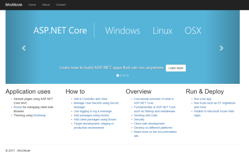

# Containerize a .NET Core App

This topic describes how to package an existing sample .NET app for deployment as a Windows container, after setting up your environment as described in [Get started: Prep Windows for containers](set-up-environment.md), and running your first container as described in [Run your first Windows container](run-your-first-container.md).

You'll also need the Git source control system installed on your computer. To install it, visit [Git](https://git-scm.com/download).

## Clone the sample code from GitHub

All container sample source code is kept under the [Virtualization-Documentation](https://github.com/MicrosoftDocs/Virtualization-Documentation) git repository (known informally as a repo) in a folder called `windows-container-samples`.

1. Open a PowerShell session and change directories to the folder in which you want to store this repository. (Other command prompt window types work as well, but our example commands use PowerShell.)
2. Clone the repo to your current working directory:

   ```PowerShell
   git clone https://github.com/MicrosoftDocs/Virtualization-Documentation.git
   ```

3. Navigate to the sample directory found under `Virtualization-Documentation\windows-container-samples\asp-net-getting-started` and create a Dockerfile, using the following commands.

   A [Dockerfile](https://docs.docker.com/engine/reference/builder/) is like a makefile—it's a list of instructions that tell the container engine how to build the container image.

   ```Powershell
   # Navigate into the sample directory
   Set-Location -Path Virtualization-Documentation\windows-container-samples\asp-net-getting-started

   # Create the Dockerfile for our project
   New-Item -Name Dockerfile -ItemType file
   ```

## Write the Dockerfile

Open the Dockerfile you just created with whichever text editor you like and then add the following content:

```Dockerfile
FROM mcr.microsoft.com/dotnet/core/sdk:2.1 AS build-env
WORKDIR /app

COPY *.csproj ./
RUN dotnet restore

COPY . ./
RUN dotnet publish -c Release -o out

FROM mcr.microsoft.com/dotnet/core/aspnet:2.1
WORKDIR /app
COPY --from=build-env /app/out .
ENTRYPOINT ["dotnet", "asp-net-getting-started.dll"]
```

Let's break it down line-by-line and explain what each instructions does.

```Dockerfile
FROM mcr.microsoft.com/dotnet/core/sdk:2.1 AS build-env
WORKDIR /app
```

The first group of lines declares from which base image we will use to build our container on top of. If the local system does not have this image already, then docker will automatically try and fetch it. The `mcr.microsoft.com/dotnet/core/sdk:2.1` comes packaged with the .NET core 2.1 SDK installed, so it's up to the task of building ASP .NET core projects targeting version 2.1. The next instruction  changes the working directory in our container to be `/app`, so all commands following this one execute under this context.

```Dockerfile
COPY *.csproj ./
RUN dotnet restore
```

Next, these instructions copy over the .csproj files into the `build-env` container's `/app` directory. After copying this file, .NET will read from it and then to go out and fetch all the dependencies and tools needed by our project.

```Dockerfile
COPY . ./
RUN dotnet publish -c Release -o out
```

Once .NET has pulled all the dependencies into the `build-env` container, the next instruction copies all project source files into the container. We then tell .NET to publish our application with a release configuration and specify the output path in the .

The compilation should succeed. Now we must build the final image. 

> [!TIP]
> This quickstart builds a .NET core project from source. When building container images, it's good practice to include _only_ the production payload and its dependencies in the container image. We don't want the .NET core SDK included in our final image because we only need the .NET core runtime, so the dockerfile is written to use a temporary container that is packaged with the SDK called `build-env` to build the app.

```Dockerfile
FROM mcr.microsoft.com/dotnet/core/aspnet:2.1
WORKDIR /app
COPY --from=build-env /app/out .
ENTRYPOINT ["dotnet", "asp-net-getting-started.dll"]
```

Since our application is ASP.NET, we specify an image with this runtime included. We then copy over all files from the output directory of our temporary container into our final container. We configure our container to run with our new app as its entrypoint when the container starts

We have written the dockerfile to perform a _multi-stage build_. When the dockerfile is executed, it will use the temporary container, `build-env`, with the .NET core 2.1 SDK to build the sample app and then copy the outputted binaries into another container containing only the .NET core 2.1 runtime so that we minimized the size of the final container.

## Build and run the app

With the Dockerfile written, we can point Docker at our Dockerfile and tell it to build and then run our image:

1. In a command prompt window, navigate to the directory where the dockerfile resides and then run the [docker build](https://docs.docker.com/engine/reference/commandline/build/) command to build the container from the Dockerfile.

   ```Powershell
   docker build -t my-asp-app .
   ```

2. To run the newly built container, run the [docker run](https://docs.docker.com/engine/reference/commandline/run/) command.

   ```Powershell
   docker run -d -p 5000:80 --name myapp my-asp-app
   ```

   Let's dissect this command:

   * `-d` tells Docker tun run the container 'detached', meaning no console is hooked up to the console inside the container. The container runs in the background. 
   * `-p 5000:80` tells Docker to map port 5000 on the host to port 80 in the container. Each container gets its own IP address. ASP .NET listens by default on port 80. Port mapping allows us to go to the host's IP address at the mapped port and Docker will forward all traffic to the destination port inside the container.
   * `--name myapp` tells Docker to give this container a convenient name to query by (instead of having to look up the contaienr ID assigned at runtime by Docker).
   * `my-asp-app` is the image we want Docker to run. This is the container image produced as the culmination of the `docker build` process.

3. Open a web browser web browser and navigate to `http://localhost:5000` to be see your containerized application, as shown in this screenshot:

   >

## Next steps

1. The next step is to publish your containerized ASP.NET web app to a private registry using Azure Container Registry. This allows you to deploy it in your org.

   > [!div class="nextstepaction"]
   > [Create a private container registry](https://docs.microsoft.com/azure/container-registry/container-registry-get-started-powershell)

   When you get to the section where you [push your container image to the registry](https://docs.microsoft.com/azure/container-registry/container-registry-get-started-powershell#push-image-to-registry), specify the name of the ASP.NET app you just packaged (`my-asp-app`) along with your container registry (for example: `contoso-container-registry`):

   ```PowerShell
   docker tag my-asp-app contoso-container-registry.azurecr.io/my-asp-app:v1
   ```

   To see more app samples and their associated dockerfiles, see [additional container samples](../samples.md).

2. Once you've published your app to the container registry, the next step would be to deploy the app to a Kubernetes cluster that you create with Azure Kubernetes Service.

   > [!div class="nextstepaction"]
   > [Create a Kubernetes cluster](https://docs.microsoft.com/azure/aks/windows-container-cli)
