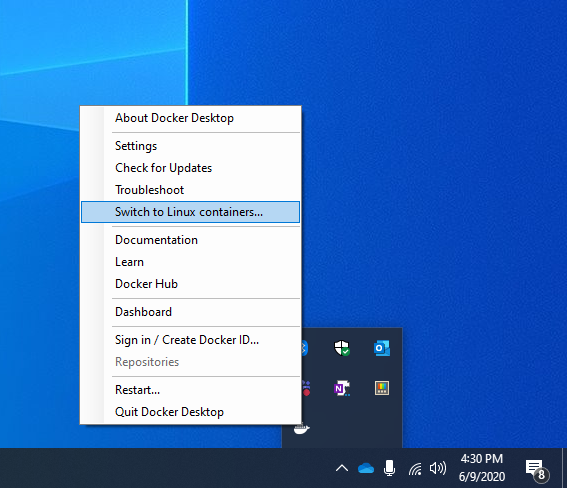

# Get started: Set up Linux Containers on Windows 10

The exercise will walk through creating and running Linux containers on Windows 10.

In this quick start you will accomplish:

1. Installing Docker Desktop
2. Running a simple Linux container

This quick start is specific to Windows 10. Additional quick start documentation can be found in the table of contents on the left-hand side of this page.

## Prerequisites

Please make sure you meet the following requirements:
- One physical computer system running Windows 10 Professional, Windows 10 Enterprise, or Windows
Server 2019 version 1809 or later
- Make sure [Hyper-V](/virtualization/hyper-v-on-windows/reference/hyper-v-requirements) is enabled.

## Install Docker Desktop

Download [Docker Desktop](https://store.docker.com/editions/community/docker-ce-desktop-windows) and run the installer (You will be required to login. Create an account if you don't have one already). [Detailed installation instructions](https://docs.docker.com/docker-for-windows/install) are available in the Docker documentation.

## Run Your First Linux Container

In order to run Linux containers, you need to make sure Docker is targeting the correct daemon. You can toggle this by selecting `Switch to Linux Containers` from the action menu when clicking on the Docker whale icon in the system tray. If you see `Switch to Windows Containers`, then you are already targeting the Linux daemon.



Once you've confirmed you are targeting the correc daemon, run the container with the following command:

```console
docker run --rm busybox echo hello_world
```

The container should run, print "hello_world", then exit.

When you query `docker images`, you should see the Linux container image that you just pulled an ran:

```console
docker images

REPOSITORY             TAG                 IMAGE ID            CREATED             SIZE
busybox                latest              59788edf1f3e        4 weeks ago         3.41MB
```

## Next Steps

> [!div class="nextstepaction"]
> [Learn how to build a sample app](./building-sample-app.md)