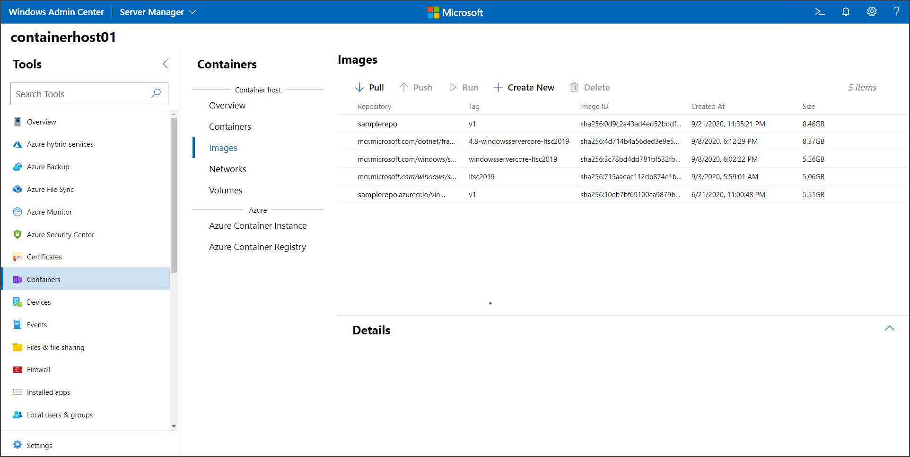

# Get started: Run your first Windows container

> Applies to: Windows Server 2025, Windows Server 2022, Windows Server 2019, Windows Server 2016

This article shows how to run your first Windows container, after you set up your environment as described in [Get started: Prep Windows for containers](./set-up-environment.md). To run a container, you first download a base image. With containers, the act of downloading a base image is also known as a *pull operation*. The base image provides a foundational layer of operating system services to your container. Then you create and run a container image, which is based upon the base image.

## Pull a container base image

All containers are created from container images. Microsoft offers several starter images, called base images, to choose from. For more information, see [Container base images](../manage-containers/container-base-images.md). This procedures *pulls* the lightweight Nano Server base image, or in other words, it downloads and installs that image.

1. Open a console window such as the built-in Command Prompt, PowerShell, or [Windows Terminal](https://www.microsoft.com/p/windows-terminal-preview/9n0dx20hk701?activetab=pivot:overviewtab).

1. Run the following command to download and install the base image:

   ```console
   docker pull mcr.microsoft.com/windows/nanoserver:ltsc2022
   ```

   If Docker fails to start when you try to pull the image, the Docker daemon might be unreachable. To resolve this issue, restart the Docker service.

   > [!TIP]
   > If you see an error message that says `no matching manifest for linux/amd64 in the manifest list entries`, make sure Docker isn't configured to run Linux containers. To switch to Windows containers in Docker, right-click the Docker icon, and select **Switch to Windows containers**. To use the command line to switch between containers, run `& $Env:ProgramFiles\Docker\Docker\DockerCli.exe -SwitchDaemon`.

2. After the image is finished downloading, read the [EULA](../images-eula.md) while you wait, and verify its existence on your system by querying your local docker image repository. Running the command `docker images` returns a list of installed images.

   Here's an example of the output showing the Nano Server image.

   ```console
   REPOSITORY                             TAG        IMAGE ID       CREATED      SIZE
   mcr.microsoft.com/windows/nanoserver   ltsc2022   4f0ead5b1b67   6 days ago   296MB
   ```

## Run a Windows container

For this simple example, a ‘Hello World’ container image will be created and deployed. For the best experience, run these commands in an elevated command prompt window (but don't use the Windows PowerShell ISE—it doesn't work for interactive sessions with containers, as the containers appear to hang).

1. Start a container with an interactive session from the `nanoserver` image by entering the following command in your command prompt window:

   ```console
   docker run -it mcr.microsoft.com/windows/nanoserver:ltsc2022 cmd.exe
   ```

2. After the container starts, the command prompt window changes context to the container. Inside the container, we'll create a simple ‘Hello World’ text file and then exit the container by entering the following commands:

   ```cmd
   echo "Hello World!" > Hello.txt
   exit
   ```

3. Get the container ID for the container you just exited by running the [docker ps](https://docs.docker.com/reference/cli/docker/container/ls/) command:

   ```console
   docker ps -a
   ```

4. Create a new ‘HelloWorld’ image that includes the changes in the first container you ran. To do so, run the [docker commit](https://docs.docker.com/engine/reference/commandline/commit/) command, replacing `<containerid>` with the ID of your container:

   ```console
   docker commit <containerid> helloworld
   ```

   You now have a custom image that contains the hello world script. This can be seen with the [docker images](https://docs.docker.com/engine/reference/commandline/images/) command.

   ```console
   docker images
   ```

   Here's an example of the output:

   ```console
   REPOSITORY                             TAG        IMAGE ID       CREATED          SIZE
   helloworld                             latest     81013d6b73ae   25 seconds ago   299MB
   mcr.microsoft.com/windows/nanoserver   ltsc2022   4f0ead5b1b67   6 days ago       296MB
   ```

5. Finally, run the new container by using the [docker run](https://docs.docker.com/engine/reference/commandline/run/) command with the `--rm` parameter that automatically removes the container once the command line (cmd.exe) stops.

   ```console
   docker run --rm helloworld cmd.exe /s /c type Hello.txt
   ```

   The result is that Docker created a container from the 'HelloWorld' image, Docker started an instance of cmd.exe in the container, and the cmd.exe read our file and output the contents to the shell. As the final step, Docker stopped and removed the container.

## Run a Windows container using Windows Admin Center

Use Windows Admin Center to run your containers locally. Specifically, use the Containers extension of your Windows Admin Center instance to run the containers. First, open the container host you want to manage, and in the Tools pane, select the **Containers** extension. Then, select the **Images** tab inside the Container extension under **Container Host**.



If your host doesn't have a base container image, select the **Pull** option to open the **Pull Container Image** settings:


In the **Pull Container Image** settings, provide the image URL and the tag. If you aren't certain which image to pull, Windows Admin Center provides a list of common images from Microsoft. You can also provide the credentials to pull an image from a private repository. Once you fill out the necessary information, select **Pull**. Windows Admin Center starts the pull process on the container host. After the download is complete, you see the new image on the **Images** tab.

Select the image you want to run, and select **Run**.


On the **Run** menu, set up the configuration for the container, such as the container name, the isolation type, which ports to publish, and memory and CPU allocation. Additionally, you can append Docker run commands that are not in the UI, such as -v for persistent volume. For more information on available Docker run parameters, review the [documentation](https://docs.docker.com/engine/reference/commandline/run/).

Once you finish the configuration for the container, click **Run**. You can see the status of the running containers on the **Containers** tab:


## Next steps

> [!div class="nextstepaction"]
> [Learn how to containerize a sample app](./building-sample-app.md)
